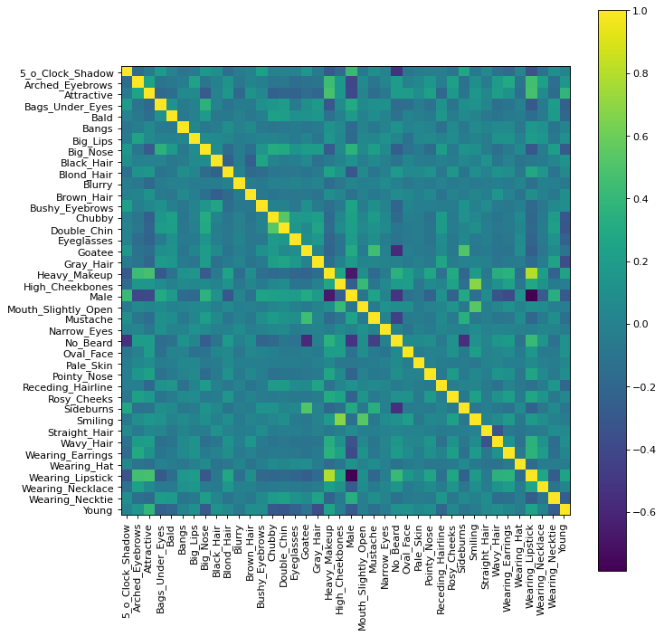
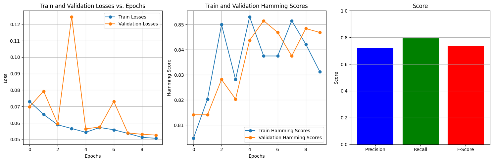
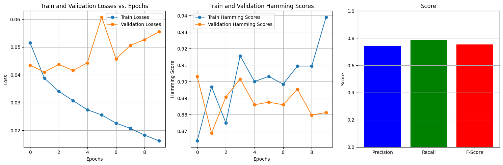

**MULTILBAEL CLASSIFICATION USING PYTORCH**

# 1. Information

## 1.1. Project Description

Our team is currently working on a project focused on Face Image Retrieval using state-of-the-art Deep Learning Models. The core of our approach involves leveraging Convolutional Neural Networks (CNN) to identify and extract facial features. The project centers around the comprehensive CelebA dataset, which contains a diverse collection of celebrity images.

## 1.2. Team Members

|         NAME         |   ID   |  CONTRIBUTE |   ROLE   |
|:-------------------:|:--------:|:----------:|:-----------:|
|   Trần Mai Chí Tâm  | 21280047 |     25%    | Leader |
|  Ngô Ngọc Hà Khanh  | 21280019 |     25%    |             |
| Nguyễn Đặng Anh Thư | 21280111 |     25%    |             |
|      Y Cao Lâm      | 21280027 |     25%    |             |

# 2. Understanding About Dataset


```python
import pandas as pd
import os, os.path
from os import listdir
import cv2
import numpy as np
from matplotlib import pyplot as plt
import warnings
import seaborn as sns
warnings.filterwarnings('ignore')
ROOT = r'Z:\ndm\note'
PATH = r'Z:\ndm\note\img_align_celeba'
from PIL import Image as PILImage  
from IPython.display import Image as IPImage  
```

## 2.1. Data Reader


```python
os.listdir()
```


    ['anno', 'eval', 'img_align_celeba', 'README.txt']


```python
anno_dir = 'anno'
eval_dir = 'eval'

print('anno:', os.listdir(anno_dir))
print('eval:', os.listdir(eval_dir))
```

    anno: ['identity_CelebA.txt', 'list_attr_celeba.txt', 'list_bbox_celeba.txt', 'list_landmarks_align_celeba.txt', 'list_landmarks_celeba.txt']
    eval: ['list_eval_partition.txt']
    

### Read attributes


```python
f = open(os.path.join(anno_dir, 'list_attr_celeba.txt'))
file = f.readlines()
sample = int(file[0])
classes = file[1].split(' ')
classes.pop(-1)
attr = []
for i in file[2:]:
    list_ = i.split()
    list_.pop(0)
    list_ = list(map(int, list_))
    attr.append(list_)
```

convert the attribute to binary


```python
for li in attr:
    for ind in range(len(li)):
        if(li[ind] == -1):
            li[ind] = 0
```

### Read eval list


```python
f = open(os.path.join(eval_dir, 'list_eval_partition.txt'))
file = f.readlines()
eval_dict = {'name': [],
        'eval': []}
for i in file:
    key, value = i.split()
    eval_dict['name'].append(key)
    eval_dict['eval'].append(int(value))
eval_dict_csv = pd.DataFrame(eval_dict)
```

### Read landmark


```python
f = open(os.path.join(anno_dir, "list_landmarks_align_celeba.txt"))
file = f.readlines()
landmark_align = file[1].split() #classes
landmark_align_cor = []
for fi in file[2:]:
    li = list(map(int,fi.split()[1:]))
    landmark_align_cor.append(li)
```

### Export


```python
df = pd.DataFrame(attr, columns=classes)
df.to_csv('attribute.csv', index=False)
df = pd.DataFrame(landmark_align_cor, columns=landmark_align)
df.to_csv('landmark_align.csv', index=False)
eval_dict_csv.to_csv('eval.csv', index=False)
```

#### Then we take a look at some of the csv files

andmark_align.csv


```python
landmark_align = pd.read_csv('landmark_align.csv')
landmark_align.head()
```


<div>
<style scoped>
    .dataframe tbody tr th:only-of-type {
        vertical-align: middle;
    }

    .dataframe tbody tr th {
        vertical-align: top;
    }

    .dataframe thead th {
        text-align: right;
    }
</style>
<table border="1" class="dataframe">
  <thead>
    <tr style="text-align: right;">
      <th></th>
      <th>lefteye_x</th>
      <th>lefteye_y</th>
      <th>righteye_x</th>
      <th>righteye_y</th>
      <th>nose_x</th>
      <th>nose_y</th>
      <th>leftmouth_x</th>
      <th>leftmouth_y</th>
      <th>rightmouth_x</th>
      <th>rightmouth_y</th>
    </tr>
  </thead>
  <tbody>
    <tr>
      <th>0</th>
      <td>69</td>
      <td>109</td>
      <td>106</td>
      <td>113</td>
      <td>77</td>
      <td>142</td>
      <td>73</td>
      <td>152</td>
      <td>108</td>
      <td>154</td>
    </tr>
    <tr>
      <th>1</th>
      <td>69</td>
      <td>110</td>
      <td>107</td>
      <td>112</td>
      <td>81</td>
      <td>135</td>
      <td>70</td>
      <td>151</td>
      <td>108</td>
      <td>153</td>
    </tr>
    <tr>
      <th>2</th>
      <td>76</td>
      <td>112</td>
      <td>104</td>
      <td>106</td>
      <td>108</td>
      <td>128</td>
      <td>74</td>
      <td>156</td>
      <td>98</td>
      <td>158</td>
    </tr>
    <tr>
      <th>3</th>
      <td>72</td>
      <td>113</td>
      <td>108</td>
      <td>108</td>
      <td>101</td>
      <td>138</td>
      <td>71</td>
      <td>155</td>
      <td>101</td>
      <td>151</td>
    </tr>
    <tr>
      <th>4</th>
      <td>66</td>
      <td>114</td>
      <td>112</td>
      <td>112</td>
      <td>86</td>
      <td>119</td>
      <td>71</td>
      <td>147</td>
      <td>104</td>
      <td>150</td>
    </tr>
  </tbody>
</table>
</div>


This landmark_align.csv file give us the coordinates for the location of some features like eyes, nose and mouth. We also draw this to beter visualize what we have


```python
landmark_id = pd.read_csv('landmark_align.csv')
landmark_id.insert(0, 'ID', range(0, len(landmark_id)))
```


```python
import cv2
import matplotlib.pyplot as plt

def show_images(images):
    num_rows = 4
    num_cols = 16
    plt.figure(figsize=(40, 10))
    plt.subplots_adjust(wspace=0, hspace=0) 
    for i in range(len(images)):
        plt.subplot(num_rows, num_cols, i + 1)
        if images[i].dtype == 'uint8':
             plt.imshow(cv2.cvtColor(images[i], cv2.COLOR_BGR2RGB))
        else:
             plt.imshow(images[i])
        plt.axis('off')   
    plt.show()
    
def draw_landmark(df, id, img):
    id = int(id)
    result = df[df['ID'] == id]
    for i in range(1, len(result.columns), 2):
        point_x = int(result.iloc[0, i])
        point_y = int(result.iloc[0, i + 1])
        img = cv2.circle(img, (point_x, point_y), radius=4, color=(51, 255, 51), thickness=-1)
    return img

images=[]
for image in ['128338.jpg', '100120.jpg', '000090.jpg', '000002.jpg']:
    file = os.path.join(PATH, image)
    image_ = cv2.imread(file)
    image_ = draw_landmark(landmark_id, int(image.replace('.jpg', '')), image_)
    images.append(image_)
show_images(images)
```


    

    


#### attribute.csv


```python
attribute = pd.read_csv('attribute.csv')
attribute.head()
```


<div>
<style scoped>
    .dataframe tbody tr th:only-of-type {
        vertical-align: middle;
    }

    .dataframe tbody tr th {
        vertical-align: top;
    }

    .dataframe thead th {
        text-align: right;
    }
</style>
<table border="1" class="dataframe">
  <thead>
    <tr style="text-align: right;">
      <th></th>
      <th>5_o_Clock_Shadow</th>
      <th>Arched_Eyebrows</th>
      <th>Attractive</th>
      <th>Bags_Under_Eyes</th>
      <th>Bald</th>
      <th>Bangs</th>
      <th>Big_Lips</th>
      <th>Big_Nose</th>
      <th>Black_Hair</th>
      <th>Blond_Hair</th>
      <th>...</th>
      <th>Sideburns</th>
      <th>Smiling</th>
      <th>Straight_Hair</th>
      <th>Wavy_Hair</th>
      <th>Wearing_Earrings</th>
      <th>Wearing_Hat</th>
      <th>Wearing_Lipstick</th>
      <th>Wearing_Necklace</th>
      <th>Wearing_Necktie</th>
      <th>Young</th>
    </tr>
  </thead>
  <tbody>
    <tr>
      <th>0</th>
      <td>0</td>
      <td>1</td>
      <td>1</td>
      <td>0</td>
      <td>0</td>
      <td>0</td>
      <td>0</td>
      <td>0</td>
      <td>0</td>
      <td>0</td>
      <td>...</td>
      <td>0</td>
      <td>1</td>
      <td>1</td>
      <td>0</td>
      <td>1</td>
      <td>0</td>
      <td>1</td>
      <td>0</td>
      <td>0</td>
      <td>1</td>
    </tr>
    <tr>
      <th>1</th>
      <td>0</td>
      <td>0</td>
      <td>0</td>
      <td>1</td>
      <td>0</td>
      <td>0</td>
      <td>0</td>
      <td>1</td>
      <td>0</td>
      <td>0</td>
      <td>...</td>
      <td>0</td>
      <td>1</td>
      <td>0</td>
      <td>0</td>
      <td>0</td>
      <td>0</td>
      <td>0</td>
      <td>0</td>
      <td>0</td>
      <td>1</td>
    </tr>
    <tr>
      <th>2</th>
      <td>0</td>
      <td>0</td>
      <td>0</td>
      <td>0</td>
      <td>0</td>
      <td>0</td>
      <td>1</td>
      <td>0</td>
      <td>0</td>
      <td>0</td>
      <td>...</td>
      <td>0</td>
      <td>0</td>
      <td>0</td>
      <td>1</td>
      <td>0</td>
      <td>0</td>
      <td>0</td>
      <td>0</td>
      <td>0</td>
      <td>1</td>
    </tr>
    <tr>
      <th>3</th>
      <td>0</td>
      <td>0</td>
      <td>1</td>
      <td>0</td>
      <td>0</td>
      <td>0</td>
      <td>0</td>
      <td>0</td>
      <td>0</td>
      <td>0</td>
      <td>...</td>
      <td>0</td>
      <td>0</td>
      <td>1</td>
      <td>0</td>
      <td>1</td>
      <td>0</td>
      <td>1</td>
      <td>1</td>
      <td>0</td>
      <td>1</td>
    </tr>
    <tr>
      <th>4</th>
      <td>0</td>
      <td>1</td>
      <td>1</td>
      <td>0</td>
      <td>0</td>
      <td>0</td>
      <td>1</td>
      <td>0</td>
      <td>0</td>
      <td>0</td>
      <td>...</td>
      <td>0</td>
      <td>0</td>
      <td>0</td>
      <td>0</td>
      <td>0</td>
      <td>0</td>
      <td>1</td>
      <td>0</td>
      <td>0</td>
      <td>1</td>
    </tr>
  </tbody>
</table>
<p>5 rows × 40 columns</p>
</div>


```python
for col in attribute.columns:
    print(col)
```

    5_o_Clock_Shadow
    Arched_Eyebrows
    Attractive
    Bags_Under_Eyes
    Bald
    Bangs
    Big_Lips
    Big_Nose
    Black_Hair
    Blond_Hair
    Blurry
    Brown_Hair
    Bushy_Eyebrows
    Chubby
    Double_Chin
    Eyeglasses
    Goatee
    Gray_Hair
    Heavy_Makeup
    High_Cheekbones
    Male
    Mouth_Slightly_Open
    Mustache
    Narrow_Eyes
    No_Beard
    Oval_Face
    Pale_Skin
    Pointy_Nose
    Receding_Hairline
    Rosy_Cheeks
    Sideburns
    Smiling
    Straight_Hair
    Wavy_Hair
    Wearing_Earrings
    Wearing_Hat
    Wearing_Lipstick
    Wearing_Necklace
    Wearing_Necktie
    Young
    

## 2.2. Exploratory Data Analysis (EDA) 

In this phase of our project, we delve into Exploratory Data Analysis (EDA) to gain insights into the distribution of our dataset. Understanding the distribution is fundamental in shaping our understanding of the data and informing subsequent modeling decisions.


```python
counts = attribute.sum()
percentages = (counts / len(attribute)) * 100
percentages_sorted = percentages.sort_values(ascending=False)

plt.figure(figsize=(12, 6))
percentages_sorted.plot(kind='bar', color='skyblue', edgecolor='black')
plt.title('CelebA Attributes Frequency ')
plt.xlabel('Attributes')
plt.ylabel('Percentages')
plt.xticks(rotation=45, ha='right')
plt.show()
```


    

    


Overall the dataset is imbalanced

Now let check some of the attributes.

First is the gender


```python
gender_attr = attribute.loc[:, 'Male']
gender_attr = gender_attr.to_frame()
gender_attr.columns = ['gender'] 
gender_attr = gender_attr.replace(1, 'Male')
gender_attr = gender_attr.replace(0, 'Female')
total_count = len(gender_attr)
percentage_male = (gender_attr['gender'] == 'Female').sum() / total_count * 100
percentage_female = (gender_attr['gender'] == 'Male').sum() / total_count * 100
plt.title('Gender')
sns.countplot(x='gender', data=gender_attr, color="c")
plt.text(0, percentage_male, f'{percentage_male:.2f}%', ha='center', va='bottom')
plt.text(1, percentage_female, f'{percentage_female:.2f}%', ha='center', va='bottom')

plt.show()
```


    

    


Although the female take more than half of the dataset. But by the number of images we have, this dataset is still very balance.

Age


```python
age_attr = attribute.loc[:, 'Young']
age_attr = age_attr.to_frame()
age_attr.columns = ['age'] 
age_attr = age_attr.replace(1, 'Young')
age_attr = age_attr.replace(0, 'Old')
total_count = len(age_attr)
percentage_young = (age_attr['age'] == 'Young').sum() / total_count * 100
percentage_old = (age_attr['age'] == 'Old').sum() / total_count * 100
plt.title('Age')
sns.countplot(x='age', data=age_attr, color="c")
plt.text(0, percentage_young, f'{percentage_young:.2f}%', ha='center', va='bottom')
plt.text(1, percentage_old, f'{percentage_old:.2f}%', ha='center', va='bottom')
plt.show()
```


    

    


Most of the people in the dataset are young, this imbalance could make it harder for the model to know the difference between young and old people

#### Correlation matrix
Now let see the correlation matrix for age and gender


```python
def plotCorrelationMatrix(df, graphWidth):
    df = df[[col for col in df if df[col].nunique() > 1]] # keep columns where there are more than 1 unique values
    if df.shape[1] < 2:
        print(f'No correlation plots shown: The number of non-NaN or constant columns ({df.shape[1]}) is less than 2')
        return
    corr = df.corr()
    plt.figure(num=None, figsize=(graphWidth, graphWidth), dpi=80, facecolor='w', edgecolor='k')
    corrMat = plt.matshow(corr, fignum = 1)
    plt.xticks(range(len(corr.columns)), corr.columns, rotation=90)
    plt.yticks(range(len(corr.columns)), corr.columns)
    plt.gca().xaxis.tick_bottom()
    plt.colorbar(corrMat)
    plt.show()
```


```python
age_attr = attribute.loc[:, 'Young']
gender_attr = attribute.loc[:, 'Male']
age_gender = pd.DataFrame([gender_attr, age_attr])
age_gender = age_gender.T
age_gender.head()
```


<div>
<style scoped>
    .dataframe tbody tr th:only-of-type {
        vertical-align: middle;
    }

    .dataframe tbody tr th {
        vertical-align: top;
    }

    .dataframe thead th {
        text-align: right;
    }
</style>
<table border="1" class="dataframe">
  <thead>
    <tr style="text-align: right;">
      <th></th>
      <th>Male</th>
      <th>Young</th>
    </tr>
  </thead>
  <tbody>
    <tr>
      <th>0</th>
      <td>0</td>
      <td>1</td>
    </tr>
    <tr>
      <th>1</th>
      <td>0</td>
      <td>1</td>
    </tr>
    <tr>
      <th>2</th>
      <td>1</td>
      <td>1</td>
    </tr>
    <tr>
      <th>3</th>
      <td>0</td>
      <td>1</td>
    </tr>
    <tr>
      <th>4</th>
      <td>0</td>
      <td>1</td>
    </tr>
  </tbody>
</table>
</div>


```python
plotCorrelationMatrix(age_gender, 10)
```


    

    


There is little to no relationship between these two attributes

But how about the whole dataset.


```python
plotCorrelationMatrix(attribute, 10)
```


    

    


Wỉth this correlation matrix we can point out the some stonger relationship, like Heavy_Makeup and Wearing_Lipstick


```python
makeup_attr = attribute.loc[:, 'Heavy_Makeup']
lipstick_attr = attribute.loc[:, 'Wearing_Lipstick']
makeup_lipstick = pd.DataFrame([makeup_attr, lipstick_attr])
makeup_lipstick = makeup_lipstick.T
plotCorrelationMatrix(makeup_lipstick, 10)
```


    

    


The correlation is about 80%, which is easy to understand as when people wear heavy makeup they most likely have lipstick on as well

# 3. Modeling And Evaluation

## 3.1. Understanding About Problem

Multi Label Classification

Multiple Labels: Each instance can belong to zero or more classes or categories. This means that an instance can be associated with multiple labels simultaneously.


Imbalanced Dataset

![image.png](data:image/png;base64,iVBORw0KGgoAAAANSUhEUgAAA+QAAAKHCAYAAAAISoJRAAAAOXRFWHRTb2Z0d2FyZQBNYXRwbG90bGliIHZlcnNpb24zLjguMCwgaHR0cHM6Ly9tYXRwbG90bGliLm9yZy81sbWrAAAACXBIWXMAAA9hAAAPYQGoP6dpAAEAAElEQVR4nOzdd1gU5/f38bM2wAIWFCygqCjYFRv2FokaeywptphojCXR2LvGElssiSV2/YpJ7MbEaBJr7L3EaOxBo6BoEBUEhfP84bPzYwV0WcC1vF/XxZU4O3vv2dnZ2fnM3HOPSVVVAAAAAADAc5XG3gUAAAAAAPA6IpADAAAAAGAHBHIAAAAAAOyAQA4AAAAAgB0QyAEAAAAAsAMCOQAAAAAAdkAgBwAAAADADgjkAAAAAADYAYEcAAAAAAA7IJADAF5IHTt2lAIFCtj03AIFCshbb72VsgW9gJ5cRpcvXxaTySSTJ0+2X1EAAMBqBHIAQIq4cOGCdO3aVQoWLCiOjo7i7OwsVatWlenTp0tkZKS9y3umjRs3islkkjx58khsbKxNbbRu3VpMJpMMGDAg0dcYOXJkvOkREREycuRI2b59u02vm5rsWdv27dvFZDIl+Ne2bdvnXg8AACktnb0LAAC8/H7++Wdp1aqVODg4SPv27aVEiRISHR0tu3btkn79+smpU6dk7ty59i7zqQIDA6VAgQJy+fJl2bp1q9SrVy9Jzw8PD5cNGzZIgQIF5LvvvpMvv/xSTCaTxTwbN26UmTNnxgvlERERMmrUKBERqVWrltWvOW/ePJsPHljL1tpSUq9evaRChQoW02ztPQEAwIuEQA4ASJZLly5J27ZtJX/+/LJ161bJnTu38Vj37t3l/Pnz8vPPP9uxwme7f/++rF+/XsaPHy+LFi2SwMDAJAfy1atXS0xMjCxcuFDq1KkjO3fulJo1a6ZavZkyZZL06dOnSvsvmurVq8vbb79t1byPHj2S2NhYyZAhQypXBQBA8tFlHQCQLBMnTpR79+7JggULLMK4WeHCheXTTz+1mLZs2TLx8/MTJycnyZ49u7Rt21auXLnyzNeKjY2VadOmSfHixcXR0VHc3Nyka9eu8t9//yU4/6+//iplypQRR0dHKVasmKxZsybB+dauXSuRkZHSqlUradu2raxZs0YePHhgxbv/P4GBgfLGG29I7dq1xdfXVwIDAy0e79ixo8ycOVNExKLr9eXLlyVnzpwiIjJq1ChjuvkseseOHSVz5sxy4cIFadiwoWTJkkXee+8947HEzhRPnTpV8ufPL05OTlKzZk35888/LR6vVatWgme847b5rNpERM6cOSNvv/22ZM+eXRwdHaV8+fLy448/WrT58OFDGTVqlHh7e4ujo6PkyJFDqlWrJr/99tszl+vTxL1mftq0aVKoUCFxcHCQv/76y+raREROnTolderUEScnJ8mXL5+MGTNGFi5caHw+Zk++d7MCBQpIx44dLaaFhYXJZ599Jh4eHuLg4CCFCxeWCRMmWPRoiFv/3LlzjforVKggBw8ejPc6Z86ckdatW0vOnDnFyclJihYtKkOGDBERkW3btonJZJK1a9fGe97y5cvFZDLJ3r17rVmsAIDniDPkAIBk2bBhgxQsWFCqVKli1fxjx46VYcOGSevWreXDDz+Umzdvytdffy01atSQo0ePStasWRN9bteuXWXx4sXSqVMn6dWrl1y6dEm++eYbOXr0qOzevdvijPG5c+ekTZs28vHHH0uHDh1k0aJF0qpVK9m0aZO88cYbFu0GBgZK7dq1xd3dXdq2bSsDBw6UDRs2SKtWrax6T9euXZNt27bJkiVLRETknXfekalTp8o333xjnKnt2rWrXLt2TX777Tf53//+Zzw3Z86cMnv2bOnWrZs0b95cWrRoISIipUqVMuZ59OiRBAQESLVq1WTy5MmSMWPGp9azdOlSuXv3rnTv3l0ePHgg06dPlzp16sjJkyfFzc3NqvdkTW2nTp2SqlWrSt68eWXgwIGSKVMmWbFihTRr1kxWr14tzZs3FxGRkSNHyvjx4+XDDz+UihUrSnh4uBw6dEiOHDkS77NIyN27dyU0NNRiWvbs2Y3/X7RokTx48EC6dOkiDg4Okj17dqtrCw4Oltq1a8ujR4+M+ebOnStOTk5WL6cnRURESM2aNeXff/+Vrl27iqenp+zZs0cGDRok169fl2nTplnMv3z5crl796507dpVTCaTTJw4UVq0aCEXL1401ukTJ05I9erVJX369NKlSxcpUKCAXLhwQTZs2CBjx46VWrVqiYeHhwQGBhrvzSwwMFAKFSok/v7+Nr8nAEAqUQAAbHTnzh0VEW3atKlV81++fFnTpk2rY8eOtZh+8uRJTZcuncX0Dh06aP78+Y1///HHHyoiGhgYaPHcTZs2xZueP39+FRFdvXq1Ra25c+fWsmXLWjw/JCRE06VLp/PmzTOmValSxer3pKo6efJkdXJy0vDwcFVVPXv2rIqIrl271mK+7t27a0I/vTdv3lQR0REjRsR7rEOHDioiOnDgwAQfi7uMLl26pCKiTk5OevXqVWP6/v37VUS0d+/exrSaNWtqzZo1n9nm02qrW7eulixZUh88eGBMi42N1SpVqqi3t7cxrXTp0tqoUaN4z3+Wbdu2qYgk+Hfp0iXj/To7O+uNGzdsqu2zzz5TEdH9+/cb027cuKEuLi7G65glthzy58+vHTp0MP79xRdfaKZMmfTs2bMW8w0cOFDTpk2rQUFBqvp/n1eOHDn09u3bxnzr169XEdENGzYY02rUqKFZsmTRf/75x6LN2NhY4/8HDRqkDg4OGhYWZvFe0qVLl2DdAAD7o8s6AMBm4eHhIiKSJUsWq+Zfs2aNxMbGSuvWrSU0NNT4c3d3F29vb9m2bVuiz125cqW4uLjIG2+8YfFcPz8/yZw5c7zn5smTx+JMobOzs7Rv316OHj0qwcHBxvTvv/9e0qRJIy1btjSmvfPOO/LLL78k2hX+SYGBgdKoUSNjOXh7e4ufn1+8buvJ0a1bN6vnbdasmeTNm9f4d8WKFaVSpUqycePGFKvn9u3bsnXrVmndurVxBjs0NFRu3bolAQEBcu7cOfn3339FRCRr1qxy6tQpOXfunE2vNXz4cPntt98s/tzd3Y3HW7ZsaXStT2ptGzdulMqVK0vFihWN5+fMmdO4LMAWK1eulOrVq0u2bNks1tV69epJTEyM7Ny502L+Nm3aSLZs2Yx/V69eXURELl68KCIiN2/elJ07d8oHH3wgnp6eFs+NO3Bg+/btJSoqSlatWmVM++GHH+TRo0fy/vvv2/x+AACphy7rAACbOTs7i8jjLsXWOHfunKiqeHt7J/j40wYpO3funNy5c0dy5cqV4OM3btyw+HfhwoXjjXJepEgREXl87a450C1btkwqVqwot27dklu3bomISNmyZSU6OlpWrlwpXbp0eep7On36tBw9elTat28v58+fN6bXqlVLZs6cKeHh4cZyslW6dOkkX758Vs+f0PItUqSIrFixIll1xHX+/HlRVRk2bJgMGzYswXlu3LghefPmldGjR0vTpk2lSJEiUqJECXnzzTelXbt2Ft3yn6ZkyZJPHWTPy8vL5tr++ecfqVSpUrzHixYtalVtCTl37pycOHHC4iDBk68d15Mh2xzOzQeEzMG8RIkST31dHx8fqVChggQGBkrnzp1F5PHBosqVK0vhwoWT/kYAAKmOQA4AsJmzs7PkyZMn3oBhiYmNjRWTySS//PKLpE2bNt7jmTNnfupzc+XKlehZ58TCz9OcO3fOGDwroRAbGBj4zEC+bNkyERHp3bu39O7dO97jq1evlk6dOiW5trgcHBwkTZqU7dRmMplEVeNNj4mJser55sHJ+vbtKwEBAQnOYw6BNWrUkAsXLsj69evl119/lfnz58vUqVNlzpw58uGHH9r4Dv7Pk9d7J6W2lPDkMouNjZU33nhD+vfvn+D85gNDZgl9F0Qkwc/nWdq3by+ffvqpXL16VaKiomTfvn3yzTffJLkdAMDzQSAHACTLW2+9JXPnzpW9e/c+c9CoQoUKiaqKl5dXvFDyLIUKFZLff/9dqlatatWAW+azpHHPkp89e1ZE/u8e1oGBgZI+fXr53//+Fy8U7dq1S2bMmCFBQUHxzmCaqaosX75cateuLZ988km8x7/44gsJDAw0AvmTZ+zNEptuq4S6hp89e9ZiRPZs2bIZZ17j+ueff6yqrWDBgiLyuFeDNbeIy549u3Tq1Ek6deok9+7dkxo1asjIkSNTJJAnp7b8+fMnuLz+/vvveNOyZcsmYWFhFtOio6Pl+vXrFtMKFSok9+7dS/Kt8xJjfj/WHPhq27at9OnTR7777juJjIyU9OnTS5s2bVKkDgBAyuMacgBAsvTv318yZcokH374oYSEhMR7/MKFCzJ9+nQREWnRooWkTZtWRo0aFe/sn6oaXcYT0rp1a4mJiZEvvvgi3mOPHj2KF5SuXbtmcQuo8PBwWbp0qZQpU8borh4YGCjVq1eXNm3ayNtvv23x169fPxER+e677xKtaffu3XL58mXp1KlTvOe//fbb0qZNG9m2bZtcu3ZNREQyZcokIhKvVvOo6U9Ot9W6deuMa6RFRA4cOCD79++XBg0aGNMKFSokZ86ckZs3bxrTjh8/Lrt377aqtly5ckmtWrXk22+/jRdIRcSi3Sc/18yZM0vhwoUlKioq6W/OCkmprWHDhrJv3z45cOCAxeMJ9cQoVKhQvOu/586dG+8MeevWrWXv3r2yefPmeG2EhYXJo0ePkvR+cubMKTVq1JCFCxdKUFCQxWNPfo9cXV2lQYMGsmzZMgkMDJQ333xTXF1dk/R6AIDnhzPkAIBkKVSokCxfvlzatGkjvr6+0r59eylRooRER0fLnj17ZOXKlcY9mgsVKiRjxoyRQYMGyeXLl6VZs2aSJUsWuXTpkqxdu1a6dOkiffv2TfB1atasKV27dpXx48fLsWPHpH79+pI+fXo5d+6crFy5UqZPny5vv/22MX+RIkWkc+fOcvDgQXFzc5OFCxdKSEiILFq0SERE9u/fL+fPn5cePXok+Hp58+aVcuXKSWBgoAwYMCDBeQIDAyVt2rTSqFGjBB9v0qSJDBkyRL7//nvp06eP+Pn5iYhIr169JCAgQNKmTStt27YVJycnKVasmPzwww9SpEgRyZ49u5QoUeKZ1wwnpnDhwlKtWjXp1q2bREVFybRp0yRHjhwWXag/+OAD+eqrryQgIEA6d+4sN27ckDlz5kjx4sWNwfpE5Km1zZw5U6pVqyYlS5aUjz76SAoWLCghISGyd+9euXr1qhw/flxERIoVKya1atUSPz8/yZ49uxw6dEhWrVqV6LJPCdbW1r9/f/nf//4nb775pnz66afGbc/y588vJ06csGjzww8/lI8//lhatmwpb7zxhhw/flw2b94cL/D269dPfvzxR3nrrbekY8eO4ufnJ/fv35eTJ0/KqlWr5PLly0kOyTNmzJBq1apJuXLlpEuXLuLl5SWXL1+Wn3/+WY4dO2Yxb/v27Y3vQkIHsAAALxA7je4OAHjFnD17Vj/66CMtUKCAZsiQQbNkyaJVq1bVr7/+2uLWU6qqq1ev1mrVqmmmTJk0U6ZM6uPjo927d9e///7bmOfJ22+ZzZ07V/38/NTJyUmzZMmiJUuW1P79++u1a9eMefLnz6+NGjXSzZs3a6lSpdTBwUF9fHx05cqVxjw9e/ZUEdELFy4k+p5GjhypIqLHjx+P91h0dLTmyJFDq1ev/tTl4uXlZdxq7dGjR9qzZ0/NmTOnmkwmi1ug7dmzR/38/DRDhgwWt9fq0KGDZsqUKcG2E7vt2aRJk3TKlCnq4eGhDg4OWr169QTfw7Jly7RgwYKaIUMGLVOmjG7evDnB5Z5YbaqqFy5c0Pbt26u7u7umT59e8+bNq2+99ZauWrXKmGfMmDFasWJFzZo1qzo5OamPj4+OHTtWo6Ojn7rszLc9i/u5xRX3/SbEmtpUVU+cOKE1a9ZUR0dHzZs3r37xxRe6YMGCeLc9i4mJ0QEDBqirq6tmzJhRAwIC9Pz58/Fue6aqevfuXR00aJAWLlxYM2TIoK6urlqlShWdPHmy8b6fVv+Ty1lV9c8//9TmzZtr1qxZ1dHRUYsWLarDhg2L99yoqCjNli2buri4aGRkZILLBgDwYjCp2jBiCAAAwCts8eLF0qlTJ7l06ZLFtfcvg0ePHkmePHmkcePGsmDBAnuXAwB4Cq4hBwAAeIWsW7dObt68Ke3bt7d3KQCAZ+AacgAAgFfA/v375cSJE/LFF19I2bJlpWbNmvYuCQDwDJwhBwAAeAXMnj1bunXrJrly5ZKlS5fauxwAgBW4hhwAAAAAADvgDDkAAAAAAHZAIAcAAAAAwA5e+UHdYmNj5dq1a5IlSxYxmUz2LgcAAAAA8IpTVbl7967kyZNH0qRJ/Dz4Kx/Ir127Jh4eHvYuAwAAAADwmrly5Yrky5cv0cdf+UCeJUsWEXm8IJydne1cDQAAAADgVRceHi4eHh5GHk3MKx/Izd3UnZ2dCeQAAAAAgOfmWZdNM6gbAAAAAAB2QCAHAAAAAMAOCOQAAAAAANgBgRwAAAAAADsgkAMAAAAAYAcEcgAAAAAA7IBADgAAAACAHRDIAQAAAACwAwI5AAAAAAB2QCAHAAAAAMAOCOQAAAAAANgBgRwAAAAAADsgkAMAAAAAYAcEcgAAAAAA7IBADgAAAACAHRDIAQAAAACwAwI5AAAAAAB2QCAHAAAAAMAO0tm7AHsKCgqS0NBQq+Z1dXUVT0/PVK4IAAAAAPC6eG0DeVBQkPj4+kpkRIRV8ztlzChnTp8mlAMAAAAAUsRrG8hDQ0MlMiJCWo+ZLbm8vJ86741L52TF0G4SGhpKIAcAAAAApIjXNpCb5fLylry+pe1dBgAAAADgNcOgbgAAAAAA2AGBHAAAAAAAOyCQAwAAAABgBwRyAAAAAADsgEAOAAAAAIAdEMgBAAAAALADAjkAAAAAAHZAIAcAAAAAwA4I5AAAAAAA2AGBHAAAAAAAOyCQAwAAAABgB3YN5DExMTJs2DDx8vISJycnKVSokHzxxReiqsY8qirDhw+X3Llzi5OTk9SrV0/OnTtnx6oBAAAAAEg+uwbyCRMmyOzZs+Wbb76R06dPy4QJE2TixIny9ddfG/NMnDhRZsyYIXPmzJH9+/dLpkyZJCAgQB48eGDHygEAAAAASJ509nzxPXv2SNOmTaVRo0YiIlKgQAH57rvv5MCBAyLy+Oz4tGnTZOjQodK0aVMREVm6dKm4ubnJunXrpG3btnarHQAAAACA5LDrGfIqVarIli1b5OzZsyIicvz4cdm1a5c0aNBAREQuXbokwcHBUq9ePeM5Li4uUqlSJdm7d69dagYAAAAAICXY9Qz5wIEDJTw8XHx8fCRt2rQSExMjY8eOlffee09ERIKDg0VExM3NzeJ5bm5uxmNPioqKkqioKOPf4eHhqVQ9AAAAAAC2s+sZ8hUrVkhgYKAsX75cjhw5IkuWLJHJkyfLkiVLbG5z/Pjx4uLiYvx5eHikYMUAAAAAAKQMuwbyfv36ycCBA6Vt27ZSsmRJadeunfTu3VvGjx8vIiLu7u4iIhISEmLxvJCQEOOxJw0aNEju3Llj/F25ciV13wQAAAAAADawayCPiIiQNGksS0ibNq3ExsaKiIiXl5e4u7vLli1bjMfDw8Nl//794u/vn2CbDg4O4uzsbPEHAAAAAMCLxq7XkDdu3FjGjh0rnp6eUrx4cTl69Kh89dVX8sEHH4iIiMlkks8++0zGjBkj3t7e4uXlJcOGDZM8efJIs2bN7Fk6AAAAAADJYtdA/vXXX8uwYcPkk08+kRs3bkiePHmka9euMnz4cGOe/v37y/3796VLly4SFhYm1apVk02bNomjo6MdKwcAAAAAIHnsGsizZMki06ZNk2nTpiU6j8lkktGjR8vo0aOfX2EAAAAAAKQyu15DDgAAAADA64pADgAAAACAHRDIAQAAAACwAwI5AAAAAAB2QCAHAAAAAMAOCOQAAAAAANgBgRwAAAAAADuw633IX2VBQUESGhpq9fyurq7i6emZihUBAAAAAF4kBPJUEBQUJD6+vhIZEWH1c5wyZpQzp08TygEAAADgNUEgTwWhoaESGREhrcfMllxe3s+c/8alc7JiaDcJDQ0lkAMAAADAa4JAnopyeXlLXt/S9i4DAAAAAPACYlA3AAAAAADsgEAOAAAAAIAdEMgBAAAAALADAjkAAAAAAHZAIAcAAAAAwA4I5AAAAAAA2AGBHAAAAAAAOyCQAwAAAABgBwRyAAAAAADsgEAOAAAAAIAdEMgBAAAAALADAjkAAAAAAHZAIAcAAAAAwA4I5AAAAAAA2AGBHAAAAAAAOyCQAwAAAABgBwRyAAAAAADsgEAOAAAAAIAdEMgBAAAAALADAjkAAAAAAHZAIAcAAAAAwA4I5AAAAAAA2AGBHAAAAAAAOyCQAwAAAABgBwRyAAAAAADsgEAOAAAAAIAdEMgBAAAAALADAjkAAAAAAHZAIAcAAAAAwA4I5AAAAAAA2AGBHAAAAAAAO7BrIC9QoICYTKZ4f927dxcRkQcPHkj37t0lR44ckjlzZmnZsqWEhITYs2QAAAAAAFKEXQP5wYMH5fr168bfb7/9JiIirVq1EhGR3r17y4YNG2TlypWyY8cOuXbtmrRo0cKeJQMAAAAAkCLS2fPFc+bMafHvL7/8UgoVKiQ1a9aUO3fuyIIFC2T58uVSp04dERFZtGiR+Pr6yr59+6Ry5cr2KBkAAAAAgBTxwlxDHh0dLcuWLZMPPvhATCaTHD58WB4+fCj16tUz5vHx8RFPT0/Zu3dvou1ERUVJeHi4xR8AAAAAAC+aFyaQr1u3TsLCwqRjx44iIhIcHCwZMmSQrFmzWszn5uYmwcHBibYzfvx4cXFxMf48PDxSsWoAAAAAAGzzwgTyBQsWSIMGDSRPnjzJamfQoEFy584d4+/KlSspVCEAAAAAACnHrteQm/3zzz/y+++/y5o1a4xp7u7uEh0dLWFhYRZnyUNCQsTd3T3RthwcHMTBwSE1ywUAAAAAINleiDPkixYtkly5ckmjRo2MaX5+fpI+fXrZsmWLMe3vv/+WoKAg8ff3t0eZAAAAAACkGLufIY+NjZVFixZJhw4dJF26/yvHxcVFOnfuLH369JHs2bOLs7Oz9OzZU/z9/RlhHQAAAADw0rN7IP/9998lKChIPvjgg3iPTZ06VdKkSSMtW7aUqKgoCQgIkFmzZtmhSgAAAAAAUpbdA3n9+vVFVRN8zNHRUWbOnCkzZ858zlUBAAAAAJC6XohryAEAAAAAeN0QyAEAAAAAsAMCOQAAAAAAdkAgBwAAAADADgjkAAAAAADYAYEcAAAAAAA7IJADAAAAAGAHBHIAAAAAAOyAQA4AAAAAgB0QyAEAAAAAsAMCOQAAAAAAdkAgBwAAAADADgjkAAAAAADYAYEcAAAAAAA7IJADAAAAAGAHBHIAAAAAAOyAQA4AAAAAgB0QyAEAAAAAsAMCOQAAAAAAdkAgBwAAAADADgjkAAAAAADYAYEcAAAAAAA7IJADAAAAAGAHBHIAAAAAAOyAQA4AAAAAgB0QyAEAAAAAsAMCOQAAAAAAdkAgBwAAAADADgjkAAAAAADYAYEcAAAAAAA7IJADAAAAAGAHBHIAAAAAAOyAQA4AAAAAgB0QyAEAAAAAsAMCOQAAAAAAdkAgBwAAAADADgjkAAAAAADYAYEcAAAAAAA7IJADAAAAAGAHBHIAAAAAAOyAQA4AAAAAgB0QyAEAAAAAsAO7B/J///1X3n//fcmRI4c4OTlJyZIl5dChQ8bjqirDhw+X3Llzi5OTk9SrV0/OnTtnx4oBAAAAAEg+uwby//77T6pWrSrp06eXX375Rf766y+ZMmWKZMuWzZhn4sSJMmPGDJkzZ47s379fMmXKJAEBAfLgwQM7Vg4AAAAAQPKks+eLT5gwQTw8PGTRokXGNC8vL+P/VVWmTZsmQ4cOlaZNm4qIyNKlS8XNzU3WrVsnbdu2fe41AwAAAACQEux6hvzHH3+U8uXLS6tWrSRXrlxStmxZmTdvnvH4pUuXJDg4WOrVq2dMc3FxkUqVKsnevXsTbDMqKkrCw8Mt/gAAAAAAeNHYNZBfvHhRZs+eLd7e3rJ582bp1q2b9OrVS5YsWSIiIsHBwSIi4ubmZvE8Nzc347EnjR8/XlxcXIw/Dw+P1H0TAAAAAADYwK6BPDY2VsqVKyfjxo2TsmXLSpcuXeSjjz6SOXPm2NzmoEGD5M6dO8bflStXUrBiAAAAAABShl0Dee7cuaVYsWIW03x9fSUoKEhERNzd3UVEJCQkxGKekJAQ47EnOTg4iLOzs8UfAAAAAAAvGrsG8qpVq8rff/9tMe3s2bOSP39+EXk8wJu7u7ts2bLFeDw8PFz2798v/v7+z7VWAAAAAABSkl1HWe/du7dUqVJFxo0bJ61bt5YDBw7I3LlzZe7cuSIiYjKZ5LPPPpMxY8aIt7e3eHl5ybBhwyRPnjzSrFkze5YOAAAAAECy2DWQV6hQQdauXSuDBg2S0aNHi5eXl0ybNk3ee+89Y57+/fvL/fv3pUuXLhIWFibVqlWTTZs2iaOjox0rBwAAAAAgeewayEVE3nrrLXnrrbcSfdxkMsno0aNl9OjRz7EqAAAAAABSl12vIQcAAAAA4HVFIAcAAAAAwA4I5AAAAAAA2AGBHAAAAAAAOyCQAwAAAABgBwRyAAAAAADsgEAOAAAAAIAdEMgBAAAAALADAjkAAAAAAHZAIAcAAAAAwA4I5AAAAAAA2AGBHAAAAAAAOyCQAwAAAABgBwRyAAAAAADsgEAOAAAAAIAdEMgBAAAAALADAjkAAAAAAHZAIAcAAAAAwA4I5AAAAAAA2AGBHAAAAAAAOyCQAwAAAABgBwRyAAAAAADsgEAOAAAAAIAdEMgBAAAAALADAjkAAAAAAHZAIAcAAAAAwA4I5AAAAAAA2AGBHAAAAAAAOyCQAwAAAABgBwRyAAAAAADsgEAOAAAAAIAdEMgBAAAAALADAjkAAAAAAHZAIAcAAAAAwA4I5AAAAAAA2AGBHAAAAAAAOyCQAwAAAABgBwRyAAAAAADsIJ29C0DSBQUFSWhoqNXzu7q6iqenZypWBAAAAABIKpsC+ZEjRyR9+vRSsmRJERFZv369LFq0SIoVKyYjR46UDBkypGiR+D9BQUHi4+srkRERVj/HKWNGOXP6NKEcAAAAAF4gNgXyrl27ysCBA6VkyZJy8eJFadu2rTRv3lxWrlwpERERMm3atBQuE2ahoaESGREhrcfMllxe3s+c/8alc7JiaDcJDQ0lkAMAAADAC8Sma8jPnj0rZcqUERGRlStXSo0aNWT58uWyePFiWb16tdXtjBw5Ukwmk8Wfj4+P8fiDBw+ke/fukiNHDsmcObO0bNlSQkJCbCn5lZPLy1vy+pZ+5p81oR0AAAAA8PzZFMhVVWJjY0VE5Pfff5eGDRuKiIiHh0eSrm0WESlevLhcv37d+Nu1a5fxWO/evWXDhg2ycuVK2bFjh1y7dk1atGhhS8kAAAAAALxQbOqyXr58eRkzZozUq1dPduzYIbNnzxYRkUuXLombm1vSCkiXTtzd3eNNv3PnjixYsECWL18uderUERGRRYsWia+vr+zbt08qV65sS+kAAAAAALwQbDpDPm3aNDly5Ij06NFDhgwZIoULFxYRkVWrVkmVKlWS1Na5c+ckT548UrBgQXnvvfckKChIREQOHz4sDx8+lHr16hnz+vj4iKenp+zdu9eWsgEAAAAAeGHYdIa8VKlScvLkyXjTJ02aJGnTprW6nUqVKsnixYulaNGicv36dRk1apRUr15d/vzzTwkODpYMGTJI1qxZLZ7j5uYmwcHBibYZFRUlUVFRxr/Dw8OtrgcAAAAAgOfF5vuQh4WFyapVq+TChQvSr18/yZ49u/z111/i5uYmefPmtaqNBg0aGP9fqlQpqVSpkuTPn19WrFghTk5ONtU1fvx4GTVqlE3PBQAAAADgebGpy/qJEyfE29tbJkyYIJMnT5awsDAREVmzZo0MGjTI5mKyZs0qRYoUkfPnz4u7u7tER0cbbZuFhIQkeM252aBBg+TOnTvG35UrV2yuBwAAAACA1GJTIO/Tp4906tRJzp07J46Ojsb0hg0bys6dO20u5t69e3LhwgXJnTu3+Pn5Sfr06WXLli3G43///bcEBQWJv79/om04ODiIs7OzxR8AAAAAAC8am7qsHzx4UL799tt40/PmzfvU67uf1LdvX2ncuLHkz59frl27JiNGjJC0adPKO++8Iy4uLtK5c2fp06ePZM+eXZydnaVnz57i7+/PCOsAAAAAgJeeTYHcwcEhwcHSzp49Kzlz5rS6natXr8o777wjt27dkpw5c0q1atVk3759RhtTp06VNGnSSMuWLSUqKkoCAgJk1qxZtpQMAAAAAMALxaZA3qRJExk9erSsWLFCRERMJpMEBQXJgAEDpGXLlla38/333z/1cUdHR5k5c6bMnDnTljIBAAAAAHhh2XQN+ZQpU+TevXuSK1cuiYyMlJo1a0rhwoUlS5YsMnbs2JSuEQAAAACAV45NZ8hdXFzkt99+k127dsmJEyfk3r17Uq5cOalXr15K1wcAAAAAwCvJ5vuQi4hUq1ZNqlWrllK14AUQFBQkoaGhVs/v6uoqnp6eqdJ+UtsGAAAAgJeJTYF8xowZCU43mUzi6OgohQsXlho1akjatGmTVRyer6CgIPHx9ZXIiAirn+OUMaOcOX3aquCc1PaT0jYAAAAAvGxsCuRTp06VmzdvSkREhGTLlk1ERP777z/JmDGjZM6cWW7cuCEFCxaUbdu2iYeHR4oWjNQTGhoqkRER0nrMbMnl5f3M+W9cOicrhnaT0NBQq0JzUtpPatsAAAAA8LKxKZCPGzdO5s6dK/Pnz5dChQqJiMj58+ela9eu0qVLF6lataq0bdtWevfuLatWrUrRgpH6cnl5S17f0i9t+wAAAADwMrApkA8dOlRWr15thHERkcKFC8vkyZOlZcuWcvHiRZk4cWKSboEGAAAAAMDrxKZAfv36dXn06FG86Y8ePZLg4GAREcmTJ4/cvXs3edUBSZDaA9IBAAAAQEqyKZDXrl1bunbtKvPnz5eyZcuKiMjRo0elW7duUqdOHREROXnypHh5eaVcpcBTpPaAdAAAAACQ0mwK5AsWLJB27dqJn5+fpE+fXkQenx2vW7euLFiwQEREMmfOLFOmTEm5SoGnSO0B6QAAAAAgpdkUyN3d3eW3336TM2fOyNmzZ0VEpGjRolK0aFFjntq1a6dMhUASMGAcAAAAgJeFTYHczMfHR3x8fFKqFgAAAAAAXhs2B/KrV6/Kjz/+KEFBQRIdHW3x2FdffZXswgAAAAAAeJXZFMi3bNkiTZo0kYIFC8qZM2ekRIkScvnyZVFVKVeuXErXCAAAAADAKyeNLU8aNGiQ9O3bV06ePCmOjo6yevVquXLlitSsWVNatWqV0jUCAAAAAPDKsSmQnz59Wtq3by8iIunSpZPIyEjJnDmzjB49WiZMmJCiBQIAAAAA8CqyKZBnypTJuG48d+7ccuHCBeOx0NDQlKkMAAAAAIBXmE3XkFeuXFl27dolvr6+0rBhQ/n888/l5MmTsmbNGqlcuXJK1wjYXVBQUJIONrm6unJ/cwAAAABPZVMg/+qrr+TevXsiIjJq1Ci5d++e/PDDD+Lt7c0I63jlBAUFiY+vr0RGRFj9HKeMGeXM6dOEcgAAAACJsimQFyxY0Pj/TJkyyZw5c1KsIOBFExoaKpEREdJ6zGzJ5eX9zPlvXDonK4Z2k9DQUAI5AAAAgETZHMgPHjwoOXLksJgeFhYm5cqVk4sXL6ZIccCLJJeXt+T1LW3vMgAAAAC8Imwa1O3y5csSExMTb3pUVJT8+++/yS4KAAAAAIBXXZLOkP/444/G/2/evFlcXFyMf8fExMiWLVukQIECKVYcAAAAAACvqiQF8mbNmomIiMlkkg4dOlg8lj59eilQoIBMmTIlxYoDAAAAAOBVlaRAHhsbKyIiXl5ecvDgQXF1dU2VogAAAAAAeNXZNKjbpUuXUroOAAAAAABeKzYFchGRLVu2yJYtW+TGjRvGmXOzhQsXJrswAAAAAABeZTYF8lGjRsno0aOlfPnykjt3bjGZTCldFwAAAAAArzSbAvmcOXNk8eLF0q5du5SuBwAAAACA14JN9yGPjo6WKlWqpHQtAAAAAAC8NmwK5B9++KEsX748pWsBAAAAAOC1YVOX9QcPHsjcuXPl999/l1KlSkn69OktHv/qq69SpDgAAAAAAF5VNgXyEydOSJkyZURE5M8//7R4jAHeAAAAAAB4NpsC+bZt21K6DgAAAAAAXis2XUNudv78edm8ebNERkaKiIiqpkhRAAAAAAC86mwK5Ldu3ZK6detKkSJFpGHDhnL9+nUREencubN8/vnnKVogAAAAAACvIpsCee/evSV9+vQSFBQkGTNmNKa3adNGNm3alGLFAQAAAADwqrLpGvJff/1VNm/eLPny5bOY7u3tLf/880+KFAa8LoKCgiQ0NNTq+V1dXcXT0zMVKwIAAADwPNgUyO/fv29xZtzs9u3b4uDgkOyigNdFUFCQ+Pj6SmREhNXPccqYUc6cPk0oBwAAAF5yNgXy6tWry9KlS+WLL74Qkce3OouNjZWJEydK7dq1U7RA4FUWGhoqkRER0nrMbMnl5f3M+W9cOicrhnaT0NBQAjkAAADwkrMpkE+cOFHq1q0rhw4dkujoaOnfv7+cOnVKbt++Lbt3707pGoFXXi4vb8nrW9reZQAAAAB4jmwa1K1EiRJy9uxZqVatmjRt2lTu378vLVq0kKNHj0qhQoVSukYAAAAAAF45Nt+H3MXFRYYMGSIrVqyQjRs3ypgxYyR37tw2F/Lll1+KyWSSzz77zJj24MED6d69u+TIkUMyZ84sLVu2lJCQEJtfAwAAAACAF4VNgXzRokWycuXKeNNXrlwpS5YsSXJ7Bw8elG+//VZKlSplMb13796yYcMGWblypezYsUOuXbsmLVq0sKVkAAAAAABeKDYF8vHjx4urq2u86bly5ZJx48Ylqa179+7Je++9J/PmzZNs2bIZ0+/cuSMLFiyQr776SurUqSN+fn6yaNEi2bNnj+zbt8+WsgEAAAAAeGHYFMiDgoLEy8sr3vT8+fNLUFBQktrq3r27NGrUSOrVq2cx/fDhw/Lw4UOL6T4+PuLp6Sl79+61pWwAAAAAAF4YNo2ynitXLjlx4oQUKFDAYvrx48clR44cVrfz/fffy5EjR+TgwYPxHgsODpYMGTJI1qxZLaa7ublJcHBwom1GRUVJVFSU8e/w8HCr6wEAAAAA4Hmx6Qz5O++8I7169ZJt27ZJTEyMxMTEyNatW+XTTz+Vtm3bWtXGlStX5NNPP5XAwEBxdHS0pYwEjR8/XlxcXIw/Dw+PFGsbAAAAAICUYlMg/+KLL6RSpUpSt25dcXJyEicnJ6lfv77UqVPH6mvIDx8+LDdu3JBy5cpJunTpJF26dLJjxw6ZMWOGpEuXTtzc3CQ6OlrCwsIsnhcSEiLu7u6Jtjto0CC5c+eO8XflyhVb3iIAAAAAAKkqyV3WVVWCg4Nl8eLFMmbMGDl27Jg4OTlJyZIlJX/+/Fa3U7duXTl58qTFtE6dOomPj48MGDBAPDw8JH369LJlyxZp2bKliIj8/fffEhQUJP7+/om26+DgIA4ODkl9WwAAAAAAPFc2BfLChQvLqVOnxNvbW7y9vW164SxZskiJEiUspmXKlEly5MhhTO/cubP06dNHsmfPLs7OztKzZ0/x9/eXypUr2/SaAAAAAAC8KJIcyNOkSSPe3t5y69Ytm8O4taZOnSpp0qSRli1bSlRUlAQEBMisWbNS9TUBAAAAAHgebBpl/csvv5R+/frJ7Nmz453lTo7t27db/NvR0VFmzpwpM2fOTLHXAF43QUFBEhoaatW8rq6u4unpmcoVAQAAABCxMZC3b99eIiIipHTp0pIhQwZxcnKyePz27dspUhyA5AkKChIfX1+JjIiwan6njBnlzOnThHIAAADgObApkE+bNi2FywCQGkJDQyUyIkJaj5ktubyefonJjUvnZMXQbhIaGkogBwAAAJ4DmwJ5hw4dUroOAKkol5e35PUtbe8yAAAAAMRh033IRUQuXLggQ4cOlXfeeUdu3LghIiK//PKLnDp1KsWKAwAAAADgVWVTIN+xY4eULFlS9u/fL2vWrJF79+6JiMjx48dlxIgRKVogAAAAAACvIpsC+cCBA2XMmDHy22+/SYYMGYzpderUkX379qVYcQAAAAAAvKpsCuQnT56U5s2bx5ueK1cuq2+vBAAAAADA68ymQJ41a1a5fv16vOlHjx6VvHnzJrsoAAAAAABedTYF8rZt28qAAQMkODhYTCaTxMbGyu7du6Vv377Svn37lK4RAAAAAIBXjk2BfNy4ceLr6yuenp5y7949KVasmNSoUUOqVKkiQ4cOTekaAQAAAAB45STpPuSxsbEyadIk+fHHHyU6OlratWsnLVu2lHv37knZsmXF29s7teoEAAAAAOCVkqRAPnbsWBk5cqTUq1dPnJycZPny5aKqsnDhwtSqDwAAAACAV1KSuqwvXbpUZs2aJZs3b5Z169bJhg0bJDAwUGJjY1OrPgAAAAAAXklJCuRBQUHSsGFD49/16tUTk8kk165dS/HCAAAAAAB4lSUpkD969EgcHR0tpqVPn14ePnyYokUBAAAAAPCqS9I15KoqHTt2FAcHB2PagwcP5OOPP5ZMmTIZ09asWZNyFQIAAAAA8ApKUiDv0KFDvGnvv/9+ihUDAAAAAMDrIkmBfNGiRalVBwAAAAAAr5UkXUMOAAAAAABSBoEcAAAAAAA7IJADAAAAAGAHBHIAAAAAAOyAQA4AAAAAgB0QyAEAAAAAsAMCOQAAAAAAdkAgBwAAAADADgjkAAAAAADYAYEcAAAAAAA7IJADAAAAAGAHBHIAAAAAAOyAQA4AAAAAgB0QyAEAAAAAsAMCOQAAAAAAdkAgBwAAAADADgjkAAAAAADYQTp7FwDg5RUUFCShoaFWz+/q6iqenp6pWBEAAADw8iCQA7BJUFCQ+Pj6SmREhNXPccqYUc6cPk0oBwAAAIRADsBGoaGhEhkRIa3HzJZcXt7PnP/GpXOyYmg3CQ0NJZADAAAAQiAHkEy5vLwlr29pe5cBAAAAvHQY1A0AAAAAADsgkAMAAAAAYAcEcgAAAAAA7MCugXz27NlSqlQpcXZ2FmdnZ/H395dffvnFePzBgwfSvXt3yZEjh2TOnFlatmwpISEhdqwYAAAAAICUYddAni9fPvnyyy/l8OHDcujQIalTp440bdpUTp06JSIivXv3lg0bNsjKlStlx44dcu3aNWnRooU9SwYAAAAAIEXYdZT1xo0bW/x77NixMnv2bNm3b5/ky5dPFixYIMuXL5c6deqIiMiiRYvE19dX9u3bJ5UrV7ZHyQAAAAAApIgX5hrymJgY+f777+X+/fvi7+8vhw8flocPH0q9evWMeXx8fMTT01P27t2baDtRUVESHh5u8QcAAAAAwIvG7oH85MmTkjlzZnFwcJCPP/5Y1q5dK8WKFZPg4GDJkCGDZM2a1WJ+Nzc3CQ4OTrS98ePHi4uLi/Hn4eGRyu8AAAAAAICks3sgL1q0qBw7dkz2798v3bp1kw4dOshff/1lc3uDBg2SO3fuGH9XrlxJwWoBAAAAAEgZdr2GXEQkQ4YMUrhwYRER8fPzk4MHD8r06dOlTZs2Eh0dLWFhYRZnyUNCQsTd3T3R9hwcHMTBwSG1ywYAAAAAIFnsfob8SbGxsRIVFSV+fn6SPn162bJli/HY33//LUFBQeLv72/HCgEAAAAASD67niEfNGiQNGjQQDw9PeXu3buyfPly2b59u2zevFlcXFykc+fO0qdPH8mePbs4OztLz549xd/fnxHWAQAAAAAvPbsG8hs3bkj79u3l+vXr4uLiIqVKlZLNmzfLG2+8ISIiU6dOlTRp0kjLli0lKipKAgICZNasWfYsGQAAAACAFGHXQL5gwYKnPu7o6CgzZ86UmTNnPqeKAAAAAAB4Pl64a8gBAAAAAHgd2H2UdQBISFBQkISGhlo9v6urq3h6eqZiRQAAAEDKIpADeOEEBQWJj6+vREZEWP0cp4wZ5czp04RyAAAAvDQI5ABeOKGhoRIZESGtx8yWXF7ez5z/xqVzsmJoNwkNDSWQAwAA4KVBIAfwwsrl5S15fUuneLt0hwcAAMCLgEAO4LVCd3gAAAC8KAjkAF4rdIcHAADAi4JADuC1lFrd4QEAAABrcR9yAAAAAADsgEAOAAAAAIAd0GUdAFJYUkZxZwR3AACA1xeBHABSUFJHcWcEdwAAgNcXgRwAUlBSRnFnBHcAAIDXG4EcAFIBo7gDAADgWRjUDQAAAAAAOyCQAwAAAABgBwRyAAAAAADsgEAOAAAAAIAdEMgBAAAAALADAjkAAAAAAHZAIAcAAAAAwA4I5AAAAAAA2AGBHAAAAAAAO0hn7wIAANYLCgqS0NBQq+d3dXUVT0/PVKwIAAAAtiKQA8BLIigoSHx8fSUyIsLq5zhlzChnTp+2KpQT9gEAAJ4vAjkAvCRCQ0MlMiJCWo+ZLbm8vJ85/41L52TF0G4SGhr6zOCc2mEfAAAA8RHIAeAlk8vLW/L6lk7RNlMz7AMAACBhBHIAgCE1wr4I3eEBAAASQiAHAKQqusMDAAAkjEAOAEhVdIcHAABIGIEcAPBcpFZ3eAAAgJdVGnsXAAAAAADA64hADgAAAACAHRDIAQAAAACwAwI5AAAAAAB2QCAHAAAAAMAOCOQAAAAAANgBgRwAAAAAADsgkAMAAAAAYAcEcgAAAAAA7CCdvQsAACC5goKCJDQ01Kp5XV1dxdPTM5UrAgAAeDa7BvLx48fLmjVr5MyZM+Lk5CRVqlSRCRMmSNGiRY15Hjx4IJ9//rl8//33EhUVJQEBATJr1ixxc3OzY+UAgBdFUFCQ+Pj6SmREhFXzO2XMKGdOnyaUAwAAu7NrIN+xY4d0795dKlSoII8ePZLBgwdL/fr15a+//pJMmTKJiEjv3r3l559/lpUrV4qLi4v06NFDWrRoIbt377Zn6QCAF0RoaKhERkRI6zGzJZeX91PnvXHpnKwY2k1CQ0OtDuRJOfsuwhl4AABgPbsG8k2bNln8e/HixZIrVy45fPiw1KhRQ+7cuSMLFiyQ5cuXS506dUREZNGiReLr6yv79u2TypUr26NsAMALKJeXt+T1LZ2ibSb17LtI0s7AE/YBAHi9vVDXkN+5c0dERLJnzy4iIocPH5aHDx9KvXr1jHl8fHzE09NT9u7dSyAHAKSqpJx9F0naGfjUDvsAAODF98IE8tjYWPnss8+katWqUqJECRERCQ4OlgwZMkjWrFkt5nVzc5Pg4OAE24mKipKoqCjj3+Hh4alWMwDg9ZAaZ99TM+wDAICXwwsTyLt37y5//vmn7Nq1K1ntjB8/XkaNGpVCVQEAkLpSI+wDAICXwwtxH/IePXrITz/9JNu2bZN8+fIZ093d3SU6OlrCwsIs5g8JCRF3d/cE2xo0aJDcuXPH+Lty5Upqlg4AAAAAgE3sGshVVXr06CFr166VrVu3ipeXl8Xjfn5+kj59etmyZYsx7e+//5agoCDx9/dPsE0HBwdxdna2+AMAAAAA4EVj1y7r3bt3l+XLl8v69eslS5YsxnXhLi4u4uTkJC4uLtK5c2fp06ePZM+eXZydnaVnz57i7+/PgG4AAAAAgJeaXQP57NmzRUSkVq1aFtMXLVokHTt2FBGRqVOnSpo0aaRly5YSFRUlAQEBMmvWrOdcKQAAAAAAKcuugVxVnzmPo6OjzJw5U2bOnPkcKgIA4NXAPc4BAHjxvTCjrAMAgJTBPc4BAHg5EMgBAHjFcI9zAABeDgRyAABeUdzjHACAF9sLcR9yAAAAAABeNwRyAAAAAADsgEAOAAAAAIAdEMgBAAAAALADAjkAAAAAAHZAIAcAAAAAwA4I5AAAAAAA2AGBHAAAAAAAOyCQAwAAAABgBwRyAAAAAADsgEAOAAAAAIAdEMgBAAAAALADAjkAAAAAAHZAIAcAAAAAwA4I5AAAAAAA2EE6excAAABePkFBQRIaGmrVvK6uruLp6ZnKFQEA8PIhkAMAgCQJCgoSH19fiYyIsGp+p4wZ5czp04RyAACeQCAHAABJEhoaKpEREdJ6zGzJ5eX91HlvXDonK4Z2k9DQUKsDeVLOvotwBh4A8PIikAMAAJvk8vKWvL6lU7TNpJ59F+EMPADg5UUgBwAAL4yknH0Xse0MPAAALwoCOQAAeOGkxtl3EbrDAwBeLARyAADwWqA7PADgRUMgBwAArwW6wwMAXjQEcgAA8FpJre7wAAAkVRp7FwAAAAAAwOuIQA4AAAAAgB0QyAEAAAAAsAMCOQAAAAAAdkAgBwAAAADADgjkAAAAAADYAYEcAAAAAAA74D7kAAAAKSAoKEhCQ0Otnt/V1VU8PT1TsSIAwIuOQA4AAJBMQUFB4uPrK5EREVY/xyljRjlz+jShHABeYwRyAACAZAoNDZXIiAhpPWa25PLyfub8Ny6dkxVDu0loaCiBHABeYwRyAACAFJLLy1vy+pa2dxkAgJcEgRwAAOAlkJRr1Lk+HQBeDgRyAACAF1xSr1Hn+nQAeDkQyAEAAF5wSblG3Zbr0xkhHgDsg0AOAADwkkiNa9QZIR4A7MeugXznzp0yadIkOXz4sFy/fl3Wrl0rzZo1Mx5XVRkxYoTMmzdPwsLCpGrVqjJ79mzx9n726KUAAAB4NkaIBwD7sWsgv3//vpQuXVo++OADadGiRbzHJ06cKDNmzJAlS5aIl5eXDBs2TAICAuSvv/4SR0dHO1QMAADwamKEeAB4/uwayBs0aCANGjRI8DFVlWnTpsnQoUOladOmIiKydOlScXNzk3Xr1knbtm2fZ6kAAAAAAKSoNPYuIDGXLl2S4OBgqVevnjHNxcVFKlWqJHv37rVjZQAAAAAAJN8LO6hbcHCwiIi4ublZTHdzczMeS0hUVJRERUUZ/w4PD0+dAgEAAAAASIYX9gy5rcaPHy8uLi7Gn4eHh71LAgAAAAAgnhc2kLu7u4uISEhIiMX0kJAQ47GEDBo0SO7cuWP8XblyJVXrBAAAAADAFi9sIPfy8hJ3d3fZsmWLMS08PFz2798v/v7+iT7PwcFBnJ2dLf4AAAAAAHjR2PUa8nv37sn58+eNf1+6dEmOHTsm2bNnF09PT/nss89kzJgx4u3tbdz2LE+ePBb3KgcAAAAA4GVk10B+6NAhqV27tvHvPn36iIhIhw4dZPHixdK/f3+5f/++dOnSRcLCwqRatWqyadMm7kEOAAAAAHjp2TWQ16pVS1Q10cdNJpOMHj1aRo8e/RyrAgAAAAAg9b2w15ADAAAAAPAqI5ADAAAAAGAHBHIAAAAAAOzArteQAwAA4NUWFBQkoaGhVs/v6uoqnp6eqVgRALw4COQAAABIFUFBQeLj6yuRERFWP8cpY0Y5c/o0oRzAa4FADgAAgFQRGhoqkRER0nrMbMnl5f3M+W9cOicrhnaT0NBQAjmA1wKBHAAAAKkql5e35PUtbe8yAOCFQyAHAADAS4nr0wG87AjkAAAAeOlwfTqAVwGBHAAAAC8drk8H8CogkAMAAOClxfXpAF5mBHIAAAAgAUm5Rj2p16dz/TsAEQI5AAAAEE9Sr1FPyvXpqX39O2EfeHkQyAEAAIAnJOUa9aRen56a178z2B3wciGQAwAAAIlIzWvUU6NtBrsDXi4EcgAAAOAVk1oHEugOD6QsAjkAAACAZ3oe3eFTcyA94EVEIAcAAADwTKndHT41B9IDXlQEcgAAAABWS63u8Kk5kJ4I3e3xYiKQAwAAAHhhpEbgZ/R5vKgI5AAAAABeac+juz1n32ELAjkAAACA18LLePadsP9qI5ADAAAAgI1S8+w7Xe1ffQRyAAAAAEim1Dj7ntpd7UVS91ZzqXl2/1XpOUAgBwAAAIAXWGqNbJ+at5pLzbP7r1LPAQI5AAAAALyGUvNWc6l5dv959Bx4XgjkAAAAAPAaS60z8C9z289LGnsXAAAAAADA64hADgAAAACAHRDIAQAAAACwAwI5AAAAAAB2QCAHAAAAAMAOCOQAAAAAANgBtz0DAAAAAOD/CwoKktDQUKvnd3V1tfn+5gRyAAAAAADkcRj38fWVyIgIq5/jlDGjnDl92qZQTiAHAAAAAEBEQkNDJTIiQlqPmS25vLyfOf+NS+dkxdBuEhoaSiAHAAAAACC5cnl5S17f0qn+OgzqBgAAAACAHRDIAQAAAACwAwI5AAAAAAB2QCAHAAAAAMAOCOQAAAAAANjBSxHIZ86cKQUKFBBHR0epVKmSHDhwwN4lAQAAAACQLC98IP/hhx+kT58+MmLECDly5IiULl1aAgIC5MaNG/YuDQAAAAAAm73wgfyrr76Sjz76SDp16iTFihWTOXPmSMaMGWXhwoX2Lg0AAAAAAJuls3cBTxMdHS2HDx+WQYMGGdPSpEkj9erVk7179yb4nKioKImKijL+fefOHRERCQ8Pt5jv3r17IiLy7+kTEh1x/6l13PzngvGcJ9tJSFLaTmr7L2vbSW2fZZ78tpPaPss8+W0ntX2WefLbTmr7LPPkt53U9lnmyW87qe2zzJPfdlLbZ5knv+2kts8yT37bSW2fZZ60ts3/r6pPfb5JnzWHHV27dk3y5s0re/bsEX9/f2N6//79ZceOHbJ///54zxk5cqSMGjXqeZYJAAAAAEA8V65ckXz58iX6+At9htwWgwYNkj59+hj/jo2Nldu3b0uOHDnEZDI98/nh4eHi4eEhV65cEWdn5xStjbaff/u0/fzbp+3n3z5tP//2afv5t0/bz7992n7+7dP282+ftp9/+69L26oqd+/elTx58jx1vhc6kLu6ukratGklJCTEYnpISIi4u7sn+BwHBwdxcHCwmJY1a9Ykv7azs3OqrNy0bZ/2afv5t0/bz7992n7+7dP282+ftp9/+7T9/Nun7effPm0///Zfh7ZdXFyeOc8LPahbhgwZxM/PT7Zs2WJMi42NlS1btlh0YQcAAAAA4GXzQp8hFxHp06ePdOjQQcqXLy8VK1aUadOmyf3796VTp072Lg0AAAAAAJu98IG8TZs2cvPmTRk+fLgEBwdLmTJlZNOmTeLm5pYqr+fg4CAjRoyI1+2dtlOn7dRun7aff/u0/fzbp+3n3z5tP//2afv5t0/bz7992n7+7dP282+fti290KOsAwAAAADwqnqhryEHAAAAAOBVRSAHAAAAAMAOCOQAAAAAANgBgRwAAAAAADt4rQJ5bGysvUsAAAAAAEBEXpNAPmfOHLl586akSZMmRUP5kwPUE/j/T2ouC24M8PyxbuNFkprbALYvzx/LHHhxvczfz9Tcd4mJibH498u8nFLSk8v8ZVkud+/eFRH77e++8oH8xx9/lClTpsiwYcPk9u3bKRbKVVVMJpOIiEycOFG2b98uadKkYUfx/0uT5vGqdePGjRRtN+5yDwsLS9G2kTjz5/nll1/K4sWL7VvMCyK1N9pPtp+Srxe3rdu3b6dYu89D3G3AhQsX4u0UJUdsbKzR9j///JNi7Zql1jY87ucZHR2dam0n9O/kivt5Xr58OdXW85SW2GeZUp8xB7WfLjXew5NtpuRrvMwHtc3fz4iICDtXknTmfZf79++LSMp+pmnTphURkQMHDkh0dLSxnF535mUeGBgoIvJSLJf//e9/8v7778uVK1dS/OSttV75QN6oUSP5+OOP5cSJEzJgwAC5detWshd23J22ixcvyvr166Vp06Zy4MABMZlMKfKFN7dx7do1OXv2rNy4cSPFdrQSe+8psQLGbWPlypXi4+Mjx48fT3a7Txo+fLhMnz49xdtNzR3bhLzIO0aqarE8li5dKl9//bWUKFEixV4jtTd6qRmAzD86W7ZskSNHjqRa+zt27JBHjx4Z/04J5raGDRsmkydPNo4MJ1dqbltELMNbz549pVOnTnLr1q0UaVvk/5bL559/LsOGDUvRA4pxfzfCw8NTtF1z3QsWLJBFixZJaGhoire9YcMGuX79eoquh3E/zx49esiHH36YYp9n3NoPHTqUap/l2bNn5cSJE3Lx4kURebzzmdz1/cnar169mryCn2Cu3bxMUvsgQkrvW4j833tIqW1L3M/00qVL8vDhwxQLEnE/z/3796foumj+7I4cOSJr166VefPmyYULF1KsfbMlS5bI0KFDJTY2NsXWF3M7hw8flpMnT6ZImwmZPXu21K5dW0RSJhz+9NNP0qRJExER6d27t3z++edG4E8JqblfmND3JTW+/xMmTJB27dql6uf65GsmR2hoqNy4cUOGDRtmt1D+Sgfy6OhoSZs2rXz++efSpEkTOXfunAwbNkzCwsKStbDNG9bBgwdLx44dJUuWLBIbGyt169aVXbt2JTuUm3dS1q1bJ3Xr1pXGjRtLjRo1pHfv3sleuVXVqH/hwoUyfvx4mTBhgsX7slXcH53vvvtObt68KWFhYfLBBx/IiRMnbG53ypQpsm3bNhH5v43pn3/+KT4+PiKSshsTc/2TJk2S0aNHp9gPZ9wfnu+++05mzJgh//77b4r8OKTWRsNkMhnLY/fu3XLs2DEZNmyYlC9fPkWWedzlvWrVKpk9e7aMGjVKgoOD5eHDhynSftzlm1IHWOJ+hwYOHCg9evSQP//8U/77778Ub3/YsGHSpUsXWbRoUYq0Hfds8qZNm2TZsmXSsmVLyZIlS7Lbjvt5/v7777J69WpZvny5iCR/22Jm/jxDQ0Pl7NmzMnbsWMmVK1ey2437Hfrrr7/k119/lW7duqVI2+b2zcvgq6++kn79+klQUFCy2427rvTv31+GDBkiTk5OEhUVlaJtDx48WD777DMJDAyU6OjoFNvmmj/Pmzdvyl9//SUjRoyQnDlzJrvduMt76NCh0qlTJzl48GCKnOGLu1yGDBki7777rtStW1c+/vhj+eijj0Qkeet73NqHDBkiXbt2lUOHDqXoDr+IyPz586Vp06YiIilyIiFu3Xv27JF169bJzp07U+wkiLntH374QcaMGSNDhgyRI0eOpMi2JW77o0aNkgEDBsi2bdtS/HduyJAh0rt3b9m0aZNERUWlSPsmk0nWrFkj9evXl/nz58uXX34pHTt2lPHjxye77bgOHDggv/32m6RJkyZF1hfzfu7atWulefPmMm/evBQ9uBpX6dKl5e7du7J169ZktxUTEyORkZFy6NAhKVmypCxatEgWLlwo2bJlS4FK4x+4TcmeoHHXxZ07d8quXbvk77//TpHPMyYmxuKg0/3792Xz5s1SsmTJZNct8n/70MePH5fVq1fLsmXLJDg4OMX2LXr37i0ffPCBXL16VQYNGiT//vvv8w/l+oqKjY01/n/27NnauXNnzZcvnzo4OOgnn3yit27dUlXVmJgYm9pfuHChZsqUSffu3au3bt3SQ4cOaatWrTRjxoy6a9eueDUk1datWzVz5sw6ffp0ffjwoY4bN04zZMigS5cutbnNuPX0799fs2bNqtWqVdMcOXJoxYoV9caNGza3HdfAgQPV3d1dv/nmG+3Xr5+WKVNGCxQooMePH09yW0eOHNGCBQtqmzZtdPfu3cZ0Pz8/Xbx4cYrU+6R+/fpp7ty59ZtvvtHr16+nWLurVq3SPHnyaNWqVbV69eqaMWNGDQwM1KioKJvbjPuZzp07V4cOHaqffvqpnjx5UsPDw21q8+OPP9bVq1er6uPvx4kTJ9TR0VHTpk2r48aNS/C1k6Nfv36aL18+bdq0qZYtW1Y9PDz0u+++00ePHtncZtzv9dSpU7Vjx45apkwZnTt3rp44cSIlytYvvvhCc+XKpdu3b0/wM0zu8hkyZIi6urrqH3/8kezv5rVr1yz+PX/+fB0xYoQOHTpUVW3fDiakf//+6u3trWXLltXSpUurt7e3njt3zub2nvy8Jk2apOXKldOGDRtqaGhosmq9cOGCxb/HjRunnTp10o4dOyZr/UtM37591c3NTZcsWRLvtZNj1qxZmjt3bj106JDF9LCwMFVN3uc7YsQIzZEjh+7bt8/mbUpcp0+ftvj3hAkTtEqVKtq0aVP977//kt1+XEOHDlU3NzfdtGmT3r59O97jyfmOjh8/XnPkyKHbt2/XkJAQ/fjjj9VkMum+fftSpP1hw4YZtd+5cyfe40lt+8l14MqVK5olSxYdP368zTUmpH///lq0aFH19vbWunXraqlSpTQoKChF2u7bt6/mz59fmzVrpu+//76aTCb9/vvvU6RtVdUBAwaoq6urrlu3TkNCQiweS+420rw937Jli/G9NEvOenLkyBF1d3fXefPmqarqsWPH1GQyJetzjVuP+X2HhYWpp6enTpo0yeZ2n7Rx40Z1cnLS+fPnJ/j9tEVCy/LatWtaoUIFHThwYKLzJFXz5s3VZDLpG2+8YUxLyd+MESNGaOXKlbVIkSL61VdfaXR0dIq1bd7/z58/v2bJkkVXrVplc1t9+vSx+PemTZvU3d1d3d3d9ciRI6qacvsXq1atUk9PTy1fvrxWr15dHR0d9ddff012u+Zle/HiRe3du7d6eXlpx44d9d9//1XVlN0/eppXNpCbjRkzRp2dnXXlypW6fft2/fDDD7VMmTLapUsXYwNgy8IePHiwNmnSxGLalStXtGHDhuri4qIHDhywqe2YmBiNjY3VXr16adeuXVVV9d9//1UvLy/t1q2bMd/du3eTXLNZWFiYvv3223r8+HGNiIjQ06dPa6lSpbRs2bLxfoSS6ty5c5ovXz4j0Kk+3hjWrFlTCxYsaFMo37hxo/r7+2vr1q2Ngx1+fn7GD3HcjWByN7TLli3TXLly6bFjx4xpkZGReuvWLX3w4IHNr3H48GHNmTOnLliwQFVVQ0ND4/1oJmcHq1+/furi4qINGzbUIkWKqIeHh44fPz7Jn+d///2nffv2jbfxX7Vqlbq5uWn9+vX15MmTSWrzaQIDAzV37txG6NqyZYuaTCb96aefUqT9AQMGqJubm3755Zc6ceJEdXFx0Xbt2tkU5MyfT2xsrF69elXLly+v3333nao+Xsf/+OMP7du3r06ePDnZdZ8/f179/Pz0t99+U9XH68uJEyd05MiRunfvXo2IiLC6rSZNmuhXX31l8R5KlCihJpNJW7RokaI/NrNnz1ZXV1cjGC5ZskRNJpNu2rTJmCcp6/ngwYO1Zs2aFtNWr16t+fLl07x58xqfoy3voXnz5tq+fXuLaaNGjVKTyaQlS5Y0DtqmlB9++EHz5s2rBw8eNKZFR0frP//8k+y2P/roI/3oo49U9fE2+H//+59WrVpVq1atqps3b7a53X///VerVaumP/74o6o+Xs93796tH3/8sf7www9J3on+/PPPtW7duhbTli9frm5ubpo/f34jkKfEOnn27FktVqyYrl+/XlVVb9++radOndIZM2Yke/sSHh6ujRs3Nn6DNm7cqFmyZDFCUWRkZLLaP3PmjPr4+OjGjRtVVfXWrVt68uRJ/eabb4z3Y6vbt28b38Fp06ZpjRo1dM+ePclq02zWrFmaM2dO3bt3r6o+PmhpMpmM9Sc51qxZo3ny5DH2rX766Sc1mUwaGBhozJOc3//ffvtN8+fPb4SI6OhovXbtmm7evNk4IGLrenny5EktVqyY7ty5U1X/7/OcPHmysaxsbfu7777T6tWrq+rj776Xl5exLTBPSwmRkZHaq1cvbdWqlT569CjZ+1qRkZH63nvvGQeFw8PD9dSpUzps2DCdO3euXr16NVntP7n9Xr58uTo7Oxufr61iY2M1KipKv/32W508ebIWLFhQW7RoYTz+5MF5a5dT3M9/xowZmjt3bp04caL27dtX06dPr927d7f5gGXctk+cOKFFixbVffv26YEDB3Tw4MGaJk0aY980Kf744w9966239OHDh8a0AwcOaNeuXdXBwUFnzJhhTE/u+nLgwAHNnj27zp07V1UfbyNNJpOOHTs2RV7ju+++0xIlSmirVq20ZMmS6uzsrO3atTMOJj6PUP7KBXLzQouNjdV79+5p1apVdeLEicbjsbGxOmbMGC1QoID26NHDWMGT+kGOGjVK8+TJEy+kLVu2TE0mkzo7O+vhw4ctakqKzp0767x58/T27duaJ08e7dKli/Ea69at0/Xr19vU7vTp07VgwYIaEBBgcfb3woULWqpUKS1XrlyyQvnJkyc1a9as8d77+fPnNXfu3Fq+fHkj0D2r/rhB++eff9ZKlSppy5YtdceOHdqqVSvduXOnRkRE6N27dzU6OlofPnyoFy9etLl2VdWJEydq69atVVX11KlTOnXqVC1SpIj6+fnpiBEjrApCcc+QmP3444/atGlTVX28o+jh4aFdunQxHje3a8sG5datW9qkSRNjR0X18RHQ0qVL64wZM/TRo0dWrStPvvbixYt16tSpxnO///57zZMnj3bv3l3//vvvJNeZkIkTJ+qHH36oqo/DubOzs86aNUtVVe/du5eso+Z79uzRwoUL6/79+1VV9eDBg5omTRr93//+p6rJ23g/fPhQ/f39dejQofrTTz9p27ZttWLFilqlShXNmjWrDh482Oa2VR9/X7JkyaLr16/Xo0eP6kcffaTFixdXLy8vzZgxo+7YscPqtlatWmXsJMTdSWnUqJG6uLjoL7/8kmJH9j///HPjINOqVavU2dlZv/32W1W17SDiw4cPjR/7K1euGNM2btyo2bJl03feeceYN6mfZ1hYmLFc4vZA+Oabb9RkMqXomSDVx2ffzWH0zz//1ClTpmixYsU0W7ZsFj1PniWh9/nZZ59p9erVdfDgwVqtWjVt2rSpfvjhh/r++++rt7e31QegntxO3LhxQ93d3XXMmDG6f/9+fffdd7Vs2bJaqVIlNZlMSe6lFBUVZRzsM/faiI6O1nXr1mmWLFn0gw8+eOr7fJon57906ZIWLlxYf/nlF92yZYt26dJFS5curR4eHlq6dGljO2BL25GRkVqmTBndsmWL/vTTT5o5c2adPXu28X6++eYb/f3335NUf1znz5/X0qVLGycSPvroIy1ZsqQWKVJE8+fPr0uWLLGp3WnTpmm2bNl0zpw5ev78eQ0NDdXq1avrkCFDVDV5O50xMTH60Ucf6ZdffqmqquvXr9fMmTMbBynu3btndQ8L8zYjrunTp2vHjh1VVXXlypWaOXNmY76wsDBj+5CUeuP69ddftXjx4nrp0iX966+/dNCgQVqgQAH19PTUwoULJ+u36PLly1qwYEH9/vvv9ejRo9qlSxf18fFRX19fNZlMRlC3pf758+dr27Zt9f79+5ovXz7t0qWL8dimTZt03LhxNtU+depUfe+99/T48eN6//59VX0cwNKnT58iB1hUVevVq6dNmzbV0NBQ/eijj7RmzZpaokQJdXBw0N69eyeprSd7xTVu3FgnTJigjx490ocPH+rdu3e1Tp06Om3aNFVN2tnsxL4XDx480B9++EHz589vEcpVH69PtpzVPnLkiE6cONHiwNvGjRs1Q4YM+sknnyQplJs/N7MJEybosGHDdNCgQca0R48e6RdffGFTKI+Ojja2jXEPjP3555/64YcfqoeHh8W2Kjn7XD/88IO2adNGVR+fyc6XL1+CJymT8hrmef/++291d3fXOXPmGPvi48eP18qVK2u7du2M36rUDuWvVCCP+0EcO3ZM79+/r/Xq1dNPP/003rwBAQGaLVs2bdWqVbzuQ3El9gHs379fy5Ytq4MHD7bY2O3cuVO7du2q7dq1Ux8fnySF23379unly5dVVbV79+5apEgR9fT01J49exo7pQ8ePNB3331Xhw4datOXffv27Vq8eHHNlSuX3rx50+I9XrhwQcuWLat58+a1agOe2Irv4+NjnN03u3v3rtasWVNz5cqlhQoVMs4gJNZG3OVuPuixceNGrVy5sjZs2FBNJpNmzZrV6BqXP39+zZs3r8WRYVvqnzJlippMJu3bt68WLVpUW7VqpRMnTtRevXppkSJFnnnU9tChQ2oymXTChAkW06dNm6YVKlTQq1evav78+S1+NFetWqVdunQx3mdSzJgxQ/Ply6eVK1eOd6atR48eWqBAgSSfrYmNjdWIiAgNCAjQSpUq6dy5cy0OOOXNm1d79OiR5FCe0Hfpo48+0vbt2+u+ffs0S5YsRhhXffyj+sUXX9i8Efzjjz+0cuXKqvr4YELmzJmN9u/evas7duxI8rJZuHChfv7556r6OAT5+/tr2rRptV+/frp161aNiYnR9u3bG/NYI7H316VLF3VxcdGMGTNqr169jB/o8uXLG2cVnubJ9XvatGnarVs3PXPmjDGtatWqWqBAAd2xY0eSl3NC35+GDRvq4MGD9bfffrP4PGNjY/XLL780doaSauXKlWoymfSPP/4w2tuwYYM6Oztrhw4dnlpTQuLujE2fPl19fHwseu9MmDBB06RJo998841N9SZUx8qVKzVnzpzaunVrLVq0qL777rs6adIk/frrr9VkMln1fYrb7pQpU3Tr1q2q+vjgU4cOHdTX11cnT55svJelS5dq/fr1k7yeb9myRS9duqSqjw+a5cyZUzNmzKiff/65/vLLL6qq2qpVK4uDiknx3Xffafr06S16kq1atUozZsyoH3/8cYLv11rLly/XH374QVUfr9+FCxfWdOnSaa9evXTjxo16+/Zt9fPzM3qNPEvc70VISIg+evRIo6OjtXnz5tqsWTPNli2bxXbr0qVL2qhRI4sdVGvbNzOHhzJlymiaNGmM2q9fv67Vq1e3+nsUt1fPw4cPdfjw4WoymfSDDz7Q2rVrGwcU0qVLZ3wWydlpbtu2rc6ePVs3bNhgcZDi0aNHOn/+fF2wYMEzg9CGDRu0XLly8eabNGmSNmnSRFeuXBnvt2LJkiXatWtXqwL/k8s7MDBQr1+/rjt27NAyZcpo9erVNXv27Nq5c2ddsGCB7t27V/Pnz291z4SEPs+bN29q27Zt1dfXVx0cHLR79+66Zs0avX//vvr7+1uc5Uuq/fv3q8lk0vTp02u/fv0sHuvevbs2b948SZeaxMbG6t27d3XBggVatGhRrVixotapU0f37t2r9+/f16FDh2qrVq2SHPITWq/Wrl2rHh4e6uDgoC1atNDly5erqupXX32llSpVihcorbF06VLt1auX9unTR/Ply6eVKlXS4cOHa1hYmA4bNkyLFCmSpMsE436eK1eu1C+//FInTZpknPy5e/eurlixQgsUKKBvvfWWXr58Wd944w1t0qTJM79L7du317/++sv49+HDh9VkMmmGDBmMZWFuY+PGjerg4KA9evSwqvdW/fr1dcCAAca/Hzx4oO3atVOTyaQtW7aM9x6/+OILzZAhg8VZbWudPXtWs2fPbtH76fjx49qtWzf18fGxuNTW1u3LpEmTtHr16nrx4kX19PS02Idev3699uzZ06oTZt9++228bfOBAwc0V65c8XpPjB07VjNnzqydO3dOkZ5sz/LKBPK4H3KfPn20SpUqevHiRe3cubNWqFAh3sLs37+/VqxYUfv165fojmjcNpctW6bjxo3ThQsXGj8Uw4cPV39/f/3kk0/03Llzev78eX3rrbe0S5cu+uuvv6q7u7tVRz7NP5YeHh7GEeD//vtPq1Wrpq6urkbwfvjwoQ4ePFg9PDz07Nmzz2w3ofcVGxure/bs0Xz58mm9evXivdezZ89q+/btn/mjGbftf//91+IMzIwZM7RcuXI6evRoY9qDBw/0nXfe0V27dmmRIkW0e/fuVrU9ceJE/eSTT4wzWBs3btQKFSpo1apVdfDgwXrs2DE9cOCA/vTTT7p582aLrjPW1n/jxg2Lo+vjxo3TN998U2fNmmV09zp9+rSWLVvWqp3m6dOna4YMGXTSpEnGcj1//rxWr15dM2XKpJ06dbKooW/fvtq4ceOnHhhKqG7VxweASpcurZkzZzaClvnHJjQ0VDNnzqw///zzM9tNaCMZEhKibdu21apVq+qcOXMsQrmnp6e+//77Vl8bGLfurVu36p9//qmqqrt379ZChQqpyWSyODp7//59bdSoUYIH057Vvtkvv/yiBQoU0OXLl6uLi4vOnDnTeGzjxo3apk2bZ/aoiLtD++DBAx02bJi+8cYbevXqVX348KGePn3a4gdVVbVGjRrGGaek1P3rr7/q999/r3/88YexI7J161aLng8PHz7U6tWrW+yMWmvatGmaK1cuHTBggMV6XKVKFfXy8tKdO3dafdYgbt3nzp0zdvjmzZun/v7+6uTkZOyMqz7uJtuoUSOLbUJSREVFadOmTdXd3d1ijI4NGzaoi4uL8Z2yxY0bNzR37txarVo1i+vVv/zyS02bNq3FemONuMvmn3/+0WvXrumNGzc0JiZG58yZowEBATpv3jwj8J48eVL9/f2fuS7Gbff69etasmRJzZ8/v7E8Hjx4YLENiYmJ0UaNGunbb7/9zJ2gJ7+fRYoU0c8//9zY8Tt//rzxnVV9HLBq1qypY8aMecbSSJj5gJ+Hh4fRhd8cyjNlyqSffPJJktuMjY3V+/fva82aNfWtt94ypv/4449GLxmzatWq6dSpU5/ZZtzlMmrUKG3evLlxOcamTZvUZDJpQECA3rt3T1Ufr+cNGzbUGjVqWPVditv+Tz/9pPPmzdOFCxfqrVu3NDo6Wrdv3x6vO7m/v3+SD2yZ14tbt26pr6+vvvPOO7p69Wp1dnbWMWPGqI+Pj9aoUUODg4Otai+xfYs+ffpo0aJF1cXFxWIbdePGDQ0ICLDqcp64Pbq2bdtmTP/999/Vz89PHR0ddcqUKcb0u3fvaqNGjbRHjx7PXM/NIdK8n7B161b18PAw9rE2btyoU6dO1fXr1xtnIm/evKllypQxLh96mrjLZdOmTTpnzhz94Ycf9MqVKxoZGanbtm2zGAsnOjpaK1asaHTDfRrzezt69KguX75c58+fb+yfTJs2TTNmzKgzZ87U+/fv66VLl3TAgAGaPXt2PXXq1DPbTmy/KTY2VtetW6fvvPOO5s2bV5s1a6bVq1fXChUqGNurpPS+2717t44fP16/++47PX/+vKo+7iljPrBo9sknn2ibNm2sOkkR9/W/+eYbzZEjhzE+R1hYmA4ePFjr1q2rbm5u2rdvXzWZTPr1118/s924das+zgz58+fXGjVqaP369dXNzc24tPHevXu6YcMGLViwoObPn18rVapkrFOJrZPR0dHarFmzeCfWFi9erBkyZNDevXvHa8O8zbHme3Ts2DFj+ZnbuXHjhn7++eeaPn1643IYc9sxMTHar18/rVatWpJD84MHD3Tt2rXq4+OjAQEBFjV88sknWqxYMZ0zZ45VbSX22vv27dOaNWtqtmzZ4u1D9+7dW9u0afPMA08hISHaunVrLVy4sMV183/++acWLVrUOOgWd9vt6+ur7u7u+tFHH1mdL2z1ygRys6tXr2q9evV0+/btqvr4C+nh4aH16tXTv/76SyMiIvThw4faokUL/fbbby1WxrjirhRDhgxRJycnrVWrlppMJm3WrJleunTJOOvj7++vJpNJCxcurCVLllRV1aCgIC1UqFCSrs1asmSJli9fXg8fPqyxsbG6ceNGLVSokBYoUEAbNGigDRs21Jw5c1p1DUzc97N582adO3eurlmzxhhQZ8+ePZo3b16tX79+gu9Z1bouPUOGDFE/Pz91c3PTsWPHalBQkN69e1cHDx6sRYsW1Xr16umoUaPU399fy5UrZ+xYv//++89su3///ponTx6dMWOGxQGVX375RStXrqxt2rSJt6OlmviPS0Lvc/To0VqhQgUtUKCAli9fXtetW6eqarGRfPDggb755ptav359q88imru9mi+XiIiI0P79+2vhwoV15MiRGh0drRcuXNBBgwZp9uzZLXZ2rXHs2DHj89m3b58WKlRIq1WrZnFE+ezZs+rp6Wl8FxLzZG+EuP8ODg7Wt99+O14onzt3rjZt2jTJXeH79++vpUqV0qlTp+q9e/c0JCREe/furT4+Pjp58mQNDw/XQ4cOaYMGDbRs2bLGZ/m0H4i4NaxYsULXrl1r/Ltx48ZqMpmMbpSqj7ubvvXWW9qqVaun1h/3MfOR17///luLFCkSrzvdvXv39OTJkxoQEKClSpWyasMd9z317t1bc+bMqW5ublqkSBEtU6aMxTp///59PXnypL711ltapkyZJK3jcX377beaJ08e7devn0Uor169ujo5OVmMnZCYuMtl+PDhWqtWLaML/blz57R69epasmRJ/fnnn/Xhw4d67tw5bdiwoVaoUMGq5ZLYZxIdHa0tWrRQV1dXi1BuvpbUmnCYWNuhoaHq4eGh/v7+FqF84sSJajKZLMbEeJq4y33kyJFauXJlLViwoFauXNk4Km9eBjExMcaBp7p161q9benfv7/WrVtX69atq1mzZtVcuXJZHPi9c+eOrl+/XgMCArRkyZLP3DGMO3369Onav39/zZkzp2bJkkX79+9vcbDy3r17um/fPm3UqJHV63li7ysiIkIbNGiguXPntgjlq1evtvqSgbhtm9/n33//rU5OThaXqqk+Dm6XLl3SBg0aaOnSpZO0czVo0CB1c3PTwMBAi15SS5cu1bRp02rt2rW1WrVqWr16dS1durRRi7UHuMy/dY0aNdLixYtr+fLljbP8qo+X++XLl/XNN9+06vsf19KlS/Wdd94xepfs3r1bq1atqkePHtVTp05px44dtWTJklYPkBZ3me/cuVP3799vXIZ29+5d47KA06dP6+3bt/Xq1avaoEEDrVSp0lPrjo2NtWj76NGjajKZjIG4VB/3SsqXL5+OHTtWT548qXv27Im3TBJbz4cNG6YuLi4WA1wePHhQS5Uqpffv34/3vOjoaL1x44a+9dZbWqVKlSR1ce7Xr58WKFBAq1SpogEBAeru7m5xcCEyMlLPnj2rDRs21HLlyln9ea5atcroEVenTh1NkyaN/vjjj3rlyhUdMWKEpkuXTr28vLRUqVJatGjRZ+4rmg8Kms2bN0979Oihw4cPjzfOwqZNm3TSpEmaN29eNZlMVu3DxbVu3Tp1cnLSChUqaO7cuTUgIMAIhWYnT540BhxL6uCrBw4c0CFDhhhnY+Mu00ePHumcOXO0devWmjFjRouB2KzxzTffWIz/YR4bxcXFxTjA8ujRI71z547u2rXLWI8T+1yfXJe+/fZb3bt3r7EOfvvtt5omTRodN26cxWW4qqp79+5N0u//xIkT9c033zS6dN++fVu7dOmiGTJkMAZEi3viIe7/J+Rp2/P169ert7e3Ra44fvy4vvvuuxaXl1lT+4kTJ3Tr1q3GPv6DBw/0ww8/VDc3N501a5ZGRETov//+q4MGDdIcOXJYdeBJVY1LRnx9fXXlypXG9Fq1ammZMmUsBlv977//tGXLljpy5Mhkj2lgjVcqkJtH361Xr55FV/HLly9roUKFtHjx4lq6dGktW7asent7W+wYJebcuXMaEBBgfBFPnTqluXPn1kaNGhlH+B48eKCbNm3SAwcOGG316dNHS5UqlWCX9cRW9D///FN9fX2No3fR0dEaEhKiQ4cO1c8++0wnTZpkvKa1+vfvr56enlqzZk2tUqWKlihRQjds2KCqj3+YPTw8tEGDBla19eQP5qJFizR37ty6cOFCHTx4sObLl087duyo58+f18jISP3xxx+1fv36Wr9+fX3nnXeMo3XNmjXTPn36WHz5n1wumzdv1jx58hg73k8+bh7orV69ejYNFKf6+IyHm5ubrly5UkNDQ7VEiRJarFgxYxlHRETo9OnTtV69elqmTBljJyupodx8TW1YWJh269ZNixUrphkzZlQ/Pz+rfjSftGPHDjWZTPrtt98atezbt884Mrts2TLduHGjNmzYUMuWLfvUHYm472XKlCnaunVrrVixos6ePds4+m4O5dWrV7d4zYTaeJoJEyYYYcp8Rkn18Xfs888/19y5c6uLi4uWKlVK69ata9VObdx1wrwTNHv2bGN8hM2bN2vVqlW1ePHiumbNGuMMZfHixa36/qs+7jER92z65s2b1dHR0SL4L1myRBs2bKj169e3qu64r7lt2zYtV66c7tu3T69fv65bt27VunXrqru7uzHK54oVK7R+/fpas2bNZ7Yft+2bN2/G68Uwa9asBEN5165dk7TTOWjQIHV3d9c1a9ZYXIP9559/arVq1dTb21tdXV21QoUKWqVKlSQvlz179uj27dstRg5/9OiRNm/ePF4o37179zN3UuK2febMGT18+LDevXvXmH7z5k0jlMcduHDZsmVJPjI+YsQIzZ49u27evFmPHz+uzZo1U5PJZPzY379/X5cvX661atXSsmXLWr1tmT9/vmbJkkUPHjyoISEheubMGW3cuLExGr/q40DauXNn7dChg1G3NfV/8cUX6uzsrGvXrtVt27bpxx9/rEWKFNF+/foZIcY8Fka9evWS/Hnu379fd+3aZbFsHzx4kGAo37ZtW5KW+YwZM3Tq1KnG8v3qq6+0fPnyFr8fc+fO1bJly2qtWrWSFJgPHz6sBQsWjHeG1Lzt2bNnj44bN0779u2r8+fPT9IyV1X93//+p3nz5jV2PGfNmqUODg4WXaRnzJihVatWter7/6SZM2dqmzZt1MXFRadNm6ZHjx7VYcOG6ahRo1T18XpvvsY+Kd//vn37ao4cOTRfvnxasGBBYzyBCxcuaMGCBbVIkSKaO3durVKlilaoUOGZdcftAm3+TZ83b546OTlZhPKPP/5YK1asqCaTSStXrmz1NnfHjh1au3Zt9fHxMbarv/32m5YvX15jYmKM58bExGhkZKROmTJFAwICrKo9rqVLl6q7u7sxWNuMGTPUZDIZA4Cae8o0bNhQq1evbnXbhw8f1hw5chhn08+dO6cmk8mi19Hx48f1hx9+0O3bt8e7s8aTRowYoVWrVjWW9YABA9TZ2VnffPNNrV69uppMJmMdiev69es6ZMgQrVatmtUh5erVq9qjRw9jPIFff/1VW7VqpZUqVTIugdm/f79++OGHWrx48SQfGL5w4YKaTCY1mUwWvQ2e3J7ev39fd+/erRkzZjQ+j4TE7fEZGhqqPXv2NIL+hg0bNEuWLDpx4kRt1qyZZs+ePd7dLVStW1diY2P10aNH6ubmpsWKFdNDhw4Z25XZs2cboTyhzJDY9uXJ97xt2zbNlCmTvvvuu/FCuaOjY4I9P6wJ499//72OHj1ax4wZY5xQihvK454pP3fuXLwDC3GNGzdOhw8fbsyzZs0azZw5s3p7e6vJZDKueY+MjNSWLVtqiRIlNEuWLFqlShUtWLCgVfvQT17S3LlzZ/X19TXWg/DwcC1atKiWLl1aAwMDdefOnTpgwAAtW7Zsit2B6lleqUC+c+dOzZMnj2bNmtU4WmL+gCMiInTu3Lk6cuRIHTt2rLEyP+1LM378eK1du7Y2bdrU4rYjJ06c0Dx58mjjxo3jHcXbuXOnfvLJJ5o1a1Y9evSoxWMnT560OPN6+vRpi+6o5tfMmTNnitwSZ8mSJZo7d27jCN6UKVPUwcHBoqvG3r17NV26dPrZZ58lqe0DBw7o559/brFRW716tfr6+mqHDh0sjlbFPeLWt29fzZkzp0UQePJ6a1XVBQsWaOXKlfXhw4fxvsjm/65evVo/+ugjm659DQkJUX9/f2NZmK95NQ8SY76O6uuvv9aPP/44yTtZZubrQ82DNkVGRurly5d1+fLlevDgwWf+aCZm8ODB6ujoqPPmzbMI5eZBYnr27Kn9+/c3rh191o/DwIED1dXVVSdPnqy9e/fWcuXK6bvvvmt0xw4ODtY2bdpo0aJFjV4E1nZrio2N1f/++0/feOMNo9uS+bnmuiIiIjQkJEQ3bdqkf/311zOPMD9p0qRJmitXrgR7pBw4cEDffvttdXd31+rVq2uHDh2s3gmKjY01RiTPmzevLlmyRI8dO6bDhw/XFi1aGActHj58aFxD/rS6nxzxduXKlfr+++/HG+373LlzWrNmTW3evLnGxMTo+fPnLQZfs+bHeOTIkerv769ZsmTRDh06WAzEM2vWLM2XL58OGDAg3pFla3Yk9u/fr/nz5zd6X0REROg///yj69at02vXrumDBw/00KFDunDhQt21a9cz61a1XJ8GDx6snp6e6uPjo+nSpdNRo0YZO9GPHj3SFi1aqJubm27ZssWijad1vTQbOnSoFipUSPPkyaP58uXTJUuWGN/Dmzdvqqenp1arVi3ej7y16+KtW7e0bt26xhmmDRs2aNasWS2up717965Onz5d+/btm6Rty7Bhwyy6Y6s+3pGoX7++enh4GNv669evG+/ZmrMpd+7c0YoVK1r0JDG/npubm/bv319v3bql9+7ds+nzHDJkiObPn1+LFCmi6dOn1wkTJhjdox88eKANGzbUfPnyWXTntaZ21ceXTLm7u2vWrFm1fPnyunXrVv3rr7+0adOmOmrUKOMSnqioKP3hhx+sqj0u8+jbcXfKzO8tsWtRk3pgy9wFc8WKFers7GysK/fv39fg4GC9f/++xa0grd0ZN4uMjNSZM2dqzpw5tVOnTtqsWTP19/dPcEc2obafPHh+6tQpLVKkiB44cEC3bNmiAwcOVJPJpPPnz1fVx5/pypUrdf78+bp58+Zn1r1582bt0KGDXr9+XXv27Kk5c+bU8PBwjY6O1gULFmi6dOksrocNDg7WPXv2aFBQUJJ+K/bt26e1atUyxoPZsmWLlitXLtGaJk2alOTf/v79+2uvXr1U9fE10pkzZzZC4t27d/XWrVv6zz//6KpVq5L0PVqzZo0xcFhCg1qZxwSy1uLFi7VevXrapEkT3bBhg7799tvG7+e9e/d0wYIFmj59eovLA8z1Xr9+XbNmzWoE7Kc5duyYNmrUSKtWrWpxedcff/xhhHJzl/W9e/cm+Uxk9+7d9dSpU8Y4I+3atYt36UXcnrAxMTH69ttv6/DhwxNs75dfftE33njDYuDU3bt366VLl/TUqVNaqFAhY2yR5cuXGwcCrL37TEL7TZGRkVqiRAktVaqUHjx40Jhnzpw5mj59eh00aFCSu5FPmzbN+Dz37NmjWbNm1TZt2hih/L///jNu1fhkDnkW84m+unXrauPGjTVbtmzGtjsiIkJ//PFH9fHxUT8/P4vnJbZ9+uqrr4yejCEhIern56cLFy7Us2fP6vLlyzVdunTGuFTR0dF6/PhxnT9/vv7xxx9JWl/ibpePHj0aL5Tfu3dPAwICtFixYponTx4tVKhQggdbUstLG8gTWzn379+vOXLk0BYtWhghOrEfxyenP7mybN68WdOmTas5c+Y0dlrNr3vy5Eljxy3uTrZ5ULcnd3IXL16s+fLlM2oKDg7WUqVKaaFChbRPnz76999/68OHDzU8PFyrV6+u06dPV1XLDXVSv5B9+/Y1BshZs2aNZsmSxQhEd+/eNQaQO3ny5FN3IHr06GFchxwTE6MHDhxQBwcHzZgxY7zrQtasWaPFihXTzp07W4SjP//8Uz/99FP19va22AnYvn27VqpUKd7rm2+fYv6RiRvgNmzYkOx7hAYFBam3t7fRuyHuADT37t3TuXPnxhu0JLFlFHed2LJli8WZU9X/C+W23Bf0aZ/50KFDNV26dBahfO/evVq8eHGtU6eOMS2x67DMbf/www9auHBhY8OzZcsWTZs2rRYvXlxbtmxpXJt+7do1HTp0qE0jcoeHh2uhQoUSHDAkIiIiwVuzWNsd3rwRNV8TevHiRV2/fr02a9ZMP/roI+OgxNWrVy1qT2zH80m//fabfvjhh9qpUydt0qSJdu7cWZs3b66NGzc2Bl6xpu6ePXsaO2oxMTH64MEDbdy4sWbOnDneD5fq4x8pX1/feGMLWLP8zUFq2bJleuDAAS1RooRWq1bNYsTTOXPmaNq0aW0auGzXrl1asmRJPX36tO7bt0/79OljnBGrWLFiggdGrF1vxo4dq7lz5za6YZt39j/99FMjOJuvYW7YsGGS6h49erTmyZPH2J41atRIPT09dfLkyUavips3b2r69OnjDUyZmCc/76CgIKML3ZPblsjISP3yyy/10qVLFgdnk9K1OV++fMa/zevwihUr1GQyqaenp3GQ+MkQ9TRRUVFatWpVHTZsmEW7qo+XkZubmw4aNMgilFq7zR0zZozmzp3bOHjTu3dvTZcunfbv39/Yjj948EArVqwY71aiCXnyPd2/f1/Hjh2rjRs31i+++EJz5Mhh9PbJkydPvDEeVJMWmP/44w91cHAwznjG7Sn2yy+/JOmytLi1m7fLn376qU6YMEH37Nljsa7ExMTo/Pnz420zrekZM3/+fO3fv7926dJFf/75Z2O/Y+/evdqrVy/j8jsfH58kD841ZcoU7d27t8VIzbdu3dIhQ4aoyWRKNKQ9bZkvWLBAS5UqpaVKldIcOXJYHLCPG8rjvmZi7z0hcZf73r17jdG8v/nmG61Vq5b27t1bp0yZorNmzdIJEybo4MGDLWqwZpmb9e/fX0eOHKk//vijxecZGxur//vf/3TixIkW7SXUdkLf26+//lorV65sXIoWd1Crn376yepB7eJauXKlBgQE6BtvvKFlypSJF2SnTZum2bNntwib5tds0KBBvMtCnqz/r7/+0qlTp2qVKlXU2dk53uVzf/zxh77zzjtapEgRiy79TxN32fzyyy8W96JesGCBmkwmHTFixFNHI69bt66+9957CS7nEydOGPe6f3IMqMDAQK1Zs6bxm7x582bt0qWLTpw40aoDNnHnuXz5soaFhRn7J5GRkerj46OlSpWyOFM+efLkZ17Xbb6rkfmMu3kdiRtWd+/ebYRycw/FW7du6YQJE5J0id3s2bM1X758Ro8m852lnJycjFtsRkZGGqOiW/s7Ye6mP3ToUP3ggw8s7sry008/afr06fXjjz+26F1prcS64R86dEg7d+6sPj4+FicXL1y4oKdOnUr2baCT6qUM5HE/4CtXrsS7Dmb37t3q4uKibdu2tdhAWbtzcujQIePLvHv3bk2fPr22a9fOOENjbufIkSMJXkebWAAy12n+kE+ePKkrVqxQDw8PrVatmrZr105v3rypnTt31mrVqllVa0LM9fXr108nT56sv/76q2bOnNkIzzExMbp06VL9+uuvLY7wJ/TD8O+//2qPHj3iDTyxYMECzZ49u7733nvxzuavXbtWc+TIEe9WPjt37ox3a5KYmBij3rjXLO3YsUOLFi2q48aNs/hSREREaI0aNYwDFklZHk+qVKmStmjRwuL+saqPBzCqWrWqVfeqjXv0Ol++fFqyZEnNmjWr1q9fX0+cOGGsG19//bU6ODjoyJEjbRplctKkSQneamTIkCGaPn16XbhwofEZ7du3Tz09PbV+/foJfqZP9tz4+eefjR3x9evXa7Zs2XTu3Ln67bffapYsWbR169bxnpOUHdrY2Fi9ffu2lipVyjiiH/c7c+zYMe3du7fx/Uqq2NhYffvtt7VBgwa6ZMkSffPNN7V27drapk0bLVCggL755pvxan7WZzBlyhTdvn27RkZGalhYmHbo0EGnTp2qFy9e1Pnz5xvXXGbPnt3qnaDNmzcbn5E5/N25c0e7du2q7u7uOn78eItRQn/55RctXLiw1bfyM7+/HTt2aIkSJYwj/Lt371YHBwctUaKE+vn5WRxEWLt2bZIGcDQLCgrS7Nmza4UKFdTJyUm7dOmiq1at0oMHD2rBggUteuE8S9weMBcvXtTmzZvrmjVrVPXx9ypbtmzapUsXTZMmjX766afGNsR8tsMasbGx+ueff2qNGjWMS3Z++eUXdXFx0dq1a6uzs7NOnjzZWAfDwsKSfODp559/1rCwMI2JidE2bdpot27dLG77pvq458Nbb731zBGbE3tfp06dUh8fH/3ss88sdqK2b9+uPXv21MaNG2uRIkWeOqp6Ym2/++67WqxYMWNnM+7lV5UqVdKyZcsaB3Settzj7vycP39emzRpYhykNH+enTp1UpPJpP379zeWeXR0dJIOrC5btszo2mo+wLp8+XI9c+aMdu/eXdu3b68mk0nLlStn1S33Envtf/75x9iexN0ORkdHa+3atRMNiU8zceJEo6fR4sWLjbNsK1asMOa5e/eu1qtXz+LMsDX69u2r2bNn1/bt2xtn3d59912jG+6NGzd037596ufnp5UrV37qMg8ICLAYufvWrVvarl07TZcuXbxriG/duqVDhw5N0kG+uK/93nvvqclk0hYtWsTbpzOHckdHR+3Zs6dVbT/ZflwHDx7UOnXqqMlk0mLFimmnTp20SpUqWrNmTa1Zs6Y2adIkSZfAxO1iPX36dHV1ddVMmTJZDGz533//af369Z854Ofly5eNA4aBgYFGj5gjR44Yg1qZB/+NO6jV22+/bdGT09rav/vuO61WrZqmT5/euGWr+fGjR49aHEwzW7VqlZpMJmNMooSsW7dOc+XKpceOHdMNGzZolSpVtHbt2vFuC7tt2zbt2LFjvM/8WZYvX64DBw6MN8Dh3Llz1WQy6ciRIxMM5UePHo13YsjMvM0/fvy4Fi9eXN966y2LUD5jxgxNmzatXrlyRf/77z9t0qSJxQDFia0z8+bNs1hWQ4YM0VKlSmnevHl15MiRRi3mUF66dGk9dOhQor1Dn2zbZDJZDN57/fp1LVCggF6+fNniObt37zZuF/rkfktitcc9CHv79m3t06ePLlq0SFX/r/v+5MmT9d1339VMmTIZyytutkjse/jk+/nmm280TZo0midPnni3Gvvpp580Y8aM2qFDB6sGQH7yNXbs2KF9+vTRXr16WQw4efDgQeNMedxxO+zhpQvkT456WqJECS1QoIAWL15c9+3bZ+yI7Nq1S7Nly6bvvfee1Rsp1ccrWP78+XXGjBnG87Zu3arp0qXTjh07xgvlCdX1pLiD6hw/flydnJwsuiuFhobqnDlztFq1aurl5WXcmsDakZSf1g0kTZo06ujoaHyBVB/vbNarV++ZPwzmIGyuc+nSpRY7l7Nnz9Y8efLogAED4m1Md+zYYXFN1rPqPnPmjHE7FrNevXpp8eLF9bPPPtM//vhDt2/frgEBAUkaBCXua4SEhFisC19//bXmzp3b4v6RERER2qhRI33jjTcS3CFP6L389ttvmi1bNqO73pEjR9RkMmmdOnWMAfpUH++EZc+e3apbVjypZcuWFkeC4zIP9vfNN98Yr7V//37NnDlzvDNOQUFBajKZLEYxjoyM1Bs3buitW7e0cuXKxiUE0dHR6uPjo56ensZ9tZMyWvOTn9H333+vadKk0a+++spo5+7du9qgQQNt3ry5VQcqEluX/ve//2mDBg00S5YsOnz4cONs1pdffqmtWrVK0kGQyMhIbd26tWbJkkU//fRTPXLkiHFfcPP1btevX9cmTZpozZo1rer2/mStNWvWNI4w37lzR9u1a6cVKlTQgQMH6vXr1/XMmTP6xhtvaK1atZ4ZUn766SfjrguPHj3S8+fPGzuCv/76q+bIkUMXL16soaGhmjt3bvX394+3w2zNGaBTp07pqVOnjANwV65c0W+//VY3bdpkcRvD8uXLJ9hzICG///679ujRwzgQcfPmTQ0MDNR79+7pnj171MPDwzhDaD6z2qlTJ4tr/BJbPhs3brQYjfbKlSsaGBioUVFRunPnTnV3dzeW05tvvqkFChTQkSNHWnT9tDaUmwdWNH+mQ4cOVZPJpJ07dza+B2FhYdqwYUOtU6eO1eMiBAYG6ogRI/T777/XW7duaUxMjE6YMEErVaqknTt31uDgYD1z5ow2atRIP/nkE927d6+6uromeg/suMvqjz/+0EOHDhm9ue7cuaOFCxfWGjVq6PXr142Brt5++23dtGmTtm3bVosXL/7U79Lvv/9uMTpwSEiILlu2zLh2M1++fMbn2b17d3VwcNCPP/7YYptoTSi/ePGiBgQEqIODg86cOVPv3bune/fu1aJFi+qhQ4c0PDxcd+7cqUWLFlV/f/9nthn38Z9//lm/++47i3usL1261AgUc+fO1UWLFmndunWtHtjuSc2aNTOuXVZ9HKIdHR118+bN+u+//+qZM2es/q2L+3ls27ZNPT09LULP7NmztWbNmtqlS5d4twUyv35iy2fPnj3xTjD89ddf2r17d02bNm28g9a3b9/WXr16aZUqVZK0zb148aJOnDhRx40bpxUqVNDOnTsb16Wa24mOjtYZM2ZojRo1kvxbsXr1ap0xY4Z+9dVXxvp+6NAhbdasmRYoUCDR22tZs10cPny4Fi1a1DjQp/r44IKjo6P+/vvvev78eT179qwGBASon5/fUz/PmJgYbdKkiZYsWVIHDhyo6dKlM7q7x8TEaPfu3dXNzU2nTZumYWFhGhQUpAMHDtQcOXI8c2DYJ8cAimvNmjXq5+entWvXNrZhqo9/5/Lnzx/vZEBUVNRTL6sMDw/XTz/91GJgxvXr12v9+vW1YcOG8bpIW3O7qrhOnTqllSpVUicnJ2N/JW4AnDt3rqZNm1b79OkT72BcWFiYxe+H2ZM9Cv/55x/NmDGjtmjRwgiZt2/f1po1a6rJZNKiRYtq8eLFn3n74Z9//lnz5s2rPXv21KtXr+rq1avV3d1df/jhB/3888+1QoUK2rZtW2OfJTIyUosXL67u7u4WtyhNbJ2/deuW9ujRQx0cHIzv45UrV7Rw4cJ67dq1ePvhe/bsUZPJZJyEeZrNmzdr9erVLa4zP3jwoF64cEFPnz6thQsXNsa8Mg/GaTKZ4h10SYz5Pf3777/GPsSiRYs0TZo0Onr06HgHJNasWaM5c+a0+m4QZmvWrFEXFxd9//33tW3btlqiRAnt3LmzxXvq0qWLurm5GQdK7eGlC+Rmw4cP19y5c+v333+v165dUz8/Py1evLiuX7/e+ELt3r37/7H3l2FVbe/3OHwtFMWgQ6W7u7u7SyxEBBQLj4WNhQW2omJhYCvWsbu7jligImIDSogIIoznBdea37V2sPf26Dnn9/w/45Vu9p5rrpl3jpuEr4iC/v37w8bGBjk5OcQSc+7cOXTo0AFJSUlC1aPjdfDRgl5ERAQUFRVx8OBBroNo+fLl6NevH5SUlIQqscV8ztmzZ3Hy5ElW7ktqaio6deqEy5cvo6SkBM+fP0dAQABsbW3bvBgmT56M4OBgQgj16dMnwiKbn59PvpeTk0OUcjoEngl+FxpT6KUPor1790JaWpqllM+YMYOE11lZWcHb21tkUhugNYTX0dGRGFvev3+P6upqDBs2DFpaWggJCcHgwYMJQzQvkiX63y9fviQersbGRowaNYqssZKSEmhrayMxMZGwKzMtncKEB/K7NBMTEyEpKYnjx4+Tz1paWjBs2DAYGhrCzc2N9dtbt25xhYI3NTVh8+bN6Nq1K1dJsSdPnkBVVZUcviUlJejTpw82b94slJDM/M6KFSuQmJiI0NBQbNu2jVyAS5YsAUVR8PPzQ0BAAFxcXGBqaiqQCZqz/a1bt2LmzJnIyMhgMe1zrkEfHx+BtZL5vdu2bdsQGxsLbW1trF+/HosWLYKnpycZ02/fvnHlwguDLVu2kPxwOk2A9sJ37twZPXr0QFRUFHr27EkuKX59rKqqgpeXFxQVFVlkhJ8+fUJjYyPCwsJYZCk+Pj5QVlYmpIptgfn3SZMmQVtbG6qqqsTowbSc19fXo6KiAoGBgbC1tRW65NPkyZNhbm6OcePGkbOQttynp6cjLi6OfD59+nQEBATA1dVV4Hr8+vUr/vjjD5ZCD/wfWU9iYiIGDx5MzsCBAwdCW1sbcXFxPxXB0tTUBBMTExYXQGpqKhQVFREeHo74+Hi4ubnB3Ny8TQI3zrzrLl26wN3dHWJiYujXrx8KCwvR2NiInJwcmJqaQlxcHJqamrCwsADQGt2jpaXFs/oEE+PGjUP37t2hqKgIR0dHIvQ/evQIBgYG0NDQgJOTE0mrAv4vrJif9/3Hjx9IT0+HmZkZJk2aRN6TNoKOGTMGvXv3Jr+fPHkyvL294eLiIpLCTKOhoQGLFy+GpqYmIiMjsWLFCixcuBCTJ08ma4iphAjjpZk4cSI0NDRgZWUFNTU1+Pj4EMP0n3/+iZSUFEhJScHJyQnR0dEi30X0s06ePAkbGxuSd/n48WOkpqaiQ4cOUFVVhaWlJdzd3dtsf8yYMcTwQre7d+9eqKiosLhJGhoaMH/+fJiZmbFSPmjwGhfOfNgFCxZwkTSlpKRAWlqaq6xmbW1tmx49zrN+0aJFiImJIf3Iy8uDtbU1kpOTWal/zJQBfm3zQnp6Onr06IFevXrB2toaFhYWZL1fuXIFbm5uMDY2ZkUiCZvuQbPvHz9+nBUe3NTUhPDwcCgrK0NKSgoODg5wdXUVer1YWlqCoigubp8fP36gb9++sLCwQKdOneDo6AhdXV2RiWFPnDiBY8eOseauoKAAHh4eMDMzw5YtW7Bz506EhITA1NRUYIg9Ezdu3ICysjJsbGxICDON/fv3kxrdnHwRomLXrl2wt7eHlpYWkVOZyvHSpUuFMgwdPXqU3GVMpb5///7Q1NSErq4uQkJCSH+rq6uxZcsWbN26VWg+imXLlsHKygrjx4/H6NGjWXW5d+7cCTc3N8TFxRFFtr6+Hn369BH6XKmursbw4cPRvn17HDx4EKWlpTAyMuLrjCwsLBTKkPjixQvo6+sjKCiIy8i7Z88euLi4EJn27NmzSE1NxYoVK0QKgT948CB8fHywatUqMn80od38+fO59ruoIeu3bt2CpqYmiRB+8uQJFBUV0aFDB5Yz7tq1a0hLSxOZOPtX4v9JhfzGjRuwt7cnisPx48chLS0NU1NTyMrKshTdBw8eCEX0w7lpExMTYWlpiZycHLKoz58/L3R5HQCkFiTQelG6urqStnr16kX6ymmBrqmpaTP/hVefR40aBSUlJSgqKkJFRQVeXl74/PkzysvLERMTAykpKXTr1g22trZCXQxZWVlwd3dH//79iQHi+fPniIiIgKenJysXNScnB+rq6hgyZAgJxW0LNMPms2fPMHLkSHTp0gVVVVVobm7Gvn370KVLF5ZSXldXh7/++gulpaVCE7gwhYx169ahW7duyM3NxfDhw6GiooJhw4bh7du3qKmpwd69exEcHIyBAwdi2rRpbZK4vH37FgoKCjAyMiJljE6ePIlHjx6hqqoKdnZ2SElJAdB6QFEUBRsbG6FYQzn7fevWLVy4cIGwJwOtl4SUlBSOHTtG1hIdUs4kLmkL3759Q0FBATp16oSpU6eSzx8+fAg7OzukpaXhxIkTCA4ORlhYmNDt0pgwYQIUFBQwffp09OvXDzY2Nhg+fDgxwly6dAljx47F0KFDMXfuXJFJc+iQzMjISKirq8PMzAxpaWmkf9XV1bh48SL8/PxgZmbWZjkc5judOHECu3fvxtatW8nnr169woYNGyApKQljY2Ooqalh9erVf4vbAWi9zHx8fBAeHk6U8traWqSkpMDU1BTz5s0j54KgWqy3bt1CcHAw1NXViaccaL3UbW1tMWfOHACt4ztgwAAcPXq0TcZTTixatAgKCgo4deoUbt26hTVr1kBaWhojRozAx48f0dzcjLlz58Le3h5OTk4iKSn19fWYPn06nJycMGrUKKKs0eURY2NjSShzeHg4K89Q0Hp88eIFxo8fD0NDQxYx0ffv3xESEoK0tDTSV7qEojDCPv1eTM8d0MpAbmZmxhI0165di5EjRyIhIYGVq8drrXOGwIaGhhIl5Pz58zA1NUVsbCxhRW5pacGRI0dw48YN8tv09HSeuaDM97l37x4MDQ1x8+ZNHDt2DGPGjIGqqiqr3np2djamTZuGzMxM0tfExEQEBQW1GQ5fW1uLKVOmwNHREenp6eS3DQ0NCAkJQd++fdHU1ISWlhaEh4ezzjZhIqlu3bqF06dP48GDB2Qezp07RyosyMnJwcTEhOXla6ttJhYsWIDu3buT365fvx4URcHV1ZWVTlNRUYG6ujqhSfN4oaGhAVZWVlxkjtevX8eJEydw7dq1Nu+6x48fw9vbG1ZWViwm+RMnTkBXV5fFWA+0GqLExcWFSiWhjaZnGbWh6dDU3r17k8+Ki4sxaNAgyMrKcpWvAnjvodGjR2PDhg2sMy0jI4MVFg+0eslsbW0RHx+PI0eOEKIlUZXxnTt3svJdN23aBHFxcVYZw9u3b8PExIT1bsLg8ePHMDY2JnJobW0tXrx4gTVr1hCh/saNGzhy5AirAk9b66WhoQHfvn2Dra0tjIyM4OzsjAMHDrB+09zcjMLCQuTn5+P69esCU71GjBjBSh8cOXIk5OTkoKamBjk5OXh7exNjxL59+2BlZUVKg82cOVNkoxPN6UJRFIkyYe6/gwcPwt7eHnFxcW2eJbwwZ84cZGZmkv/v27cPLi4u8PLyIqlMTKVc0Hr58uULzM3NoaamxpJdY2JiYGJigvr6ehQXF8PIyAghISEic6MwHW5Lly6FjY0Niymfxs6dO+Hu7o4+ffqwHGpttX/u3Dls2rSJGB+rqqowYsQIdOjQgUQPu7m5ITk5GUOGDEHfvn0RHR3NOgPaWov0c589e0aqVzGVcvp8fPr0KT59+oTw8HCW80OYc/HQoUPo2LEjli1bxuWApJXy7OxskSJiOCNBtmzZQvr16tUraGlpYeDAgVi/fj0kJCRYnnJh6t7/Tvw/qZA/fPiQWDvOnDkDJSUlssAtLS1hbGyMnTt3sjZmW4sjLy8P27dv5wo9GTBgALS1tbF69Wqi/Ny9e1fo2qsrVqyAlpYWqYXMtIoBrUKgjIwMDh48KDDshROceSGmpqa4ceMGnj59ivPnz8PQ0JBFlnb69GkcPXoUV65cafNiYIZd0WH0/fr1IyHpz58/R2hoKJdSnpWVhYiICKE2zv79+2FtbQ1jY2PIy8uzwnKam5sJMylzozAhSp7h3bt3MWrUKNYhtHHjRhgYGGDIkCF8rWFtHYJiYmKws7NDeHg4iwhi3759sLW1JR7Uo0ePIjw8HFZWVkKx5nN6akxMTKCpqQk7OztW3czU1FSIi4vD3d0d5ubmLAs2r7FhVhRgvpe1tTUoisLYsWPJZ7NnzybeIWZJlrbm9fDhw+Sdt2zZAh0dHUIycuzYMYiJicHIyIiE2DL7REMQYR6N48ePs0oEff/+HVlZWXB0dCTGr+PHjyMhIQFRUVFCCxNjx46FiooKYd/W09NjeRlfv35N8l5jY2PbbIsGbcllzgnzfXbt2sWllFdXV6NPnz5wcnLCqlWr2hRY6Hf68eMHHj9+jLCwMOjp6ZG9WlFRgYCAAAQHB2Pq1Knw9fWFlZWVQI8hDTpHOyIiglV2CGjdwx06dCBpGs+fP8eSJUtEYrBmzsm8efOgra3NqgxA13r18fGBiYkJq1SdsJEUHz58wNSpU6GiosIioKRDP+Pj42FnZwcjIyOBKTac4PTwPH36FMbGxlw5jW29N9Caa8l8n5ycHISHhyMsLIwVSnvmzBmYmZkhLi6OpYQBrZUERowYAWlpaS6+ByY2bNiApKQkjB8/nnxWWlqKSZMmQVlZmWffS0tLkZaWxkXuxO+9WlpaMGvWLOjo6GDq1KlkD65ZswYURSEwMBBmZmZCzyeN8ePHQ1dXFzIyMjAyMoK7uzsZn0+fPuHmzZtwcXEhTMttYdWqVaxxevPmDZKTk0kO94EDByAtLY05c+ZAT08PHh4ePCPA2uo3s9xgfn4+Zs6cyRL4aI4IzvxcJtpai5cvX0ZMTAwsLCxISG1NTQ10dHQQFBTEMsq8evUK5ubmbT6Lxo8fP9CvXz/Iy8uzqhicPHkScnJy6NmzJ/msuLgYqampoCiKGI/aAl2nfceOHeR8HDp0KDlfOKOgvLy8SBqFqDIS0KrA0Yr2rl27WAz2X758IffWo0ePRObSuHbtGmRkZPD8+XPcunULaWlpMDY2hqSkJIyMjHh6rYU9W2pra9Hc3AwPDw84ODhg//79P2X4+fDhA1JSUmBoaIiVK1fi+fPnhDTsxYsXePDgAfT19WFtbU3SRgoKCmBpaYlp06aJZHR68uQJuXu+fPmCgIAAKCsrk3Fg7pXDhw8LFWnKRGNjIzIyMkBRFCFwBVoJLb28vODt7U2iFJjniqCz5cmTJ3B2doaRkREaGxvRt29fmJiYsNIwHz58CFNTUzg5OQntXDl+/DjGjx+PIUOGEC/y2rVroaamhrCwMK7oxd27d8PQ0JCEkrfV740bN0JLSws9e/ZkrbPq6mqMGjUKFEXBwsICs2bNwpAhQzB06FCkpKQgLS1NaP0F+D8FtbKyEl26dEFwcDA5E+h0Q4qioK+vL3SkI43Kykp4enpykR0z98jq1atBUZTAO5X+TVFREUaMGIGoqChWusTNmzfx48cPBAYGEiNoRUUFKatG10j/GefKr8R/XiHnd4B9+PABzc3NiIqKwujRo9HS0kK8KtLS0qzwqrbw48cP2NnZwdLSEvv37+c69G1sbIjHipmLIiyjIi3EM/vDFLLj4uKgpKSE3bt3/9SFs3v3bsTExJCyKTRKSkqgqamJfv368fwdr3FduHAhwsPDWf1YsWIFX6Xcy8uLZWQQZI1kfp6cnAyKohAUFMQl5NFKubS0tNDKDy9cvnwZEhISkJKS4jKGbNq0CYaGhhgxYkSbAiwvJCUlwdLSEjExMawxWL16NVRUVMilMHnyZEybNk1kcqhFixZBXl4e165dQ1NTEzIzM0FRFMs7uHr1akycOBETJ05ss4Tf6dOnkZKSwkWCERsbC3NzcyxdupSLKOfly5d4+vSpUBb93NxcdOzYkSgnW7duJeVE9u/fD1lZWaxcuRKzZs2CtLQ0hgwZIlKpN06ldsOGDdDT02OFYlVXV2PChAlwcHAgFumHDx8KHU2xadMmyMvL4969e3j//j3evXsHX19fqKmpsYxFX758YXEjtIXz589DVlaWXLptKeW+vr6IiooiAm1tbS0GDhwIQ0NDLks6ABbJIfMs8fPzA0VR0NTUJNbmO3fuICQkBO7u7qy9ze9cPX/+PMsQ8fXrV9jY2BC+ie/fv5P3HzVqFGxtbbnyL9san+LiYmLRZ34vIiIC8vLysLGxwahRo0ib27dvx5AhQwSuc6BV6aDnn6n4BAYGQkFBAXp6eqyc8lGjRqF///5ISkoSynCzZs0awiFw6dIliImJwcvLC8uWLSMC18qVK9G9e3dWpEJbyMjIwIABA1hrYuPGjZCRkYGKigoxbNE4d+4cLC0t4efnxzo3T506hT/++IOrugcTHz58QJ8+fSArK4sBAwaw/kYr5erq6iwBqby8HGvXroWtrS1PQfT58+dkjzLHLjw8nMxneno6CQXNy8vDoEGDWOXehNlPK1asgJycHC5evIgnT57gwIEDxKjL3AMNDQ3Iy8trc8+fPXsWqqqqGDRoECtPuaCgAOXl5bh9+zY0NTUJzwJdR9rU1FRo1t01a9bA29sb7969Q11dHXr16gUzMzOoqalh3rx5uHnzJurq6uDk5ESETWHvCeb9vG/fPoSFhcHc3Jx474qKiqCgoAAvLy/k5ubi6NGjJB9d0DOYRpXk5GRISkqylPITJ05wKeWPHz8WyNTMPG+ioqJgbm5OIswSEhIwZswYnr97//79T5XBpN9j0qRJmDhxIq5du4auXbsSXp6WlhZs3LgR2dnZAoltOfvP3Aeurq5QUlKCpKQkhg8fTkgyu3fvTnJrBYHe+69fv0ZhYSEqKirImq6uroaHhwecnJwI0eXkyZMRFRXF+m1bePHiBcaNGwdTU1PExcWhb9++rPeprq6Gmpoa+vbtSz47efKk0FFULS0t+PDhA7p06YKUlBRiuPr69Su8vb2hoaHBiuoRFryeX11djaysLFAUxYp6oiPOzM3Nf6pmdFFREWxtbSEmJgZDQ0MWpwW9Ju7fv881dvyQl5cHVVVVTJ8+nRV5BLTeEZaWljzDo8+cOSNwj27duhWdO3fG9u3beZa6q6ysRHp6Otq3b883LYDfM/78808yf8x9ER8fDx0dHRgZGcHX15fIol+/fsWePXt+qpxkRUUFNDQ0WCmwTNDPX7duHc9KGTTo+bh//z4UFRURGRmJ3r17Q1xcnFXGs7S0FCYmJsQo+enTJ8THxyM/P19o4tzfjf+0Qs5c+OfPn8fJkydZ7LT19fWwsrLC4sWLyffj4+NZoc1ttUnj69ev8Pf3h42NDQoKClgLccCAAVBTU8PgwYOFPkzo7zU2NmLq1Kkk52fEiBGsvtMIDQ2Furq6QCZYzhD7jx8/IiYmBgoKCvDx8SF/ozfE4sWLYWNjI3RZk5KSErKpmIJgTk4Ol1L+4sULhIeHw9TUlAipbVkjOcc9Pz8fOTk5cHR0RJ8+fbhIIJqbm7F9+3b4+PiI5BHnxNKlSyEpKYmUlBQuhvfNmzdDVlaWJaS31WdayD9y5AgSExNx4sQJREdHw93dHfv370dVVRXxsrq4uAj0VvFCU1MT+vfvTzyPBw8ehJSUFFHM+DF68zsEZ82aBQsLCwwfPpx8Jzo6GqampsSDs23bNnTq1Ikrp5zXGDBBl82iBQWgdS9VVFTg/fv3sLa2JlbKT58+QV1dHWpqakKnfJw/fx4+Pj4sS3JBQQEMDAwIYym93p49ewaKorhy1nj1n/MzpoDD/JujoyM8PDx49k3Qpfny5Uu4urpCXV2dREfw4iOg38nExAQTJkwg7VZXV2PIkCFcZIlnzpxBYGAgi0cAAHr27AlTU1McPnyYhK/TxoSqqio0NDS06e1oaWnB169foaysDFdXV1btzQkTJkBJSYkomfTvZ8yYwYrcaAstLS148uQJKIpCdnY260yKjo6GhYUFnjx5glmzZsHBwQGjR48mSjmzv/zW+ZUrV6Crq8sK4QPA8iBOnDgRBgYGLMu5oDJ4NGjmXprwhQ5PTUpKgpubG7p164aVK1ciPz8fvXr1IqGagtZJdXU1ee6dO3fI9w8cOIAePXpg8ODBLKMQ0OpZTUhI4FrHnNEUvM7iO3fuYODAgZCUlORilH316hWGDx/OFelUXV3NdYfQrPUURWHZsmUsgx89nw8fPsS0adPg4OCA8ePHk3tVmPnkfLfExESMGzeO9fy//voLFhYWJJKKc6zbmk86JDolJYWUiaOxbNkyBAUFkXfeuHEjBg0ahISEBKGUZjoSgFn+srGxEU1NTcjIyEBERAS6dOmChQsXws/PD6qqqiIZKWnMnDkTYWFhRJEwNzcn4a6lpaXw8fGBkZERTExMEBQUJNDoxJzz/fv34927dxgwYABkZGS4lHJ5eXn06tWLq4220gOZcxoWFgZjY2McOHAAffv2xYwZM4gh+OnTpygpKcHly5dZxr627iJ+f/vzzz95MtjTMh9njragtqdPnw5zc3Myt3Q+8YULF1jeQTc3N1YEIT/QY75//37o6+tDS0sL6urqmDt3Lrn3ampq4OvrCyMjIzg6OkJOTk6oUnvMeS4qKsK4ceOgqqrKquDDJNLS19fnWQVHWGzfvh3y8vJIS0sj99bXr1/h5eXFipoTFZzKWHV1NebNm8flKd+8eTNGjBjx0/Li48ePERwcDE1NTWLwp9sSVCKZib1796JLly6s9Qaw9wadU56WlsYzepLfHi0tLYWlpSWRD5koKirC58+f0dzcjB8/fiA1NRUSEhLYuXMn+U5bOszXr1/h6OgIeXl5loJKh+9//foVb968gYWFBXx9fXlG24jCpfHy5Uvo6OgQwmnm+Ny/fx85OTkCQ8jpeaDJsmny4ebmZowYMYKVBvfhwwfo6upixIgRqK6uxsSJE2FnZ/dTBpzfhf+0Qk5jwoQJ0NHRgbW1Nbp3746goCAikIeFhUFTUxMZGRmEIIpf6CFzsZSUlOD9+/dEKfn69St8fX1hY2ODPXv2kIsgMTERFy9eFMlaCLQKiIcPH8br16/R0NCABQsWwNTUlKWUAyBhZcKUfGpoaMDnz5/x5csXsnifPXuGpKQkyMjIcIV15OfnQ19fX+RaeseOHYOioiLLO8dLKS8qKkJ6erpIoV5Lly5l1a7cv38/7Ozs0KdPHxbzJieb+M+Q/tCYN28eVFRUMHPmTK5xPnr0aJts6mVlZSyFE2j1GhkaGiInJwfl5eWIjo6Gi4sLqY8+btw4TJo0qU2rHg3O9fTjxw/Y29sjLy+P1DCmrfpNTU1YuHAhK0xeEJqampCVlUVydMPCwmBpacmyzDY1NWHHjh1EuBYGGzZsQMeOHbnYV2lF7tatW1BXVyf/f/jwIXr16oUNGzYIfWFu3boVTk5OrPCuV69eQVFRkav0RXFxMczMzLhyRznBHO+8vDy0tLRg+PDhMDU1JZ/TB/iBAwegra3NM1RVGLx69Qq+vr5QVlbmqZQDrcLWt2/fcP/+fS4LM6+z5vz587C2tkZUVBQJW46NjYWJiQmJzLhz5w6CgoKgpaXFtQYFRa+UlJTAwMAAvr6+xEj2/PlzQtZGe94bGhrg5+cnMDSYEzNmzECHDh3Imo6NjYWpqSmLkG7GjBlwdnbGwIEDWcZRQQgODoaFhQX27NkDoDX6iBl6WFJSgvT0dBgbG2PmzJlCt7tmzRq0a9eOJ/tqY2MjqqqqMG3aNDLmFEXB3d1dYLtMT+ehQ4egp6eHnJwcsg7o/NehQ4dyKeU0mpubec4pc51xRl7du3cPSUlJMDIyImNF48OHDyJxRowfPx4SEhJEQKQNQ/R80jnlzs7OSE1NFUpgY77PsWPH8O3bN0RFRcHX15fruxkZGXB2dhY6F5U5Fps3b4aVlRVSUlJY0QZDhw6FoaEhfvz4gdraWoSHh/M14nCCl5ESYN/vNTU1KCgoIKzbFEWR6iXCno2rV69G165dce7cObx9+xY7duxAYGAgK3ydrp5RVlYmMPSYOeaZmZnQ1tbGw4cPCYkYp1J+8uRJUBTF4iDhB+Y70YJ+S0sLQkNDYWJigh49epDydHJycpCUlIS6ujr8/PxEZlPft28fli1bhnnz5pFzOzMzEx07dkR+fj5evnyJv/76CwEBAbCyshIpDHzixIlQUlLCyZMneYZb19XVobS0FKGhobC0tBRaOTl27BikpKSwePFifP36lTxnxIgRZN9/+fIFK1aswPz58/meBfxA9+PJkycYPXo0OnTowFU/fOfOnSLJivzITPfs2QMpKSmMGDGC5Sm3traGubm5QAWLs2IPvc44q3ZUVVVh0qRJoCiKp3IqalQijadPn8LOzg4GBgbE+yzsnmxpaUF1dTXCw8NJlCAnOIlvbWxsWCWVBeHRo0fQ19dnOSk2bdqEvn37gqIomJiYkCoX9fX1iI+PF+ouovHixQv4+vpCQ0MDVVVVJHyfKQOVlJTAxsYGVlZWLMP9zyAxMZEngfX48eMREREhVIWssrIyKCgosKJ2gNaUYEtLSxgaGiIwMBBr167FkiVLoKysDDU1NXTr1k1kMsTfjf+8Qr5ixQooKiqSic/NzWURjnz//h0RERHw8fFBTEwM35BMZg3AqVOnkhqARkZGJLSovr4ewcHBsLS0hKOjI5ycnETKLWQynUpJSWHq1KlkoX3+/BkLFiyAubk5qVs4bdo0eHl5CcUauHfvXkRHR0NNTQ0aGhqwt7cnBAuvX79GYmIibGxsSC3jly9fwtfXF/7+/iLnRTx48ABDhgyBiYkJ67DLycmBm5sb+vfvz5X/IswBmJ6eDjU1NWRlZbEscAUFBaQm+LZt24hgK2y/mfOyfv16pKamYsSIEazSTpmZmXyVcn79Lysrg7y8PCiKQnBwMHbt2kXm89ChQ3Bzc0N5eTkeP36M6OhoeHp6cgm4wiIzM5MIZenp6fD19WXluwGt4XshISFcIVD8wAzzmzt3LkxMTCAtLU08QpzewZMnTwpVYufVq1ekXizz+wEBAYiJiUFDQwNu374Nc3NzZGRk4Pbt2wgJCUGfPn2EEvY5Q7q9vb0RFBREBJELFy5AQkICPXv2xPbt23H58mUEBgbCzs5O6HJSixYtQseOHfH06VNcv34dmpqaLLIYoFVQMjQ0ZOWCigpeSjndj48fP8LIyIjUSQeE20eXLl2Ci4sLYmNj4eLiAnNzcy7Pxt27d2FnZ8diERUEek5KS0uhra0NX19fcmFdvHgRwcHBkJCQgL29PczMzETKGWPO95w5cyAmJgZjY2OYm5sTQwL97vX19RgzZgwGDRok1BnAHDPaO2tvbw8TExMuksmXL19i8ODB6N27t1Btr1mzBh07dmSRQAGtURV0GCaN169f48KFCwgLC0OPHj1YpSbbwp9//ommpibExcXB3d0dq1atIu+0Y8cOqKmpYfjw4W3mbzPBHOtVq1YhLi4OvXv3ZoWi07VXjY2NeRJ9iTKfU6dORfv27WFmZsZzPr98+YK0tDSh5pP59+nTp8PAwABPnz5Fbm4ubG1tcfDgQdazN23aBGtra6GjwGjQdwDN6M1UyouLi6GgoAA1NTWSGymM4rZt2zZQFMUVvRIbG8sKjabf8dOnT6QclrW1tdB9b2lpQVJSEhch3KlTp2BnZwcLCwueLPvCKBaPHj1Cr169WJFGzc3NRCmn5a6WlhbcuHFDJHLVWbNmwcnJiVXXuXfv3tDQ0CD38sePH1FcXIzy8nIu8kRBSE9Ph5aWFnx9fREcHEzSvEpLSzF58mRISEhAWVkZlpaWIldruXv3LoyMjAgJ4ZcvX1BaWoqNGzeirKwMDQ0N2LVrF5ydnVncK4LarqysRFhYGGbNmgWg9Y7X1tYm7OFDhw4VOv2FF2hCW1oRfvbsGcaMGQMNDQ3Mnj0bnz59QklJCfz9/eHt7S2Sd/n48ePIzMzkIiDes2cPOnTogOHDhxM5r76+XqBhu7KyEnJycnB0dCT32cuXLzFixAjIyspyOSIuX76MDh06gKIokv7wK1BUVAQHBwcYGxuL7MyqrKyEoqIiV4okDc7c7Llz5yIxMVHocS8pKYGEhASysrJQXl6O+Ph4WFtbo0+fPti/fz9GjRoFc3Nzsn9pLgJRUFJSAnd3d5IbzpxfJtHbgAEDhGqb3r937tzBli1bsGXLFuIooKM/5OTksHz5cqxYsQLDhw+HpKQk1/3KDy9fviScTrSTYt68eejcuTMyMzOxfv16Utv94sWLePz4MQ4ePPi35Lrfhf+8Qj506FBSZ3DXrl2QkZEhSgpTkWX+m/OSuH//PiQlJVFRUYG5c+dCTk4Ohw4dws6dOzF9+nS0a9eOWLS+ffuGpUuX4o8//sCYMWNIW8Iu6hs3bkBOTg55eXlc1sDPnz9j2bJlUFdXh7a2NhQVFQWWpwFalcyuXbtiypQpyMvLIyW8JCQkiOX++fPnSExMRPv27aGhoYG4uDiEhIQILJvE7/PCwkIMHz4cBgYGWLduHfl81apVMDQ0xIwZMwAIf1muX78eSkpKLIvajx8/yPNPnDiBwMBAGBsbw8vLSyRyCBrjx4+HgoICkpOT4ePjAzU1NQQFBZG/z5kzBxoaGhg7dizP3BtOlJaWwtbWFk5OTkRo09DQwJo1a7Br1y6EhoYSdtlHjx7B19cXoaGhAq16GzduJMJZc3MzamtrYWNjQy7769evQ0lJCQ4ODsQA8O7dOwQHB8PJyUkk6y8z5Co7Oxv29vZIS0sj3mVebQkjfC5fvhzi4uLIzs5Gc3MzevbsCTMzM6J0NjU1YcyYMTA0NCS1r0UtbUaDJvdhKuXXr1+Hra0tNDU1YWRkBB8fH6GFoCtXrmDEiBEk1aKqqgoTJ06Eo6MjJk6ciJqaGhQXFyMkJAT+/v5/K2UCYCvltIDy7t07uLm5wdTUVCQvMI2LFy/C2dkZcnJy2Lp1K/mcM0xRUN+PHTuGgwcPskr2AK2Wcm1tbXh4eJCcyS9fvmDLli2YP38+Vq1aJTI7PrMvNJNzRkYG65yk+9/Y2CiSp5b53n379kX79u2xdOlSngR27969E4qt+e7duzy9gFFRUbCwsCDKPmdbnz59QnR0tFCklLNnzwZFUfjw4QMqKyvRq1cvuLi4sJTynTt3on379nxTa/hhwoQJ6N69OyZPnoxx48ZBS0uLVb3i9u3bGDRoEOTk5FiM2sKC+R50CGlmZibLC800sojCkF1YWIjIyEjSr3fv3sHT0xNBQUHYtm0bGhoaUF5eDj8/P8TExLTZJue5s3jxYlaqxcaNG8n5ThsrS0pKMGvWLFYJn7bOlcrKSpibm8PKyop1p8fGxkJXV5enMkKP34cPH6CqqsoiVBWEsWPHwtXVlcuYT6+nHj16CEyXost/0tiwYQMMDQ1hYmJCBGbm/omPj4e8vDxXmTNh9j9dHmzv3r1cxvyIiAhYWlpi9+7dXGVghb3rtm3bhm7duhH5Yv/+/aAoimVIKywsxIULF3D//n2Rc9KvXLkCaWlpvH79Gg8ePMDo0aOhr68PSUlJ6Onp4cWLF3jx4gW2bdsmUi5tQ0MDCgoK8Pz5c1RUVMDIyAiDBg0C0FrWTk5ODgkJCT+tlF+7dg3GxsYwNTUl5+zTp08xevRotGvXDt26dUNSUhKCg4MF8otwguZWmDdvHpEn6D22YMECdOnSBUOGDBEpwuz169cwNDSEnZ0duZPKysrwxx9/QFJSkqWUP336FIMHD8bevXt/ivCuLRQVFUFTU1Nk5v2nT5+iY8eORCHmtX7fv3+PtLQ0LgOdsA6/BQsWQFxcHMrKytDX18eBAwfIPn7//j1kZGS4nDaiyjDPnz9HTEwMunfvTtr+mfB9us8FBQWQk5ODh4cHVFVVERgYyErpGDZsGGxtbWFsbIygoCChlXEaxcXFCAwMRHh4OFJSUqCkpMQyKpaWloKiKJ6cPP8l/GcVcpo8yNbWFsuWLcPVq1fRtWtXooz/+PED48eP57KM8cubU1JSwuPHjxEREcHKOwFaL2SKorhy6miIstlXrVoFd3d31NXV8RQGGxoa8ODBA2zcuFEoIoFLly6hR48eXPkoHz9+RGJiIjp06ED6XVxcjMTERFhbWxOLK/1MXmCO1dq1a5GZmckKZeKnlBcUFIikFLa0tOCPP/4gkQGPHj3CmjVrYGVlBTMzMxIK+v79e5FKmzFx7do1qKqqkryWxsZGnDhxAqqqqiwv4dSpUxEZGSm0ol9cXIzo6GhERkZi37592L9/Pzw9PREZGQmKouDg4EAO1qdPn3J5Knn1k2Y2py/ApqYmGBgYsEjbzpw5A0VFRVhbW8PAwADOzs6wtbX9qRrsnJ5yR0dHDB8+nCtPSpS2gNboFYqioKenx/KMMQXYoqIi3Lp1S6g53bx5M3x8fDBu3Dhcv36dFRZ46NAhuLu7IzAwkAiLnz9/xuvXr1mKp6A18+eff8LMzIxFNAO0sixnZmZCQ0MDXbt2hYGBAezs7EQWUviBVspphng/Pz8YGRmx1oCouHbtGlxcXBAVFUVK7wDCX5jXr18n+ZVeXl7w9PTEpk2biFf848ePMDQ0hL+/P1/DoaihgZxKnJiYGJYsWcLK++ZHgCcIzL7ExsbCzMwMW7duJUI+5zgIavvRo0eIj49Ht27diOWd5l+ghUzONuh53LdvHzQ0NNosA3nz5k1MnjyZVUqGqZSvXr2avNOpU6dEGuvt27dDX1+fpB3s2bMHnTt3hqSkJOs8vHr1KubNm/fTIZ7MMZ02bRrat2+PlStXshRFUedz9erVcHBwgL29PctQ9PLlSwQHB8PY2BiysrKwtLSEhYVFm4Y+UcpscSrlTAgzPmfOnIG7uztiY2Nx48YN9OrVC6ampqwwbU7QZLQmJiZcURgA/727adMm6OjoYNeuXaw86x07diAkJARZWVlt9jk/Px9xcXGs77x+/RrOzs5o164dcnNzuRSF5uZmBAcHw9/fX+BYMFFYWAgDAwNiAKXBNNxERUWhW7duXKlqwmLevHmEA2XPnj3o2rUriTirqalhkXTR4De2vOapuroa7u7u6NatG6SlpTF06FAik8nIyLDkI0C0c5H2QNKGIrqvy5cvh46ODgICAoQqJ8vrfVpaWnD79m2YmZnByMiI5SlPT0+HrKwsKwpP1HuIVspnz57N8qTm5eXB1NQUGhoaXCUYeaGhoYFwKL1+/Zrcv0ylfNSoUejUqRMWLFiA8+fPIzQ0lBXpJCwfhbAoKysT+Vz88uULrKysEBISQpw+nOvpzJkz8Pf3Z82pKPdcU1MTioqKcO7cOa7fvXr1Cs7OziIZ9/ihpKQEHh4eUFNTI7LYz4zl+fPnoaSkRPbjhQsX0KVLF1hYWJDUNaBV3qirqxO5zjiNoqIi+Pn5oVOnTsR43dLSgu/fv+PNmzcwNzcnEaz/Nps6P/xnFPIrV65g+/btrNI0QKuCa2VlhQ4dOmDDhg3k86qqKgQEBLRJEMUcdGNjY6xYsQLKysqs0D2aAKFXr15ITExEU1PTTwsnQKulx8bGhtU+jQcPHgjlmWX2feHChQgICCBCJSfZTmhoKNTU1IhyVVRUhMTERDg7O7PGqy1kZGRAVlYWrq6uUFFRga2tLdkUDx8+xIgRI3iW8xFEDsPs68yZM9GxY0fMnTsX1tbWCA8Px+zZsxEdHQ1VVVWuTSjqxqdJkJiXwvfv37Fnzx4YGBiw6t2K4qkBWhXtoKAg+Pv7o6ioCHV1dbh27RpCQ0MJQ6QoG7ygoAASEhIYO3YsuUQMDAwIgzc9rg8fPsTOnTsxd+5clhHkZ5Q3psI6b948uLi4oG/fvj91+DHfla5FOXbsWJZ3g9faaGu9fP78Gd27dycs4QoKCrCwsEC/fv2wY8cOfP36FRs3bkRcXByCgoJ4EqEIs2YKCwsRHx+PTp06cZ0dDQ0NqK2txaFDh3D16tW/Nd688OrVK1Im5O8q4zQuXrwIFxcXREZGshQ7YfD8+XP06tWLMNYOHjwYNjY26NixIwIDA7Fw4UIcOHAAsrKy6NevH1d91J8FZ/h6u3btsHTpUqHyxQSBM3zdzMwM27Zt4/K8CQs6NE9OTg4ODg6wsbHhSj0AwDKIAK0eTDMzM9Y7Md/71KlTUFZWhoqKClEA6fVQWVmJ3r17w83NDQsWLGD9jt8eamxsZClmq1evJlFfhw4dgqysLJYuXYp169ahXbt2LE+5oLYFgdm/jIwMiIuLY/Xq1QJJSvnh1q1b0NfXR8eOHbnC6T99+oT79+9j1apV2Ldvn8A9KkqZrY0bN8LOzg4xMTF8y2HyAnMdnDlzBs7OziS1jCYMYo5tcnIy670OHDgAiqK4vKDMvj18+BCPHj1ifScuLg7q6upYt24dioqKUFlZifDwcEyaNIlvji8TTGMP3e7Hjx/h5OQER0dHVug9k0NH1Lv51KlTUFRUJCGizPGiI/haWlowfvz4n16D6enp6Nu3Lw4dOgRJSUmWoJ+bm4uxY8cKVWOY+W6fPn1iGYTevXuHdevW4fTp06TfDQ0NcHFxEaq+O/3eT58+xa1bt7iiUmiuBVqBHT9+PNasWcPTmNAWOPOtaaXc3NwcxsbGZBwePHiAlStXCpUaQO+vFy9e4P79+3jx4gX5Ph3tNGfOHJL/PWXKFOzYsYMvCS0TdDqmlZUVcSTxUsrfv3+PefPmoUOHDqSsryiRlH8n31kU+W7y5Mno0qULZs6cicrKStbf6uvrERMTg6SkpF+uFNbU1CAsLAweHh5/S4dhoqSkBF5eXtDS0hKJiZw+J5qamjBlyhTijHv58iW0tbURGxuLqKgo6Orq8uQA+Fk8f/4c/v7+CAoKYqXGZGRkQEtL6z8Zps7Ef0IhX79+PVRVVWFpaQl5eXmWBfbq1avw8PCAvb09ofB/9eoVgoOD4eDgIHRNPWdnZyxduhQzZ86Em5sbCX2lN0VKSgoiIyP/9rscOnQI0tLSLGt3S0sLyaM7evSoUBuR/k5sbCwJu+b8XXNzM3bu3InOnTuzGCyLioqQnJwMIyMjwvbL+TsaP378QEJCAm7fvo1v377hzp07MDMzg5mZGTlMHz58iPj4eJIDLGzIMVNA/Pz5M9LS0mBkZITFixeTcjPXrl2Dq6urUFZUXqD78ujRI6ioqLCYbYHWC0RGRobL+yDqYVhcXAx/f3/4+/tz1QD+GRQUFEBcXBwjR47E+/fvYWVlxfLY0heNMCF8oubaNzU1YfLkyRg8ePBPW4+Zz1y5ciWxknOWVxMF165dg56eHgYNGoScnBwcOHAAvr6+MDQ0hJqaGiIiIuDu7g41NTW4uLi0uWbaEhyLi4uRkJAAS0tLVggTr7PkV11szGdnZmaKHO7dFi5evAh3d3e4ubkJJLXjRElJCUJCQqClpUXG89ixY5gxYwZ0dHTg7e1NvOictcj/DphzM3/+fFAUxWKD/TtgzlnPnj25wtdEBV1ruV27diQ9gDlvtMBCn41NTU2IiIjgOxc7duxATk4OUlJS0KFDB+Tl5ZG/0fv+06dP8Pf3x5AhQwTub14CLdA6t5WVlbC2tiblX549ewYVFRVQFMXlJeYFYdm/OT3lFEVxEZsJ+h0ThYWFMDQ0REBAAN/SPTTaIuUERCuztXbtWpFyOnnh4sWLcHBwQGBgIMsQ3NzcjMDAQOjr67PWz5MnT7jCuJlznpGRAXNzc3Tr1g1ubm4khQ9orQJjbm4OKSkpGBoawsjISGBtd+bnV69ehYaGBv744w9WOo2dnR3c3d1ZSjnzd8J4l+l/37x5E+rq6izvNz1neXl5XJ5zYYwInDh06BCsra0hISHBIiatra1FSEgIxo4dy7dNGsx3mjlzJqmUkpyczGXs/PbtGyFwE6acHD0We/bsgaqqKrS1tSEpKQlPT0+yRjZs2AB9fX307NkTMTEx6Ny5M4v7SBg8e/YMioqK8PLy4nq3c+fOoXPnznBxceEiQeTV/61bt7KUpZ07d0JNTQ3y8vIwMzNDaGgoOa+WLl0KOTk5WFlZwdXVFZKSkkJxXuTm5kJKSgqjR4/GqFGjICYmRjz2dPi6tbU1yzDy6tUroaLimPNJpx/xkoc5wVzDjx49EtqYy/xdeHg4OnbsiEGDBuHRo0coLy/HhQsX4O3tDUtLS4F7VBRUVVVh/fr1hNRUlGoKwjz/5cuXMDU1JZVoeIEzN57+HdAaLn7//n3U1dXBwcGBlGi+e/cupKWloaWlRbznvwJ0+HpAQADu3r2LrKwsSEhI/OcI3HjhX1fIaVbSvXv34t27d/jzzz+hoaHBYlo8duwYvLy80L17d+jq6sLKygqOjo58F96RI0cwefJkXLhwgYS3LlmyBElJSdi/fz8cHBwwZMgQcgnS9RJHjhwpdL/phVxbW8vyMpaWliIuLg5ubm4kpOnTp0+YPn06unfvztOz1xbS09PRrVs3QkLDuYHevHnDk0jm8ePHGDZsGFfZJOYh9ejRI9y4cQPh4eEsy3thYSHMzc1hbm5OlPKSkhKBTPPMz7OyshAQEIDg4GBMmTKFHGpM8p0fP34gICAA4eHhQhsp+AkC5eXl8PX1RWxsLKskSGVlJSwtLVnl8n4WzI3OFLR+FgUFBWjfvj369OkDDQ0NyMrKwsvLC87OzjA1NYWVlRWmT58udHvCWDCZeUCi5OjyAnPO6PD1uXPnikywxGzr3Llz0NLSQv/+/fHy5UsScrR27VpMnToVGhoaoCgKtra2fPvNySqdn5+PrKwsZGVlkVBj2vPp5OTECjf8J0OZOPtJ42fm4/Tp0xgyZMhP/ba0tBReXl5QUVHhUgzu3buHnJwcDBo0SGTjgSiVEfLz839pHiDzTpg8efLfNqw8efIEAwcOhJycHPGG//jxA0FBQTA2Nua6i/gpL1lZWVBWVsbz58/x4MEDxMfHQ0NDg0UGSbdVU1Mj8MzlFGjbtWvHyh+8ceMG1NXVyfn+7Nkz9O3bV6gQ+ISEBNja2gqdv8p8z3Xr1rU5n5zeyqNHj2Ljxo04efIkMQLcvn0b+vr6iIiIYJ3pP3NXCFNm69q1a3zfR1ScPXsWzs7OiIqKIndFSEgIDAwMRIqMmTlzJhQVFXH69Gk8ffoUAwcOBEVRLBbn27dv48CBA9i7dy+ZU1HW+5w5c2Bra4sxY8YQ+eTt27dwcHCAl5eX0Hcn53jRqVzl5eUwNjZGVFQUi025qakJ/v7+pPKMKIR/Bw8eRH5+PtmLDQ0NSExMhIaGBnJycvD69WvcvXsXQUFBLDZ1Xs/g7HdGRga6deuGLVu24OLFizA2NoanpyfLYLh161Z4eHjA2dlZ6DSya9euQUpKChs3bsTjx49RXFwMa2trWFtbE4fK7Nmz0a9fP0RGRvJMnWhrTIBWQ8GhQ4dgbGzMVZWgqqoKdnZ2oCiKlKzjN+Y1NTVwc3ODm5sbdu7ciaKiIujp6WHlypW4evUqNm7cCFNTU5iYmJD3P3z4MGbOnImxY8cKVWFm3bp1EBcXZzlR+vTpw+I2KCsrg5WVFWxtbXl6N4UxDC1duhRTpkyBmJgYq6KBoN/l5OTA3t5eJM8wcw0MGjQI6urqaN++PaSkpGBpacnK1f8Vxv7m5mbs2bMHERERSE5OFmjo55c2Iwjv3r0TeB4+f/4cY8eOxefPn7F7925QFIUXL16Q3507dw7m5uZExrh9+za8vb3xxx9/8Kxa8HdQXFyM0NBQKCkpQVxc/G+zwf9T+FcVcrrU0uHDh8lnb9++JaRh8fHxxKpaVlaGU6dOIScnB8eOHeMbqlZbW0uYdo2NjdGpUydCgKapqYn6+nrs27cPjo6OUFVVJaVHTExMhLZa0X8/cuQIPD09YW1tDTc3Nzx69AhAq0V44MCBkJKSgoGBASnXJoqFhn7G7t27oaCggMmTJ/Mk4rp48SKsra1Zij79W34CP/B/BGgmJibo0qULK7wDaPWKW1lZoVu3bkLVAmWO2YIFCyApKYnp06cjPj4e5ubmMDAwIOGbNTU1hD1bUA4gDc6wraVLl2LQoEGIiIjAkSNH0NTUhPv378Pc3Bz+/v7IzMzEoUOH4OvrK1IJEkGgN7qjoyOXAMcPbR1kBQUF6Nq1K/T09LBixQps3rwZ69evx/Lly7FhwwahlZT169cLXd5CmDaFJWLh5SkXpv5qW23RSnmvXr24apd++vQJd+/e5Vv5ID09HT4+PkTgHzVqFGRlZQlhSJcuXQgxzNOnT5GYmAhXV1eudIy2wOndnTJlisi/40fkxhxPUb0jNH5mrdM57j169GjTaNjW2rlx4wZJycnMzBQqhJ5z/n6lkYKzr22dh8KA5uiQl5fHmTNn0KtXL+jr6/NUsHidZUVFRRg5ciQrvPWvv/4iJciYnzPnkN+7tyXQ0tEOL168gI6ODtLS0vD48WMEBAQgKipKqJDmoqIiKCgoICgoSGilnLM9XmM+fvx4ZGRkECPtqFGjoKCgAHV1dRgYGEBXV5cQCd66dQuGhoaIjo7mWfeWF5jjJUqZLR8fn19qkDt79iyphmBubs53rfDD7du34ezsTLhFjh8/DklJScTGxqJr1658S/fxm9O29tDcuXNhZWXFUsrfvXsHTU1NEm7aFjgJGxMTE2FhYYHVq1ejoqIChYWFUFBQQEhICObMmYMtW7bA09MTZmZmAsciJiaGdcZOmDABXbt2hampKSiKIvXp6+vr0adPH5ibm6N9+/awt7dnEcTyGhc6pJj+29mzZ2FiYkLkoatXr6JDhw4wNjaGg4MDifp48OABNm3aJFJa06pVq+Do6IiGhgaWR9HCwoLLoy3MWcUc88+fPxND+Pfv33HkyBHo6+uzyAtra2vRv39/XL16Vajz9OXLl4iIiEBgYCAmT56Mfv36sd7z3r17MDU1RWxsrMC2OHHu3DlQFMW1hi0sLGBmZgZJSUk4Oztj69atKCsrg7m5ObS0tERmPZ8yZQqUlJSwe/durF+/HklJSaAoipXSQIO592lDJz9eqbbAOUZ79+7Ftm3bcPv2bZH4kYQ9i2pqavDq1SuhznQaa9euFSpCSpR+7d+/H127dkVgYCAkJCRINAL9/TNnzkBVVZVEq2ZkZCAxMZGLpf9X4enTpwgPDyfRuP8v4F9TyOvq6uDp6QkjIyPCVA0AkZGR6NatG/r27QsLCwt06NCBr4Av6OKprKzEpUuXcODAAaSmpsLe3h6RkZH48uULSkpKkJOTgxEjRiArK0vkENKDBw9CUlISU6ZMIXlj5ubmJPyKfvasWbOQn58vkpWNE5GRkYTCn5mT0tjYiJCQEAQFBQnN0Ai0ElsZGRlh37592LNnD+zs7GBkZMTTO5aQkCB0OBbQaoyIj49nkUrcu3cPDg4OsLa2RkNDA0pKSjB79mwMHDhQqHGfMmUKJCQkSJTAhAkTICsri/79+8PPzw+ysrJIS0tDVVUVCgsLkZqaClVVVdja2v5yiyTQqijFxsYKZdVjzsuePXuQk5NDStPROHjwIDp06ICMjAyebQizJu/fvw8JCQmBYaLMuTp8+DDJcWRiyJAh0NbWFspCz9lmQUHB3/J00m2dP38eWlpa6Nu3L5dSToNzPpuamrB8+XLY29ujV69eePz4MUJDQ3Hv3j00NDSgsbERI0eOhISEBIsdPzw8HKmpqUJdgMz5vH37NlJTU4Wq385se/v27Sz2ZoBbQd+wYQPs7OyEGstfta6ZxHP0eSVs20+fPoWNjQ1SUlIwZMgQUBRFDJRtgZMTgxeYY04TJzI9rMJE7PwqFBcXE6FOV1dXKAWrpaUFR44cAUVRkJeXZxmggda9m5ycDFNTU8JJIQhtCbTm5uaQlJSEi4sLli9fjkWLFkFVVRUaGhpC513SIa0vX76EvLw8IiIihPJ6MdvklT/a3NyM3r17w97eHgsWLMDp06dhb2+PGzduoKqqClevXkVUVBSkpKRIyOvdu3chIyMjVMoEc638bJmtX4lz585BW1ubNe7Cno+1tbWYN28e6urqcObMGXTv3h1r165FTU0N/P39CXeHMGCOy4EDB7Bw4UJs2bKFdcbPmTMHVlZWGDt2LNn/lZWVIo3LhAkT0K1bN8yfPx/Z2dmQlpZGnz59ALTKAX369IGenh4cHR0RFxcn1N28YMECtGvXjtTgdnBwwJ07d1BeXo59+/ZBXFwcqampAFrH9vXr1zh+/LjAsObp06dDUlKSELHSJKR0hMmJEycgJyeHTZs24e3bt1BQUICLiwtXSStefX/9+jW2bt2KtWvXEjlh2rRpMDQ0JN+hZQA6dFeYijtA6x3LdFBkZGTAxcUFmpqaWLFiBXF8HD16FHp6ejA2NkZWVhZcXV3h4eHBly2bCfo7L1++REhICHr06AFbW1uu7+Xk5MDS0lIo0jkmiouL4ebmhvDwcJLaEx0dDV1dXezatQvHjh2DiYkJjIyM8Pr1a5SWlqJPnz4ircXKykrY2tqyPOJ0tCpFUSyOJWa7tDLOi2RRWLQlj4ta8Qho+6zmlcraFhoaGjB48GAEBAS0+T3OtgsLCwVyAkycOBEURcHb25tn5Zbg4GDo6urCzMwMMjIyAitB/F38XSP8P41/1UP+6NEjBAUFITAwEEePHkXPnj1hbm7OIoxwc3ODubm5SKWB+LFNFhQUwNHRESEhIUQREYYwhxPPnz+Hra0tYWuvqKiAlpYWlJSUoKioiKNHjwpFICIIzP4EBARAWloadnZ2WL58OSZPngx/f39WyBC/jcjsS15eHmbNmsUitisvL4etrS1MTEy4lHJefaExdepUVhjRnj17YGFhAU1NTVb+ZHNzMy5dugQTExPCqF5ZWSm0Ra+oqAju7u7Q1tbGs2fPkJyczMorXLt2LUxNTTF+/HgArZvwy5cvKC8vF8jA+bMQtVTVhAkToKysDB8fH+jq6sLa2hqXL18m/dqzZw8kJCSQmJgosG1ezM719fVISEjA8OHD0dzczHcP0MjNzQVFUTxD7z99+gRtbW04OTkJXX6iubmZ1f7fOQiZSrm2tjbi4+OFFlYaGhqQl5cHJycnODs7w8nJCZ8+fWKNR1JSEtTV1Yll9tWrVwJDgzkxfvx4mJubIykpCcbGxiSHvq33AVrHvX379qwUk549e2L58uUsI83cuXPRr18/gf3gDLETJm+3Lbx69QoBAQEQExMjBjBhsXr1anTv3h2dOnUihEWCFFUaa9euRXh4eJtEYBMmTICBgQEkJSUxbNgwFskc57wx/79q1SoisHNCmKgFThQWFmLx4sUiG3HT09NBURSmT5/O9Z73799HdHQ0+vbtK1Rbwgq0tra2+Ouvv/D27Vtcu3ZNKA8Nc0wKCwuxcOFCUBSFuLg4VsgxJzjnMyYmhpXOxTyLhw0bBnd3d6SkpJDwWRqvXr1CSEgI/Pz8iHLx7NkzkYTx31Fm62cNPIWFhQI9qW2R9QGt4a/MUklpaWlwd3dHWFiYSKHe48ePR/fu3eHj40NKDDHTJebOnQtbW1skJyez9r8w43L16lXo6uqSs/rWrVsQExNjKbDNzc34+vUryysmzP7JycmBmJgYUlNTkZSUxOrP4cOHIS4ujmHDhvE1AvHCpUuX4OPjA319faKU19XV4dOnT/j27RuCg4MxY8YM8nsPDw/06NGDL/8AjYcPH8LCwgLx8fFEJgFa14GMjAyrkg3QGlmko6PT5t5iviudGtbQ0EDO3CVLlmDUqFEQFxfHH3/8QRTkwsJChISEwMPDA9HR0UJXDWGumZcvXyIqKgqysrJYtWoVF5mlsrLyT5Vlo1MAQ0JC4OLiAmtra1aK5Z07d0BRFJEZaQh7Dnz8+BEyMjLIycnh+tzNzQ0URWHjxo0A/u99V69eDWlpaZ4kfT8b7i3Md5nzsXfvXsyZMwdZWVkC+YqYbYoSgfvw4UN07NixTd4WzpREKysrnmSXnNGxf/zxB9TU1DB06FCuKL8HDx4gLy8Pc+bM+elSfv//jH9NIWeScfn5+UFFRQWqqqrkEqCVyEmTJsHLy4sVNv2zz2pubsauXbvg4eEBGxsbkUIl6DZaWlpQWVlJLNfv3r2Drq4uhg4dCgCws7ODhYUFDhw48EusM8zLKisrC35+flBSUoKvry9Gjx4tUCg8ceIEsrOzSXi1oaEhKIpCQkICayNVVFTAzs4O5ubmQoXKHj58mOXhBlrTCmJiYiAuLs7lzaipqYGWlhaLkAYQ/kB78eIFXFxcIC8vD319fS7L2ooVK9C1a1eBB8a/gWXLlkFFRYUcmH/++ScoioKpqSkuXLhAxjA/Px/u7u5C95eTcGn9+vXo3Lkzz4udUynkRXQH/N86qqqqgqamJhwcHIRSypnti8oK21Z7Fy5cQKdOnUjde2F+09DQgHXr1sHe3h7y8vJEKaC9fjdu3ICKigoX6ZawYdGHDh1C165diVHo/fv3yM7OhpiYGObMmcPqD+e487rsU1JSICEhgby8PKKATJw4ka8Syfm+QKsC1K5du58KsePEixcv8Mcffwgt+NDjdvz4cWhpacHc3Bypqalc9Ut5/QZoHZcuXbpwGROY39m3bx/U1dVx+PBhLFu2DC4uLggJCeFJOsVrzJlKBy9MmTIF+fn5IhtSeZ27ba2jESNGoEOHDsjPz+ciVnr27JlIofnCCrScOcDCPmP8+PFQVlbGtGnT0LdvX0hKSvINX+ccc17zCYClmKampkJeXh6GhoZcufe5ubnQ0dHhIm4UZk3+7jJbWVlZxOsuSFFljnVTUxPPnF8mzpw5g507d+LVq1dE+W5oaICtrS1hxq+vr0dsbCyr5Kswd8ayZcugrq5OZIElS5agY8eOcHR0ZLU1adIkJCYmCmyTsyrCpUuX4OjoCKCVAKxr164kNLi2thbnz5/nMoC09YxXr17hr7/+IqHYa9asgZiYGMzNzbnqXh85cgQSEhKIj48Xid3/5s2b8Pb2hq6uLsu5UFdXBysrK6I8NzQ0YMCAAThy5Eib++fhw4eQlZXF1KlTWeNz8OBBbN++HVlZWTAwMCAkizU1NZg2bRoMDAyEDsemjelLly7FtGnTWArrzp07ISUlhZEjR7I8lMzoI2GMpBUVFaipqSGOq9evXyM8PBxubm5YsWIFgNYSX+PGjYOBgYHQ1YM4UVxcDF9fX0hLSxPOJdq4f+fOHRgbGwvF18NvTpKTk+Hj48N1Zg0dOhSurq5o164dOR8LCgogKyvL865gtl9ZWckVHSlMlJYwBt/09HSoq6sjLCwM/fr1A0VRfO8uzjNXVlaWkFULg+HDh6NPnz6ora1t06DdVvg+/b2LFy9i48aNrFRbVVVVDBkyhNUnUfr3/0X8qx5yevKePn2KgIAAuLu7s4SHpqYmeHl5YdCgQb/sWS0tLdi4cSOGDh0qcl5iXl4eXF1dAYDkWQ0bNgwxMTHkEujfvz8oioKBgYFQJaWEuUg5L31OhYefUJCXlwcVFRUMHTqU1KMFAH9/fygpKeHcuXOs31ZUVEBDQwPx8fEC+wT83yFVUFBA8jQ+fPiAnj17wtbWllXf8tu3bzA3N//pXF2gNa85OjoaFEXhzJkzAP7vkPvx4weUlZVZjMX/FpiX36dPnzB+/HiSdrFv3z5IS0sjNzcXDg4OMDU1xfnz57mMN4KUmC1btsDQ0BDZ2dksITwkJARJSUl8Q3rpw7WtMi2iKuXM9tesWYPAwECe4ceiGkbo79+7d0+o8Domvn37hs2bN0NVVRVBQUEsQbCwsBAqKipCcQCkpKRwKQVr1qyBubk567MvX74gIyMDFEVh+fLlpP9033iNO3M8xo0bhw4dOhCCuREjRiAlJYVvv3jN6d/1jvOCsJ5UoDXS5uPHj1ixYgWcnJyQlJQkUKESZj2eOXMGaWlprPPk3Llz8Pf3R3BwMItBnTP0kJ+3g9n348ePo2vXrkJFYTDb58W+y2z3zJkzKCgoYJVJAoDU1FR06tQJW7du5VLIONsQBGEE2p+pCnHr1i0oKCiwSjPdu3cPsrKyCA4OZglWvMI9Ocec1zt9//4do0ePRrdu3ZCRkcE6My5cuABtbe2fEuB+d5mt2NhYGBoaEm+sMMI4L06O4cOHY+nSpUROGDt2LOTk5NCtWzd069YNixcvJkat7OxsKCsro1+/fnB2dmbxovB7Pr13m5ub8eXLF6SmppKzaf/+/ZCWlsaECRPg6enJqtHLbJPfWjx06BCCg4NJrj/QSr6rqamJ7du3Q1pamkUuePToUcTFxQmdurdr1y54eXnBy8uL9BloLU0nJiaG2bNncxng9u7dC3d3d5HIJIFWsjVaKac95R8+fICPjw/Cw8Mxa9Ys+Pn5wdramvyW1zM+ffoEd3d3QlJHg64iERISguXLl2PBggWQkZGBmpoaLCwsoKSkxDcti4k7d+5g//79ePXqFTZu3AiKotClSxeuMmc7d+6EtLQ0Ro8e3SZ7Pyfovx06dAhOTk6wsrKClpYWYVovKytDeHg4pKSkYGFhgbi4OJiamv5twqznz58jICCAq1RVaGgoPD09RZrPp0+fsmSVffv2wcnJCUOHDiVr7+vXr4iMjMTOnTsRHx+PsLAwNDU14cqVK1yl6AD2mM2YMQOOjo5QUlJCUFAQ8vLyeJ7hnL/Lz89HXl4e133KPH/27t0LZWVlIqtv376d5cXn13Zb9xyNuXPnIjMzk+VF3717N+Tk5EhqED+DNr/wfea+k5eXx7hx41iOsh07dkBNTQ1DhgzBxYsXMXPmTFAUxRWx+D/8H/51lnV6Uh8/fgw/Pz/4+fkRi19oaChMTU1/WYkAXr8XNnSnvLwczs7OxLJJIyQkBBMmTCD/Hz16NO7du8eVPyGoP4LCtpjfZW5ifmOyY8cOdO7cGbt27SKWWubvXF1doaGhgUuXLrHGoLq6WqSccZpILTo6mghPb9++JeGTcXFxmDNnDiIjI6Gnpyd0eCezD9nZ2di+fTtaWlpQXFwMb29vqKmpsS6b9+/fc7EV/xvYuXMngoKCWML9mTNn8OHDBxQWFkJPT4/kGx86dAgURaFbt24i5dK8ePECN27cwPz589G9e3e4ubkhISEBZWVlmD59OgICArg8CACwfPlyyMnJCVRQmBCklAvrGWMiMzOT7HFBe5q5DpjM8Lz6ffbsWezbtw+HDx8ml+SWLVtgbm4Od3d3XL16FadPn0ZQUBBsbW0FrvOPHz8iIiKCy1hy7NgxdOnShUsQoQmAKIrCggULyOdr1qxBly5duMad04M+atQotG/fHvv27cOgQYMwYMAAFBcX4+rVq7h79y5evHiBI0eOsCJ71qxZI1AB+tXEcwB7Xk6fPo3z58+zxmPhwoVwdnbGoEGDiOdn0KBBrDBzfoIEp4Clq6uLLl26IDMzk/U9WikPDQ3l8gLzGxdOrF+/HqtXr8aiRYva/B7AXqubNm3CypUrWWPE/PvEiRPRo0cPWFpaokOHDhgyZAgrIiM1NRVdu3bF2rVrRU5/4cTfFWh54ebNm1BRUSGeJfrcvnLlCjp27IgBAwZwlTUSZj5v3bqFGzdukOiSHz9+YMSIEbCyssKIESPw4sULPHjwAH5+fnB1dRUptJb+968ss8Xr+Q8ePICPjw+Le6atfi1fvhwdO3bkimiKiIiAgYEB1q1bh5MnT8LJyQmXLl1CTU0N0tPTYWRkhFmzZuHz588oLy9HdnY2goKCkJycLDD3+uTJk9DR0WFVvCgqKsKbN2/w6NEjaGtrk5S77du3o0uXLtDX12fxG7R1Nt+9exdSUlLo2bMnKw89JCQEFEWx5KRv374hNDQUPXv2FGotbtiwAZKSkti4cSPPaK/Vq1dDTEwM8+fP56lEAMIZtZiGKqZSTns/r1y5An9/f7i4uLBKfPFr+/Hjx9DR0cHZs2fJd1avXg1xcXGsWLECfn5+iI6Oxq5du/Dq1SusXLkSO3bsEMpIsXXrVlhaWiIkJASTJk0C0DpOFEVh5MiRXJVNaJZrURwgQKvhpFOnTliyZAkeP36McePGgaIoQqj4+vVr9OzZE3Jycpg3b57IueP8QEf7BAcH49KlS4iOjmaRIAozn+np6VBTU4OUlBQ8PDyITLV+/Xo4OztDW1sbMTExsLCwgIWFBYBWQ7iTk5NQusXMmTOhpKSEPXv24P3794SAjldEKaeTgqIoFlcWkxeL3sMLFixA//79Afwf2S9dlrWmpobsBc7oMkH3XH19PebNmwcNDQ3Y2dkhJiaGyOpJSUmIjIzkeY61Fb5P4+LFi5CUlGSVj2Vi3759MDIygqmpKdTU1EQuy/r/NfzrCjnAVsoDAgIQGBgIAwMD1ob8VYQrP6PUX7lyBQMGDEBcXByqq6tZbURGRsLIyAh5eXkYOnQopKWlRabwz8vLIyG5ouSD8UN5eTk8PT25cme+fPmCy5cvk80YFBQETU1NXL58mWt8RRnv9evXw8vLC3FxcaTtd+/eoVevXmjfvj0CAwOxePFiodpmergbGxtRU1MDPT091uX54sULuLu7o0ePHsjOzsbGjRsRHBwMc3Pz30LMIyzKysrQvXt3yMnJoV+/flyeqS1btsDV1ZWkZRw4cADjxo3DkCFDhO732bNnQVEUEZTfvHmDTZs2wdHREba2toiNjQVFUSyOAKBVaJeVlSUM40wwD/jHjx/j9u3bqK2tJZ9//vyZEEIxhS9hPGO80LdvX7i7uwuMIGGudUFCy4QJE6CmpgZXV1d0796d1ABuamrCxo0boa6ujk6dOqFXr14YM2aMSLU6gVbhh45EKCsrg5+fH/r168fyED179gwpKSlYtGgRFBUVcenSJdTW1iIoKKjNcGymYjNy5Ei0b98e3bt3R9euXWFjYwMpKSkoKipCV1cXDg4O5LfLli2DpKQkl/X6dxHPAUC/fv1YZeLGjBkDeXl5qKqqQl1dnfWMRYsWwcXFBTY2NvD09ET37t1Je1u3bkX79u3bXC/0nO/btw9mZmZwc3Pj8mJfuHAB1tbWhGkZaGUfb9++vUBSnsrKShgYGICiKIwaNYprDPiNDS1gMYkrmcjKymJFYMyfPx9iYmLo168fSyDp1asXF7vyz+LvCLS83vnVq1fo1KkTmWvaePThwwfo6upyEYrl5+fzHHNm25MnT4a+vj5MTU0hIyODQYMGobq6Gk1NTRgxYgQkJSWhpKSEiIgI9O7dW2Dff3eZLSZmz56NZcuWkdDcadOmwdHRkZzl/Izkubm5kJeX55urOXDgQJibmyM9PR1//PEH629TpkyBgYEBMjMzeZaSbMu4/fDhQxgYGMDS0pIY8OjxzM3NhYuLC/Hw79q1C8HBwcjKyhKKjIp+7l9//YUePXogKiqK3Atnz56Fq6srTExMsG/fPuTm5iIgIIBVxaatZ1y5cgVqampc5Iacc7V69Wq0a9cO2dnZQs8j55lLURQJvwb+TynX0dEhEQ2fPn1CfX09i/+AH/Lz89GuXTtWf16/fk2MZLQhx8bGRugqJkCr8tapUyfs2LGDK80yJyeH3PecUWlnzpxps7+ca7a5uRnx8fFE4S8tLYWenh6JUKXf6/nz54iLixOZY0QQiouLERISAnFxcaHKA3J6l/X09HDgwAGcP3+ekFvS4e63bt3CwoUL0a9fP0yaNIlEEA4cOBD9+/fn8nIzuQiam5vx/v17Fsv++fPn0aVLF3I+8isjSxspmefisWPHQFEUF8v5kiVLMGDAAOzevRtdu3ZlRYTt3LkTY8aMYc3xypUrISsrK1Q0EtAqKx4+fBiOjo6wsrKCr68vBgwYAHd3d6Kz0O9w4MAByMnJ8XVw0c+YOnUq4QCpqqrCyZMnMWDAAPj5+RGj68OHD3H9+nUSffI/8Md/QiEH/m8hPHnyBLa2tnBxcRGZlfRX9YET06ZNQ/fu3WFgYEA+oy//r1+/wsPDA8bGxrCwsBCZNfDHjx/o3bu3UCWrmP17+vQpVw4XDVogYZbDWbVqFVHWFBUVERERAQDw8/NDly5dRCLv4vXvvLw8uLu7s5TyDx8+ICYmBiEhISxGS37jfOLECVAUhdGjR5PPqquroampiZs3b7K++/z5cwQFBYGiKCQmJmLx4sW/3HgjKr5//47AwEAoKioiJiYGcXFxrFSBmTNnQlVVFc+fP0dFRQVCQ0NZXj9h+v3582f4+voiMzOTy7O2ceNGTJo0CV27doWzszPXhckraoM5F1OnToW2tjZUVFSgrKyMjRs3kjY+f/4MLS0tODs74/bt2yKHTDGxd+9emJmZEUVUEAHdqlWroKamxjfqZM2aNejRowdZI4sWLYK4uDgJZf7+/Ts2b94MfX19VjRLW+dKY2Mj4a2ora2FgoICrK2tSR+2b98OV1dXBAcHY+fOnbh69SoCAwMRExODx48fQ1lZmZAZcQpKzPedMWMG3N3dWQL7jBkzQFEUMjMz8f79e1RUVKC8vByfP39mVZDo2bMnV7giE7+SeI5+ZnJyMqSlpbFjxw58/PgRxsbGuHPnDq5evYo5c+aAoigWadHOnTuRnp6OoUOHkvGuq6vDkiVLWB4DTtAhtbSgtGfPHtjY2KB///5cVva7d++ScampqcHMmTN5RmnwypMrLCyEt7c3tLS0yNxyrkdBIXzMc/j9+/eIj48nCkVBQQFkZGTwxx9/QEZGBjExMSyjwq8M3RNVoOV8fkVFBVpaWsg5NHnyZKipqbGEstraWqSlpeH27dvke/X19cjOzsaRI0f4PmfhwoVQUFAgRgp6jdP/b2pqwtixY6GkpMTKReTX999ZZosTL168gKSkJMTExDBu3Djk5eWhpaUFNjY2LOJFXpwRvIyUr169YqUZ0bXF3dzcuIyUU6dOhYmJCdLT01l5usIooYWFhaTcI1ORy83NhaGhIc6ePYvv378jPDwcmZmZpE1+9xAvwrS7d++ie/fuiIiIIPf+5cuXERcXR6K3BgwYIPTdvGLFCri6uqK8vFzgvUAro8JUJmD+btGiRZg4cSKJZlq4cCH527Vr1wjRG3OOONvghUuXLqFjx47kbGB+n36XtWvXws7OTmjP8sOHD2FiYsIyggLsfbFs2TKilPOSCXmt96ysLC5F9Nu3b7C0tMThw4dRV1cHZWVlDB48mLxHTk4OMXD9LvbqJ0+eIC0trU1uJM77tKCgAPPnz2elNnz79g0ODg4wNzfHhQsXuEhby8vLkZ6eDhkZGa6yWKmpqZg5cyZrv9Ee8cbGRvz5558shfnr16/YsmULV510fvv/8+fPWLVqFRQVFVmG5L1790JHRwedO3dmGbZpoz5tNAZao8MkJCRImhIN5p65fPky9u7di+vXr3MZ9A4dOoRx48ZBQkICFEVxcT7du3ePZ5lJzoiU7OxsEjUQERGBoKAghIaGIjg4GAoKCiLxOfwP/yGFHPi/SX7z5o1I9fp+JcrLy0lpsf379+P48eOorKzErFmzICEhwWLNZB5KHz584Ksg8wP9jiUlJVBQUOCZK0KDMwTO3Nycrye+vLwcqqqqSElJwZkzZxATEwMzMzMMHToUJ0+exJ49e6CmpkZyvFJSUgRelEePHuXJTM9LKe/Vqxe5nN+8eYPo6Gh4eHiwcsp4oaqqCmvWrIGSkhLLW6Crq0tyX5jEOEVFRcQrTOOfXi+cz71z5w4CAwMxYcIEuLu7IyYmhijlX758ga6uLmRkZKCpqQlzc/M2LzZ+wnp6ejrL48DZxsWLFyEtLS1STvGsWbOgrKxMlKSwsDCoqakhOzubhFp+/vwZEhISLE6HHTt28PV08hJIaNja2nKxK/P6nTCkXMOHDycX2+7duyEtLU3IhOrq6vD161c0NDTg0KFDAvMugdaLMTo6GlZWVpg1axaAVq84zVpNj8e+ffsQHx+Pdu3awcDAAPb29mhqakJzczMsLS0JCQq/Z02ZMgXy8vI4ceIE12U+duxYdOrUCRs3buRLhNRWCZJfTTxHo6ysDGPHjoWUlBTS0tJYjMPV1dXIysriCtlngt+a5bXWTUxMWKzju3btgq2tLfr3788zb5FuQ1Bud2VlJd68eUPWwrNnz2BhYQETExOiuPBi3eclYC1ZsgQmJibEeFNfX4/jx4+jqqoKt2/fhoaGBhGuFi1ahM6dO3PVRv2VSrkwAi0vZGZmwsXFBY6Ojli/fj2qqqrw4cMHpKamQlZWFuPHj8eyZcvg7e0NKysrLoVZUNh9fHw8idjas2cPZGRkyB6lx66xsRHz5s1rM0+XE7+jzBav586fPx8dOnTA7NmzERERgaioKOzatQvKyspcQjHwf8SZnPto9+7d8PPzw9y5c1kGxhEjRqBHjx5YtWoVlxyRlpaGvn37iuQJpr9bVlYGiqLg7OxM1vbVq1fh6ekJNTU1aGlpwdTUVGApvK1bt0JFRQUzZ87Ehg0b0NjYSITt+/fvQ1lZGaGhoazSeG/fvmWNszBpeZGRkfDw8OD7d6B1v9IKxr59+0S68zMyMqCoqIiCggJs2bIFw4cPB0VRLLLZ69evw9zcHHFxcUK3C7R6w5WUlBAeHs7XAz527Fj07NlTYPkoGidOnICWlhaKiop4huXTn61evRoURWHSpElCcRcdOHAA7du3x/Dhw1lK+YgRIxATEwMVFRUMGzaMrIv6+npERkaS/fl300eFAa95jY6OJoZumrG/c+fOoCiKi/3+27dvcHR0hI2NDYuMr6KiAqNHj4aNjQ1PB1pqaiq0tLSwePFiogvU19dDX18fvXr1grS0NKuU2tOnT+Hp6clKhVm5cmWb92h1dTVWrlwJOTk5VqTRyJEjIS4ujtWrV+POnTu4c+cOAgICYGVlxRqPBw8ecN2BzDmZMGECdHV1oaqqChcXF/Tu3ZunEaiwsBCTJk2Ck5MT4cUSNLfXrl3DunXr0NjYiCdPniAhIQGysrIYMGAA4Xb666+/YGVlxSXX/A9t47cp5PwuU0GTzVx0/Mo3/Q60tLSguroa8vLyyMjIIPk5NPvox48fMX36dBgYGLAYn0XJ/+MnBNTV1WHgwIFITk4GINhDIyMjwzP0mInTp09DWloa2trasLCwwJkzZ8jh8vnzZ1haWpLQJEH9+/LlC8zNzaGmpkashm0p5V5eXvD19SWX0ocPH+Dr64vg4GC+tYZp1NTUIDc3FwoKCkhLSwMAWFlZ8Tw4v3//jg8fPvyrYeqc71NaWoqQkBAUFBTg8uXLcHFxQUxMDAlfb2howJo1a7Bt2zahhebS0lKWktHQ0AAtLS2edXnpuUhMTETfvn2FGpuHDx/Cw8MDhw4dAtBqfJGWloaPjw8kJSWRlZVFhMcvX76QNhsbG7Fq1SouTyqzH0BrCPHSpUtZFueDBw/CysqKy9spSAHiJZRERERgw4YNuH37Nsty/ePHDyxdupTLi9zWmNDPHD16NEaNGgUxMTHS3uvXr2FoaAgrKytWPuiLFy/w6tUr0rdx48ZBW1u7zRCtp0+fwtzcnCvsmamojhkzBhRFcdWt5sTvJJ6jwRyz0tJSpKeno2vXroiMjGR9r6amBtnZ2Wjfvr1QzPiceP78OdkP+/fvh4uLC8sYs2fPHjg4OCAkJERowi9OUh5vb2/IyMhgwIAByM3NBdA6H1ZWVjA1NSWKC/N3vASsNWvW8CwdQyuYmZmZCA4OJorLokWLEBAQgLi4uH/kXhO25NyaNWsgJyeHnJwchIaGwtraGqNGjUJVVRVqamqQk5MDfX19ODs7s3JphQnvB1rXhI6ODgoKCnDlyhXWHv3+/TvGjRuHU6dOsX7zb5fZAlqrYTCF7ISEBIwcORLv3r1DZGQkrKysIC0tDT8/P5awS9ec59xH69evh4yMDObNm0fuM+Z7DhgwAPr6+li7di2XwsYvV5rGxYsXSWg08/1iY2NhYGAAQ0NDlqf8xo0b2LVrF1avXi3wHqqtrUVAQAAoioK1tTVMTU2hra0NPz8/bNu2DW/evMGLFy/Qo0cPJCQk8CQoE1aBGzFiBIyNjfl6kJuamhAfH8+VfiPMnFZVVcHR0ZGVysc0IjLzrQsLC39qj+7duxcdOnRA//798ejRI/I5zQsgKyvL5ZFtC3PnzoWCggL5P69xfPToEUpLS7Fy5Uo4OzsLHGtmVYxOnTph2LBhxAi0detW6Onpwc7OjmUYmjRpEnR0dIjS9m9hyZIlROamz9XKykoYGRnBxMQE9+/fZ73/t2/foK2tjcTERFY7r1+/5rozORVaDQ0NLFq0iKzFDRs2kOhH+vv19fWkRCO9l+vq6uDt7c3TUMdEVVUVUcqZ3u+BAwfCwsIC7dq1g6OjI3x8fESKFs7KykKPHj1IuP7YsWMhISEBPz8/EvHIbOf+/ftQUlJqM8KJOUYxMTEwNDTEli1byFriNECNGzcOdnZ2IlWy+h9+k0LOPMhOnTqFTZs24dixY8SjK4yyzsxV/SdRUFAAcXFxiImJcXl03717h+nTp8PQ0JB4zoRBVlYWKyR80aJFGDduHJ49e0beed++fejQoQMrxBkQnSGbifLycp65t58/f4abmxux8glzWT558gTOzs6sEhfMeeRklBw8eDDr7x8+fOCroHA+v6qqipRxCAsLg4aGBiwsLODv7w9PT0+4ubnByckJc+fOJb/5N5Ty3bt3w8vLC7m5ufjy5Qt53xUrVkBVVRVVVVU4cuQI3N3dERsby6qdTkNQv7ds2QINDQ306dOHVc923rx5XIIgE0FBQejfvz/P9jkJAqurq7Ft2zY0Njbi4sWL6N69OxGYQ0NDoaGhgYyMDFZZlraEOKZS+fnzZ0RGRsLBwQEKCgpYvnw5bt68icbGRhgYGPD1pK5evZqnh4lGdnY2EfyWLFmCzp07o3379izlu7a2Fj4+Ppg5cybPNjixbt06iIuLs1I9+vTpg+XLl5NxLisrg5WVFWxsbLjW8/nz55GcnAwFBQWBNUFv3LgBaWlpnp5eZonHZcuWtXkJ/27iOX54/vw5IfzhDBmtqalBRkYGXFxcRPKk0EbQKVOmEPK3nj17olevXqwx2LJlC5KTk0Ui/AJaU4/k5eVx6NAhXLlyBb6+vlBWVibkkI8fP4aNjQ0UFRVZoXaNjY0IDw9nCVi5ublo164da60AYFU3SEtLg7e3N4n4ioiIYJWO+S8wzd64cQNpaWms0knz5s2Dvb09Ro4cSfb8ly9f8P37d6FyaWmsXLmSCGrTp0+Hvb09OnbsyOIJqayshI+PDyEYawu/u8wW8ztv376Fubk5XF1diWF49+7dSEpKIuslPz8ffn5+cHNzY7X78OFDLv6Q06dPQ0lJiaeQzlwz/fv3h76+PtavX8/1vvz6/v79e3h6esLDw4NF6hcdHQ1TU1OUlpbi2bNnsLKy4gpfpyHoHiosLER4eDhUVFTw8uVL7Ny5EykpKdDU1IS8vDySkpIQEBCAdu3aISIigmf5UWGQn58PiqK4qqXQ704bQwQZKXnh06dPUFBQ4KoDXllZCV9fX548G6LKFT9+/CApP4aGhkhKSkJqaipCQ0PRvXt3kWpFA61rrlOnTqxKEpxIT0/nyvNuy1hG/+3jx49YtWoVKIrChAkTyOdTp06Fubk53NzcMHz4cERHR0NOTk7kvv9KcJ6VS5YsQWZmJlEw6ahQV1dXLoNHY2OjUJFxAHu+09PTiVJeXV2Nz58/Iz09HdLS0oiNjcXAgQPh6enJijChz0XOnHR+Z31FRQVRyplRocXFxbhy5QqeP38uMFqY2TZ9FtD3+LFjx9C1a1cMGjQIFhYWCAwMJIYI5rs6OTnxJDblNV7fvn1Dnz59YGNjgw0bNrDe9dq1axg2bBhkZWVZ/Dr/g3D4rSHr6enpUFVVhY6ODgwMDKCurk4uqra8wCtXrgRFUVwlG341mH2gL8Vnz55BXFwcFEVx5ZEArRfCrFmzoKioyMW4zgsXLlyAqakpYmJiiMWUZsd2cXFBdHQ0nj17hm/fvmH48OEYMGAAz5rroirj/FBeXo6QkBA4ODiIfNkUFRXBzs6OpZQz23jz5g0rzAkQHOXAqdQza6/m5uZCW1sbsrKyyM/Px8KFCzFr1izMnz8fs2fP/tfC04FWr6iqqirExMQgISGBhIQEDB8+HOXl5aipqUFiYiLxnNGKu7e3N8tqzgu8PMDLly9HXFwcsWYfP34c79+/h5SUFMsbRKO0tBRKSkoCy5Fs2LCBRIDQ0RNJSUlISUkhY5ucnAxdXV307NlTKGH21KlThMBv0KBBiI+PR2NjI6qqqjBnzhx4e3tDWVkZM2fOREJCAlRVVbmMRocPH4aYmFiba93FxQWRkZFEeI6Pj4eKigru3buHxsZGvHr1CoGBgbC1tRVqnZw7d47seSZoJlVJSUk4Oztj69atKCsrg7m5ObS0tFhGirdv3yIzM5MnMzANegzv3LkDLS0tllWaWUaQk7WU1zv8buI5Zp+A1jPI2dmZ/L+0tBSjRo2CpKQkq44x0GpUEEY45Ox/x44dkZCQgMDAQGRlZeHp06cQFxdncVDw6x+vtum/l5WVwcnJiURznDlzBp07dybt0t8rLCxEYmIi19nIHP9NmzaBoiiuGtYREREYPnw4+f+xY8fQqVMn2NjYQE9Pj5Vm8k+EfArC8ePHoaenB2VlZS6Bf968eXBwcMDIkSOFrrnLxPv372Fubk7SIw4dOgRra2u4u7uT/f7x40cEBwfD2dlZ4F30u8ts8VpHz58/x+bNm6Gurg5nZ2ds2bIFjo6OrNDY8vJynmRONOi/TZ8+Hb169WKN3a1bt7BgwQIkJSWxSE8TExMhLS1NIpaEwcGDBxESEoKQkBDcv38fffv2hampKcuj+fjxY9ja2v50bueTJ09gY2MDS0tLkr5WUlKCGzduYNCgQejZsycoioKjo+NPG5u+f/+Ovn37onPnzti2bRurn9XV1QgLC2N5I/mB3/OHDRsGd3d3LqVt1KhR8Pb25jLq/iyuX7+O6OhoWFhYwNXVFRMnTvwpefbFixeQlpZGTEwMax/S66impgYxMTHEu8+ZgsQPBQUFUFVVxaBBg6CnpwcxMTGkpqaSv+/YsQOpqakICQlBeno6TybxfxLM+WxqakJGRgZ69OiBJUuWkGi1jx8/QkVFBW5ubjyjEERNUwFao9TU1dWxaNEi1NfXo7a2FgcOHEBQUBCSkpIwY8YMgREmzLb//PNPrF+/nqXIMpVyJn+SMP1jzvWZM2fQ2NiI48ePo6ysDNevX4eKigqJAhsxYgQoioKlpSVLbtm6dSu6du1KIs54PauiooL1+bdv39CzZ0/Y2dkhLy8PjY2NKC0txcSJE+Hl5fWvOVT/X8cvV8jpRZmfnw95eXlcu3YNtbW1uHPnDgYMGIBOnToJ9ALLyckJDPf4VSgrKyNW/EOHDiEvLw8PHz7Enj17SE4OrazQqKqqwrx584S2Am/duhU+Pj5E+abb2LZtG3x9faGlpYW4uDj4+vrC09OTXHb0uOzduxcSEhICWYPbQkVFBebNm4eQkBDY2dn9NAEaUymn+wm0Hoaenp6Qk5MTWlFmbvBFixYhISEBZmZmyMnJwaNHj9DS0kIIu/iFv/6b4eqLFi1CaGgooqOjMWfOHCQkJEBDQwNTp06FsbExwsLCyHe3bduGYcOGCW2cALhzYbdu3Yo+ffpAWloaw4cPh52dHfT09HiSnQmTo+bi4gJ/f3/y/x8/fiA0NBTDhw8nhpFevXrh+vXrApUroFWYio+Ph62tLXx8fCAnJ8d1ML9+/RrHjx+Hvb09LCwsQFEUtm7dSp4PtBqx6HArfli7di3s7e2Jl/r06dOIiYmBuLg49PT0YGlpCScnJ6HXeXFxMdzc3BAeHk7C6OnSfbt27cKxY8dgYmICIyMjvH79GqWlpejTpw+X5Z1zDtuabwcHB1hbW7MEtYaGBoSFhXHVsuWF30k8x9n348ePIzMzExRFoXfv3uTzly9fYvTo0ZCSkuKZRiOMcMgkHwwPD4eDgwNu3rwJPT09pKSkwNXVFTo6OkITZk6YMAFpaWlcngNDQ0O8e/cOBw4cYIVNf/v2DXl5eaRyAQ1ea6a2thb+/v7o0qULa3/SPB30XUK/98mTJzF79mzMmTOHnIv/5pnFibFjx0JeXh6pqalcayA7Oxva2tosZVEUDBo0CC4uLuT/ubm5cHR0hIqKCuzt7WFjYwNbW1uh9ujvLLPFWZXg9OnTKC4uJvP19etXREVFISIiAk5OTqAoiktpE/ScoUOHIjIykuzXKVOmwNvbGxoaGsQ7y1T058yZI9Q6Ye6vw4cPIzAwEMrKylBXVycedmbfHjx4wNPgJCxo3hZdXV3W/U/j2rVrpO2fVcofPnyIqKgotG/fHtHR0cjKysKYMWPg4eHB4l0Rhn2/sLAQ58+fR0lJCRobG3H58mU4OjoiJSWF5LvX1dUhIiIC27ZtQ3JyMgICAlBTU/O3jWa/ap/v2LEDHTt2RN++fVle6rdv3yIoKAguLi4iOSeKi4shJyeHlStXorm5GZ8+fcK2bdsgISGB1NTU/0TkDhPMeRg+fDjCw8MBtJaWpD3YTKVcQ0MDBgYGQhvjmPjrr7/w8OFD1m9Hjx4NNTU1LFq0CJ8+feL5O35zzRzLCRMmQEtLC5aWloRwjt5DlZWVWLlyJZSUlFgcPW2BOS5TpkyBiYkJ6w6bOnUq+vbtS2S5JUuWICgoCJMnT2b19/nz5+R3dH9fvnxJSonevXsXdnZ2OHDgAOt96HB9dXV15Ofno7m5GR8+fOA7Rv+DYPwyhfzkyZOscLYpU6awyLaAVqEoLi4OXl5e5LL4OyHZfxdfvnxBZGQk7O3tiVeeaQjYvHkzKIrC1KlTiUc4KyurzfAhJpie4r179xKPOCej+a5du5CRkYGuXbuySvDQKCkpIWQJP4t79+4hNDQUf/zxh8iEP5woKiqCvb09DAwMSFkQV1dXGBkZ/ZSiP3HiRCgqKmL58uWYPXs2dHR0EBYWhrq6Onz+/Bm5ublQVFREfHw8+c2/6WFiHkoLFiyAr68vkpKS8O3bNxw8eBBTpkxB165dIS0tzbM0CK8Lj/lZTk4OevXqheDgYBZzKNBqEb916xYCAwOhpKQEFxcXkS9Q+vv379+HmpoaKwd29OjRUFRURL9+/WBnZwcjIyORBSwbGxsSBkeDc63V1tbiwYMHiIqKgqGhocjCS11dHdTU1FilQ758+YLjx48jPz8fJ06cIG0Ku87p0lEhISFwcXGBtbU1i2n3zp07oCiKFd4LCHcZHzhwAPPnz8emTZuIwv/x40cYGBjAyMgIU6dOxaJFi+Dp6cnypPLDP0U8B7RGOuno6GDy5MkICwtD165dERAQQP7+8uVLjB07lqfXWBC2bt0KX19fEhHw/v17BAUFoaCgAA0NDZg4cSI8PT2Frqn79etXDBkyBI6OjsjIyCBz8OrVK5iammLs2LGQlZVleVPv37+PsLAwoc/Yx48fw9HREUZGRmhoaECfPn1IaDDQ9lj+W1E9be3d0aNHw9LSEnPmzOEKk966detPeyPfvn0LZWVlVhjwnTt3sHnzZsyZMwc7duxoc4/+E2W2mHM1fvx4qKqqQk1NDZ06dUJCQgLOnTvHGoshQ4aAoigMGTKkzTHhRF5eHjp16oTw8HAYGRlBU1MTixYtIgbF+fPn84wWElUpP3bsGLy9veHh4SGQzf/vKOX29vbQ19cnchFnyszfVUYrKyuRlZUFc3NzKCkpwd/fH+np6QJlF+ZYTJw4ESYmJoTtPTY2FvX19di2bRs8PDygoaGB4OBgmJmZEb6NjIwM2NnZ/RJlmtmXvyOv/Pjxg6RTqaqqIjAwEP7+/nBwcBDoXMnMzCSVDGjcu3ePEMUxsWXLFpIyJCzp3O8GZ0SJi4sLSWcCWvcsp1L+/v17REZGCpzD7Oxsliw/ZswYaGpqQlJSEjY2NiRVBWg9IzU0NLBkyRJWmqCw87pkyRIoKSmRSjC5ubmgKAp6enrkDKisrER2djaCgoJEWi8lJSWIiIjgur+GDRsGCwsLQvIXHR3NVX6Y13Pevn0LBQUFGBkZYffu3fj69Svs7Ozg6urKIscDWh19cnJyMDAwII6V/+Hn8UsU8k+fPkFTUxOGhoZkgidOnAhdXV0uL19eXh7U1dW5cl9XrVrFs6be78bJkydhYmKC9u3bkxyKxsZG8h6bN29G+/bt0bdvX/Tr1w8dOnQQylPD9Dbs3bsXP378wPbt2+Hl5YXo6GieoctFRUVIS0uDj48Pz5Dwv4uqqiqBpU2EBX0p0wQgxsbGP1Wm7vr16zAwMCBRE5cuXYK4uDgrFPvbt29YtGgRgoKC/jPWW86yOw4ODhg8eDDJz3v06BGX1ZEfmBEYEyZMgIqKCkaPHo25c+eCoihMmzaNK8Swvr4et27dEkpZ5nXotrS0oLKyErGxsRg6dCjrbxMmTMCAAQOQnJwskoGlsbERHz9+RHx8PCIiIuDi4oIlS5aQdBBeAvKLFy9gZGSE06dPc7XH9MBs374d+fn5XAY8e3t74ung9Z6irvPi4mL4+vpCWlqaGOdoVtk7d+7A2NhYoPeesy+0oO/h4QE3Nzc4OzsTMrfGxkYMGDAAHh4ecHFxwcCBAwWO+T9FPAe05pzLycmRy76xsRHHjh1D9+7dERQURL737NkzLF++XGSF89ixYxgzZgxkZWUxcOBAXLt2DfPmzcPYsWPx9etXfP/+HQ8fPmR5mPmBGcY5ceJEeHh4YNKkSWS90fuJGVZeV1eHkJAQ+Pv7i7RWaE+hmJgYDA0NiVeAOe+JiYk8eSP+aTD325YtWzB27FhMnTqVRZY3cuRI2NjY8FTKAf5rkamI7dmzB8+fPyf7vb6+HkOHDkWfPn2ErofMxD9RZosGXYbo7NmzqKiowK5du+Dj44OIiAhcvXqVfK+5uRkFBQU/ZVhZvXo1RowYgSFDhqCsrIyVO75s2TK4uLjwTFcTBsx1d+TIEQQGBiIgIICVy/4rjdhFRUVwcHCAsbExK/z1V4OTkA8Qbk4XL14MRUVForwNGzYMHTt2JDn2t2/fRm5uLgYOHIgZM2YQL2JycjL69OnDlQP8X8C9e/eQlpYGf39/JCcnIycnh69Bi55rLy8vrvDt4uJitGvXjhiW6e++ffsWqqqqoCiKxfz9X8DOnTsRHh5Oygwy52f8+PHQ1NTEkiVLuO4zfmvlr7/+gq6uLmJjY3H16lUcPXoUGhoaOHXqFE6cOIElS5ZARkaGVeUjPT0dHTt2FEioDLTKsQsXLsTChQuxZ88ejB8/npy3f/75J6SkpDBr1izY2trC0NCQOG6YkRnCpHotX74cGhoacHBwIMY8+rynCVANDQ1hY2MDQ0NDoVKmzp07BzExMdjZ2SEkJARHjx7F169f4eXlBUdHR1aa3ePHjxEVFYXevXtzlQn8H0THL1HIW1pacOXKFZiamsLS0hItLS24efMmDA0NsWLFCpZyeunSJZiYmLDCven8zbZKG/0K8FJaXr16BT09Pejp6cHb25ssaiaBze7duxEREYGwsDCh6nWfPHkSurq6qKmpwahRo9CtWzdCpLB161Z4enoiOjqapUjQB8fTp0/RqVMnLrKgX4lfdTEXFRXBxsbmp5VxALhy5QosLS0BtEYKMIl5vnz5gqNHj5LQ3LZy9f4NMPuxdOlSODo6YuDAgSxFSNBYX7hwAfLy8qirq8PJkyehoaFBjBMnT56EmJgYxMTEMGzYMCKscbbJ79Lh/N6mTZsIoQ3d9927d6N9+/ZcVnQmhK1jzNmnhIQEODg4sJRyAKyQpu/fv0NbW5srRWXNmjVISEjAp0+fUFNTA1tbW5ibm8PQ0BC7d+/Gixcv8PHjR2hqahIP/68yXj1//hwBAQEICgpikSSFhobC09NTpPVHX5i0UL948WKIi4tDX1+fRfBVX1/PEsb5jfnvJJ7z9/dnedWA1jBYJSUlrjnbvXs3KIoiJaaYfRYml45zrq5cuQJDQ0NEREQgMjISBgYGPAUfYdfiuXPn0KdPH2hqamLmzJnkb3SZo8GDB2PgwIHw8vJikfKIMrePHz9GcHAwNDU1uZTY0NBQKCkp/as8F5wYN24clJSUEBYWRqIOmGHSaWlpsLe3x4QJE4QqnbRq1SrC5fHu3TtIS0vDzs4OwcHB+Ouvv9Dc3Iy//voL4uLiOHv2rEh9/d1ltjjL2vXv358rVPT48eOwtLTEtGnTWL8Rpn1ez+IHOvQzOTn5b93NnOHrQUFBCA4OFnnshUVRURE0NTVZKSzC9k9Y4xrneAgaH5r5OiYmhrCpHzlyBF27diVROI2NjVyOonfv3vGtS/1fB+dZymu9nTt3DpcuXSLnXHJyMhwcHFje5m/fvmHw4MHYvn37v54zzkRdXR0SExPRo0cPODg4kM+ZMsXEiRNZyrIw++j06dNwdnbGgAEDMHToULLP6bYPHDgAeXl5VjrMypUrBcoZ69atg6KiIqytrSEpKQkTExMkJibiy5cvuHv3LjQ1NYmMu2LFClAUBWlpaZZhi1//L1y4gIULF2LRokX4+vUr3r17Bx0dHVAURUrW0mhqasLevXsxZcoUTJ48WaSUqaSkJFhaWiImJgbu7u44fvw40ao/lAAAa7JJREFUUcqdnZ2xYcMGvHnzBtOnT0dCQsJPGxL/BzZ+Wch6c3Mzrl69CgMDA7JpJk6cCDMzM8yaNQtPnz5FSUkJAgIC4OPjw1pwr169EkhA9avw5MkTTJ48GaWlpYQAo6SkBMeOHYOXlxeLdIZp/f/x4wfrAGgLnz59gpWVFVRVVSEpKYnCwkLW32mlnM7lBNjlhzw9PcmG/afws0ruy5cvBbJA0mBesvS/T5w4ASMjI+zatQvS0tKskiQnTpxAfHw8K8f2v0CGxASnUu7i4oKUlBS+7OecKCoqgq6uLpKTk7FmzRrCfH/kyBFIS0tj/fr1hM9g6tSpQgnKND58+ICysjLcu3cP9+7dw5gxY6CgoAAfHx/MmzePtDVgwAD0798fNTU1P70OVq1ahaSkJMycOZMon1++fMGAAQPg7OyM+fPno6KiAl5eXqzUg4MHD0JMTIwVPrd27Vqu0PC6ujq8fv2a5BRraGhg8+bNCAkJgYWFBalL+6tAh68HBwfj0qVLiI6Ohr6+fpuK24QJE1hW4traWiQkJGDFihUAWjkqpKWlMWnSJISHh0NbW5ur7BnAf43/TuK5lpYWTJo0ieuMe/XqFZSUlLB+/XrW56WlpdDS0oKYmBhCQ0MF9p1znyQmJsLDwwO5ubnkDKyoqMCsWbMQExMDiqLQrl27nxIMR48eDXd3d4SEhEBNTQ0qKirIyMggfVu9ejXi4uLQp08foUh52sLTp09hZ2cHfX19YngODAxkrZX/Qs74mTNn0K1bN+Kx//btG3bu3AkJCQlMnTqVfC8xMRFJSUkCz1l6jzJ5Tb58+YKdO3ciKioKSkpKiImJwbZt2zBw4EDEx8cLLbT97jJbzL9dunQJX79+xYABA4hxiTlfM2fORI8ePUQ6dwWBfn59fT2ePHmCwMBAmJub/xLCP05Pua2tLVd9Zl742XO/rKxM5PWdnZ1NCCQF/VYYIzyvvwUFBeHkyZNEGWeW2Vu3bh0OHTpEfldVVYX09HTY29sLzVPxb0HQ2mDmAOfm5hLjvp2dHZSUlMj+v3z5MiIiImBjY4MdO3bg5s2bSE9Ph5aW1r+eA8zrHT98+ICxY8dCSUmJpTgzyw4LoywD7DV37NgxODs7Q0pKikVqB7Qq5cnJyejVqxdXeWN+z1m3bh06dOiAXbt2ob6+HmfOnIGXlxfc3NxQXV2NnJwcBAcHk+ifnTt3Ijk5GWPHjhXY982bN0NfXx+jRo1i1UGvqqqCjo4ObG1tBRqTBBlv6Pv/yJEjSExMxIkTJxAdHU0IUevr69GrVy9oaGhAVVUVysrKPM/f/+Hn8NMK+Y0bN4hFhinQ3LhxA5qamnB3dwcAzJo1C1ZWVqAoCubm5iwSl3/a0/n9+3fY2dmR3I0xY8awvPInTpyAu7s7PD09iVK+cOFC5ObmitzXtLQ08hzaO848aGiiN09PT5YQT+fxtMXU/DvxdwwjbV0WnN4x5sFAe2uYeZ3fvn1DSEgIYmNj/zMecX5g9m/ZsmXQ19dnlWRrCzRjqKOjI/bs2YOXL1/i3bt3sLKyIt7soqIiyMvLg6IorpIt/LBt2za4ubmhR48eoCgKZmZmGDlyJN6/f4+0tDTY2dlBRUUFmzdvxtChQ+Hl5cXFpizsO0+ZMgXy8vIICwuDjY0NTExMiKL55csXDB48GCYmJlBTU4O1tTXrcrt+/TorWoZfOSmmR+PJkydYs2YNDAwMYGBgAIqiSC7Yr1wrxcXFCAkJgbi4OAwMDNqMAqmsrIScnBwcHR1ZXunnz5/jxYsXePz4MbS0tEg+7caNG9G+fXvIyMjwDNfn15/fQTzHiezsbFJ/uba2FgMGDIC/vz/LQFJRUYH4+Hjs3bsXKioq2Lhxo1DvMH78eMjJyWHChAkICwuDtbU1fHx8SG5dQ0MDSkpKkJycDCcnJ5GF/YKCAsjJyeHWrVv4/v07CZu2trbG9OnTybtzhqT+HaWZTt8xNjaGl5eXwLXyu8FpGAJaiaGMjY25BMu1a9dCVlaWde5zeo85Qe9RTi4FJg4ePIhp06aha9eu6NSpE7p160b2hTB79HeV2WI+e9y4cVBRUUFFRQUWLFgACQkJrqiRLVu2/K1Qcn6gieK8vb3h5+cn0HjDq/oGPzC/e/XqVZHOxN91/zMRGxsLGxsboZVxAAJTa4BW5ebJkydobm5GZGQkTE1NISMjw1Je3rx5A19fX9ZnQKvC9ztD7/8J0PP84MED6OvrIyoqimXwdXFxgZaWFjGYX7t2DUOHDoW4uDh0dXWhrq7+r5Y2A9jrura2Fj9+/CBnFi27ODg4sOQrTiOysGc5/awzZ87AxsYGurq6pAoHjenTp8PR0VEoZxynwZxev1lZWejevTs+ffqE6dOnQ0FBAS0tLYRMcPLkyQL7vmXLFnTq1Al79+5l9SUrKwtXr15FdXU1NDU14eLiwkqHFcaQVVZWxlVhpby8HIaGhsjJyUF5eTmio6Ph4uKCo0ePorm5Gbdu3cLBgwdFkhn/B8H4KYX87NmzoCiKlLhITEzE/v37yeTcvHkTlpaWhGG1oaEBhw8fxtWrV0UmWvrVyM7OxuLFi3Hy5ElMnz4dsrKy6NOnD9avX4+WlhYcPXoU4eHhUFVVRUJCAiiKEipMnfMyunfvHi5cuAB7e3uYmJgQLy/zvbdt24ahQ4dykST8k8o489l3794FRVHYtGmTwN8x3/fRo0dcIWD8npGTk4OePXsiJCSElHi4ffs2bG1tYWBggO3bt2PlypXw9/cXmpjnd0GUZzK/u2vXrjYvBU6v3+fPn6Gjo4OePXsCaGWZ1dPTIyV+ysrKMHz4cFy8eFGofZOXlwcJCQmsXLkSZ86cwYULF5CYmIh27doRT9XXr18xfPhw+Pj4wMzMDBRFkRJFgsB8t8ePH2P06NEk1PnOnTsYOHAg1NXVSdme+vp6XLhwAfv37ye/5SQBAlotwGJiYqwcJaBVgNu0aRPXu79+/RoXLlyAjY0NfHx8hOq7qHjy5AnS0tKE8qLS+dv29vYoKytj/W3t2rVwd3cnnrYDBw4gKiqKlQcoDH418RwvhIeHo0uXLiRv/O7duwgJCYGjoyPS09OxZ88eeHl5wdfXFxUVFTAyMuJbBYGJ27dvQ0dHh5UG8OeffyIyMhJhYWFc1QJ+hu9ixYoVMDQ0ZClQFRUV6NWrF+Tl5ZGZmflbzpKioiJYW1uziC3/jTuOn2Ho7Nmz6NSpEzF80GP7119/oVu3bjh//jyrHX5jtG7dOnTs2JHLYBYeHs7TsFRSUoJFixbBwMAAAwcOFOldfmeZrYqKCgwdOhSnTp0in0VFRaFHjx64cOEC3rx5g9raWvj6+iIiIkJoz6Qo2L9/PzZu3ChQJuL06AvzTGHTmv6J+5/zN6dPn4atrS15l7bKxQGtaT9dunThqzDTfCjt27cnpFX0WWxhYYFv376hrq4OlZWVhJWcOR7/tai7v4MnT55AVlYWEydO5Eko6+zsDDU1NRYvAl2nnhdr/j8JTrLckJAQ2NvbY+rUqaR835s3b5CWlgZHR0ehyg7zQ15eHvr27UvO6tOnT8PR0RHh4eHEiFFZWQl3d3ehUzJog3lERAQrFSArKwtaWlqoqKjAs2fPYGRkBGlpaRgbG8PY2FjgPfH48WOYmZmR8mU06POPNmhXV1dDS0sLbm5uQtcALysrI86e4OBg7Nq1i+gfhw4dgpubG8rLy/H48WNER0fDy8sLmzdvFqrt/0F0/JRC/vz5czg5OcHW1haBgYEYOXIkZGRkoKOjg4iICCxduhSbNm2CqqoqfH19hb4c/gmcO3cOUlJSxMP07t07zJgxAx07doS7uzvWrVuH9evXY+7cuYiLixMqn4h5kLx9+5Z1cZSXl8PKygomJiYswXnVqlWsjdjc3PyPjwtzXpYuXYopU6ZATEwMFEVxWZD5/S4nJwf29vZClZiYMGECunfvjszMTOTl5YGiKCQkJKC2thaFhYWIiYmBgYEB3NzchCK3+qeQl5dHcqxFCZ3j1e9Dhw6Rw6+0tJSEudIC88qVK/Hx40eIiYlhzpw5uH79OoKCguDv78+qYsAPd+/ehY6ODis/GWi9XFatWoWOHTuif//+rO/n5+cjODiYp5LMBDOdAGhl8FZRUYGZmRlLmSosLERSUhI0NDR41tLlHJeWlhZ8+PABkpKS8PDwYFlde/bsCW1tbcJgzfwNjdu3b0NPT48oG78L/Ma9oaGB5Le+fv2asJkzlfK1a9eiR48euHTpEhobGxEWFoZJkyb9lNL5q4jnAN5MwE1NTUhISICUlBRRWAoLCzFjxgxoaGjA0tISvr6+xFLv6enJqoNLg7kf6L7JyspyeWF27doFbW1t8vnPCMv0s3bu3AljY2MiVDC9RnJyclBXVyfhq4LaEhWipO/8TvAyDL19+xZ+fn7o27cvS1h79+4djI2NhWLHf/XqFSiKQkxMDOvzuLg4aGlpcXnl6bH4/v07Vq9eDRcXF5HDYX9VmS1OgykdNcT0JlVWVqJPnz6QlJSEhoYGTE1NWWW2hFmLN27cEBjezqsdYUp4nTt3DiYmJixFRJj6xLzKYnJ+53fc//xYxhsbG2FjY8NKXeL3u9zcXMjLy7dJpEV/f86cObCzsyPREqdOnYK8vDyMjY1hZmYGFxcXWFlZ/Wfkil8NujY0k7QSaN1/JSUlZP8EBgZCTU0NV65cEXjn/xuYNGkSFBQUsGrVKmRmZsLBwQG+vr7kTH/z5g3++OMPaGtrs8h/hUVTUxOmT58OKysrDB06lIwBXY5VSkoKLi4uiImJgbOzs0j7nzaY+/v7o7i4GGfOnEHHjh1Jak9TUxNKSkqwePFirFy5Uqi87hMnTkBTU5NEfwCtJIW6uro4cuQIfH194e/vj+vXr6O6uhri4uIYNmyYUGNRWloKW1tbODk5wdraGikpKdDQ0MCaNWuwa9cuhIaGkkjoR48ewdfXF2FhYTzLpP4Pfx8/HbJeXFyMqKgohISE4P79+/j8+TNOnz6NiIgIuLu7Q0JCAmpqaqAoCn/88ccv7PLfx7hx49CvXz8SttirVy8YGhoiPj4ePj4+EBcXJ8Xu28LWrVtZoXJTpkyBra0tunfvjvnz5xMW2IqKClhbW0NPT4+U+TEzM/vPhGJPmTIFSkpK2L17N9avX4+kpCRQFMUzj51XmTpO5Y8X7t69CwMDA+KJOXbsGDp37swlHL9//551Sfybgm1LSwu+f/+OHj16CHXAMceGn1D2119/EW6B4OBgzJkzh+StDRkyBC4uLiguLsbatWshJiZGWOyFvRQOHjwICwsLvH//nitUuaqqClOnToWUlBRfoh9+F3RBQQHc3Nzw48cPsm4PHz6MiIgIdO7cmYsUrrCwECkpKejQoQPLGt8W9u7dCy0tLQwfPhxlZWXo2bMnTE1NiaDP790rKiqgqan528iL2gKv8mO8lPK7d+8iNDQUcnJy0NPTY1nGf8ZD8yuI5zgVZmYYd0tLC/r27ctSyoFW4wPzMk5PT4eysjLxYPDCjBkzsGbNGly9ehV6enpc7L4AoKysjCVLlgjsM6++M1FaWgoFBQUkJiay+nnjxg2Eh4cjJydH6HP3nwjf/ZXgZxiiFbIdO3bA1dUV/v7+yM/Px6lTp+Dv7w9bW1uR2Mg7duxIKpLExMQIVfKNTrsR1nPD+du/U2aL2adNmzbh/PnziIiIQIcOHUiOLXNNHDt2DDt27MD27dvb9F5zMutv374dBgYGQjF0M/vLT87g7HdqaioUFRWhrKyMBQsWkL9xrmdORVtVVbXNcOzfff9v3rwZ06dPZ3nRaeLbc+fOCWxfUOUd+jfnz5+HgYEBK+z406dPWLx4MbKzs7Ft27Z/PULzd6KpqQlubm6EswRoVTJHjRoFKSkpqKqqklLEgYGBkJaWbpPM9d/A3r17YWhoSBxmx44dQ8eOHWFsbAwXFxcSafrq1SssXrxYqHOL13lfV1eHBQsWwM7ODqmpqeQ8OXfuHOzt7aGrq0tqawOirZfi4mIEBQXB2toa4uLipBwYP9lK0DvMnj0b8vLyrM/evXtHIqAeP34MFxcX2NnZoaWlBZ8+fRLZwB8dHY3IyEjs27cP+/fvh6enJyIjI0FRFBwcHMgZ9fTpU6HSR/6Hn8PfInUrKipCQEAA/Pz8WEL3jx8/cOjQISxduhS9evX6z1nh9uzZAycnJzQ3NyM5ORndunUjnvAnT55gyZIlAj3jR48ehZiYGCZNmoQPHz4gPz8fPXr0wIYNGzBhwgSoqqoiJSWFKFt1dXXw9vaGjY0NfH19/7U8ek5UVlbC1taWZRGnc10oisKGDRvI58xNTl+WTFKftkCXlwNaw3W7du1KQnCqq6t5Muz/26Fk9Nxs3boV5ubmbRK+MPu6ePFi+Pr6EsGMeag3NDQgKysLU6ZMQXZ2NkaMGAEjIyP8+eefhGWdFnaLi4sJWzH9e0GYMWMGunXrxrNfQOuebd++PfLz84UYgf9DbW0t6QfTm3b+/HkEBATAzMyMCLc07t69i7lz54qUK1hQUABVVVVoaGhAX1+fMNYz25gwYQJL+d65cycoimpTKfwdEKb8mI2NDQkdvH//Pnbt2oXVq1eLxHjKDz9DPEeDk2QtNjYWjo6OWLZsGcuY1LdvX8jIyHAZO65fv47ExESoqKhwebyZbe/btw+ysrIk7ScsLAw6OjqsNKCKigpYWFhwMe0Lg5ycHKSmpmLcuHGEPPPcuXOQkJBAr169sGfPHty+fRsBAQEYOHBgmxEJ/2T47q9GW4YhZl36/fv3IyEhAR06dIC1tTXrLhJFKRcTE4OOjg4sLCyIMs4cv5UrV7K8pqtWrYKcnBxfb60g/GyZLebcLFiwACoqKrh9+zaKiorg6uoKLS0tQsApisA8duxYDBo0iPU+27ZtQ0hIiEh9Wrt2Les84IWpU6dCXl4eGzZsQH5+Pry9vWFlZcVKMeKV95+bmws5OTls376db9u/4/5nroOGhgbEx8fDzMwMKioqJOrr69evcHJyIncd51mVm5sLGRkZLmV83759JJXm4MGDXMbe3r17w9raus2z7//fPOM0ampqYGhoiEGDBuHp06eYO3cuDAwMEBMTg2XLlmHDhg3Q0NBAZmYmAMDHx4dFmPtfwKlTpzBq1CgArdGE8vLyWL16NXbv3g15eXl4e3tzyebCzidn1FhdXR2ys7NhZ2fH8pQfOnQIQ4YMIWvoZ2T04uJieHt7w9TUlCUX/YxMu3PnTnTu3JlnFBPdt6ysLAQHB7OM0KKs86dPn5JIzKKiItTV1eHatWsIDQ0lsuK/LY//fwF/m2W9uLgYAQEBCAgIYOVNcOK/ppS7u7tDTEwMysrKP2W1B1qFQVVVVcyePRvp6emk/BLQWk7KyMgIycnJLIGVZncH/htW2o8fP0JGRoYrHPnjx49wc3MDRVGEsInJUiwtLS1SzfiioiK4ublh/vz5kJSUZOXDXLlyBSEhITxrs/+T4HfgFBYWwsjIiAgtbXkkaEFi27Zt5DPOfOITJ07Aw8ODeAfWrFmDbt26ITs7G/b29pCTk+MaC2EvhV27dqFz586E5IwTTU1NUFVVFRi2yw+3b9/mino5ffo0oqKiYGVlxVU2i4YoSvnhw4fRrVs39O3blyUwNDc3w9/fH/r6+qww1ZMnT5JolH8KopQfs7a25pnP9ysEQ1GI53hh4sSJ6NGjByZOnIilS5eCoiiMHz+elTYQHx8PiqJYHuOWlhZs3ry5TSPItm3bsHTpUixcuJB89uPHD7i4uEBdXR0ZGRmEL8Lc3Fxkb8fkyZOhoKCAsLAw2NraQkFBgXh8rl27Bmtra2hqapI6rW1FmfzT6Tu/Ej9Tl/7169d4//79T99FGzduhJiYGNLT0wGwK2j4+vpCW1ubJdAuWLAADx48+FvvKWqZLSZu3bqFxMREFsnVs2fP4OTkBB0dHUK8KuyenDRpEqytrZGenk72ypo1awgPCI22ynatWbMGYmJiXIRKzO+WlZXBxMSEeNmA1iiyIUOGQF9fnyi0AFvGEta7/Kvvf+b+PHnyJDHW/PjxAzNnzkRkZCS6dOmCrKws+Pv7Q1lZmctIQ6d1cba/evVqdOjQAefOncPDhw/h7OwMcXFxjB49mnjpb9++DRcXF0JK+ePHj/9PKRJnzpxB+/btoaGhQeQs+g79/v07/P39WaUq/03wm5cPHz7gy5cvcHNzI0anhoYGWFpaokePHhg8eHCbv+eFU6dOQV9fH9OnT2d9Xltbi0mTJkFRURFjxozhilb5Ow6zZ8+eITAwEIGBgbh8+fJPt/PixQtISUkhJiaGK3UPaH2H0NBQwsn0syguLoa/vz/8/f3/Vn//h5/HLyl7Rntq/u7C+ydAb+IjR45AX1+fCNSibG7mpb106VKoqKhAUlKS1LmksWfPHhgbG2PQoEFc3sP/EklZcnIyfHx8UFxczPp86NChcHV1Rbt27XDw4EEArR5MWVlZvjXj+Qk0ZWVl8PX1RYcOHViskjSbes+ePf/1aAEau3bt4vIqZGRkQE1NjQhuNHiF2DG9Bjdv3gRFURg3bhxLaZw6dSq6d+9OhOTr169j5MiRhHH+Z9M8Xrx4AWlpacTExLCUKnpeXrx4AUtLS+JlEBWVlZVYsWIFlJSUWOV0Tp06haioKBZZj6hgjuX+/fuhqqqKwYMHk3UZHBwMQ0PDf5U0C/i58mOampq/jcVXFOI5Jnbv3g1tbW1iRLl69SooioKYmBgGDhzIMiQxy4PxOysbGxsJmdqXL18Iwz9nTiPQmgPn6ekJW1tb9O7dW2Qv7du3bzF+/HgS2vjs2TP07t0bHTt2JF6zyspKvHz5Evfv3xc6yuT/1959h0VxfX0APwMooqKAHVCwoAgCgiggSFGkKlY0BhWNGmPvXTQWxF6IXbAltth7AXtvsaOgUWwYQaVYkPp9/+Dd+e2wIKBUPZ/nyROZ3Z2dnZ2de88t5xbG9J389K3r0gNfXxatXLkSSkpKkozHHh4eksR2uUkmlhdfs8zW33//DTMzM4WRGUDGddO8eXPUr18/y0azzOS/84CAAJibm2PUqFGIiYnBggUL0LZt22xfK/+ZZddLdsG4TEJCAurXry9O55C9/7t372BoaAhdXV2F5FarVq3KMmAu6PJf/tyMGzcOhoaGWLt2rSRvQFxcHPbt2wc3NzdxxRvZb0t2fLdu3ZJMwwEyzpeKiorkfMXFxeHYsWNwd3dHgwYN4OzsjC1btqBu3boYPXp0lp/1R/Ds2TNcu3ZNnN4hk5aWBm9vb0yePBlpaWlFWt+Sf++nT5/i7t27kqVLw8LCUKNGDXH6wfPnz9G1a1fs2rXrq477v//+w5AhQ2BjY6NQbkdGRkJHRwdVqlQR72X51YgjazC3tLTMVXLo7GzevBmqqqr4+eefJSM1IyMj0bp1a5iZmeXLsomyWM7V1fWr63Hs6+XbOuT5deEVlv/++w/16tWTrMGaG1ld7EFBQVBXV0ePHj0Uekd27NgBLS0tBAQEfNPxfiv5m9iDBw8k39GuXbtgY2ODAQMGiMf/8eNHtG/fHlu3bkX37t3Rtm1bpKSk4Pz581nO1c3ccrdw4UL06dMHP/30k9iLdvr0adSuXRteXl6YP38+1q9fj5YtW8LExKRIs6nLf6eRkZHw8PCAqqoqOnfujD/++ANpaWl48uQJHB0dxUA983GuXr06yx6J2NhYBAYGonLlyrC3t5cMM/T19cXAgQPFNSnfvn2LK1euYPDgwd8UbMrfvOXXiPz48SM8PT1hb2+f5znG8uLj47F06VJoampKgvLQ0FDY29vnmE05t2sE79y5EzVr1sSAAQPESnNRB+PAty8/VpC+dF4yf587duwQlxo8ePAgNDQ0sGXLFhw5cgTKysoYOXKkQg94dvvPasj0s2fPYGNjAwMDA7ExSv4YEhMTkZCQkKteWvnXbdmyBSoqKjA1NZUc37Nnz9CtWzeoqallOTcyp2u+sKbv5JevaRjKvC79t1qxYgWUlZUxZ84ctGnTJs+/0cKYp//06VN06NABZcqUEa9NeQ8fPkS9evXQpUuXHPclS54o4+/vDzMzM0yZMgUDBw5E586dsW/fPuzduxcHDx7E0aNHsXbtWknj1qpVq7IsK7K6PmNjY+Hk5AQfHx/Ex8cjPT1dfP/evXvD3t4eLVu2FAPVHTt2KKwPn3nfBVH+y5s+fTqqVq2KU6dOZTs//t27d3j06BE8PT1hamr6xf2tXr0apUuXVsjsv2rVKnz8+BGxsbF49OgRvLy80KVLFwiCgNKlS3NAIScpKQmTJ0+Gtra2QsNLYZP//UyaNAnNmjWDuro62rZtK9YnoqOjYW9vD29vbxw8eBAuLi5wc3PL1TDy7JLrRkdHY+TIkWjatKnkPhAeHg4fHx9s2LChQOqfYWFhGDly5DftOzU1VWx81dXVhZubG5ydnWFlZSUZ/ZVfo+7atGkDa2vrYpdj4HuXbwE5kD8XXmH6888/Ua5cuWyH2WYmfyPZtm2bpOK2dOlSaGtrY8KECQrB6YkTJ4rNvKUxY8agZs2aqFChAhwcHMTWtqCgIDRv3hx16tRBp06dYGZmBjMzMwAZSfBsbGyyrQBNnToVqqqqYiE/bdo0aGlpwdfXF6ampqhUqZKYqTE0NBS+vr6oUaMGnJ2d0aNHj2IRZAHAjBkzxIrNnTt34OPjA0tLS9SvXx/r16+HoaGhmBRFXlBQEARB+GJvR3h4OHr16oXatWvDxsYG165dQ1BQEHx9fcWbXubz+7XnIyUlBWvWrEHp0qWho6MDDw8P/Pzzz7Czs4OZmVmubt7yv+Hg4GCMHz8ePXr0wKlTp5CQkICUlJQsg/KrV69m+/u/ePGiWEHLbVC+e/duCIIgOe6ivk6Awll+rKD8+uuv2LJlC+Lj4/Hs2TNER0ejWbNm4hr3L1++hI6ODgRBwMyZM3PcX05Dphs2bAhLS0sxKMlpyHhmO3bsQK9evcS52RcvXkTHjh1RpkwZcRi07PXPnj2Dj48PBEFAWFhYHs5K4U3fyS/FpWFo5cqVEAQB9erVy/E3WtDz9LO790RFRaFjx46wsrLK8v2eP3+e43mR37d8Q8LMmTNhbm4u/macnZ2hq6sLXV1dGBsbSxpAFyxYAA0NjS8GzHfv3kVkZKTYs3zixAmoqKhgxIgRYqbs5ORkeHt7Y8OGDbCysoKvry+AjEz/Xxr9VBDlv7yXL1/C0tJSzIoeFRWFs2fPYsyYMZLh9bJ9xcTEoFatWmIPfGbZNTq1adMGTZs2xZs3byTb7969i2XLlqFatWpi43dJqY8WlD///BNDhw5FtWrVinydcfnREv7+/qhcuTJCQkLw6tUreHt7Q1NTU+xEWL16NWxsbKCnpwcnJ6c850ZZvXo1hgwZgm7duom/t7i4OIwaNQqWlpbo2bMnQkND4eLiAh8fn69a8SSvvvVavHHjBgYNGoTWrVujT58+WLZsWYEkKrx//z46d+7M64wXsnwNyOWVhJvgixcv4OjomKusgfKf586dOzA1NUXz5s0liYhkw9cnTJiQ5YVcFJVx+ffcsWOHmOX41KlTMDMzg6mpqdiSfPXqVcyfPx8+Pj6YMGGCuKxR79690aNHj2yzxyYkJKBVq1bQ19fHjRs30L9/f0nLmo+PDypUqCBZXzo2NlbSel4cgqxBgwZJEiAlJiYiLi4OQ4cORdeuXaGpqZnl3LYjR44oBF5ZiYuLw6lTp2BtbY26detiyJAhMDAwwIABAwrk89y4cQMDBw6Ek5MTfH19MXv27FwNa5aveI0aNQqVK1dGp06dYGNjg8qVK2PcuHF4+fIlkpKSsGzZMlStWhV9+vSR7CPz73/69OmoWbMmdu7cmauM8fKPXb58uVhmx83P5ccKkvy5PHnyJLS0tCQ5Bh48eICGDRuKKyBERUVh7NixOHv2bI7nOy9Dpps2bfpVGVoPHToEQRDw22+/icfzzz//oGXLltDW1hbnSMo+5+PHjzF16tQ8jRaQyc/pO4UhvxuGMv8mc1uOHz16NMd7S0HP05c/1itXrmD//v149OiROBT22bNn4iow2a2lm5vz4ufnByMjI8n3Pn/+fJibm6Nv377idS+bviH/2i5dunwxoeaECROgra2NunXrwsbGBvfv3weQ0YutqqoKJycntG3bFtbW1jA0NASQMf3J2tpaLK+z+zwFVf7Li42Nha2tLfz8/HDw4EH89NNPaNasGZo3bw4NDQ1MmjRJ8vzk5GQYGxtn+xvKqtGpU6dOMDU1/eLqG7JRaZkD9h/NgwcP4OjoiA4dOuS5gTK/nT59GpUqVUJ0dDTS0tLg5OQklpvHjh1DuXLlEBQUJHlNQkICHj58mOds56NHj0aVKlXQpUsXtG3bFoIgYOjQoXj79i3i4uKwePFiGBkZoV69epJgv6TmGyiI2CKnVaZY/iuwgLykyE0hI2/MmDH46aefYGlpifLly8PMzEySwGvJkiWoVasWBg0apDDfuDBlXidw586dmD17NgIDA8VtiYmJsLKygqmpKU6fPq2QqTU6OhpjxoyBhoZGjlnnP3/+DAcHB1StWhUmJiYKifJ8fHygoaGBw4cPK9xUi8tN8NixYzA1NRV7GORvck+fPsWBAwdQr149/PbbbwC+7bgnTpwILy8vaGhoQBAEheF4BSm3N+/Q0FDUqFFD0qq+cOFCmJiYiEO+3rx5g7lz58Ld3f2L5+PTp09wc3ODpaUltm/fnuuecvlKdnEKxmXyY/mxwrJx40aMGDFCMucXyGgNV1VVhZ+fH44ePQoPDw84OjqKj2d33gtzyPSxY8egpqaGvn37SoJyV1dX6OnpKQTlXzr2why+WxgKomEoMDAw14kS5c95bn6jBTFPX/5548ePR926dVG9enVYWFhgyJAhYvD29OlTtG/fHk5OTlm+X05+//13VKlSBSEhIQpzzv39/WFubo6xY8fmeqqH/LV44sQJaGtr4+jRowgODkbbtm1RsWJFMcHn1atXMWHCBHTv3h0jR44Ug4hOnTqhZ8+ekvt6YZT/Wd3bUlJSMHToUFhZWUFZWRljxozBiRMnkJaWhh49emDUqFGS5+/duxeCIIhrTGdFvtHJzs4O5ubmWQbj8tf4w4cPYWZmVuRBaHHw+vXrYrFudHh4OAwMDDB48GDExsaiefPmuH37Nvbt24fy5cuLo6o+f/6M1atXKwyXzm1Zevr0adSoUQNXrlwRt23btg1aWloYP348gIxg8/379wgPD/+qpc2KUnGpL7P898MH5DmRv/jXrFmDihUr4urVq4iJiRFbb+3t7cUhWkBGwdyuXbsi++F07NgRGzduBJBxE/v48SPKli0LQRAkw4uBjELZ2toaTZo0wcGDB8WbU0xMDEaMGIEmTZpku9zX5cuXsXnzZrF34/379+IcLlkPnPw56NmzJwRBKPJ5KfLHlPkm36ZNG9jY2Ih/Z17L+/Dhw1BTU/vqgl7+/S5fvgw/Pz9YW1sXWGGQl2vw7NmzWLBgARYsWIB//vkHFy9eRN26dfH06VNJZc/f3x+amppig9P79+/F98mq0JRf/s3V1RW2trbYvn17jq3S8ttzk3CpqHzL8mMFSf78RUVFwc7ODmXLlhWTKson9lm/fj1Kly6N+vXrw8bGJlc9BgU9ZDrzb+LIkSMKQfnVq1fh7u6OOnXqiL2JuVXQw3cLU342DL1+/RqWlpZiRuLcDhGVDaf+koKapy97bkBAAGrUqCGuYPHrr7+iUqVK6NatGx49egQgo6e8RYsWGDRoUJ6+x1evXqFp06YKPdzy2c3nzJkDHR0dhWkPOVm9ejUWL16MxYsXi9sePnyINm3aoGLFimJALP9eL168wLhx41CpUiVJwFwY5X/mdds3btyIrVu3ivlQIiMjFbLq29vbK/SQh4eHi9/Ll2TX6CTj5uYGa2tr8fucNm0alJWVxdEKrOilpKRgypQpMDU1xd69e2FlZQUvLy9oaWlJGsdkKzd9bU6Ow4cPo06dOoiKipJk2d+wYQNKlSqVZY6r4tRwzn5cHJBnY/bs2QqtiiNGjICzszOA/1VUw8PDYWJiAhMTE0lQnjmQK0yLFi0SeyDfv38PIKMi1LBhQxgbG+PmzZuS40pMTESdOnXQq1cvyX6eP3+ebS//hg0bYGJigl9++UWSqCwhIQEuLi6oWbOmeOOTf69p06YVm5bI5cuXIzAwUDLn/8aNGzAxMVHohZEl04mOjkbjxo2/qVEhu2uiKM/LmjVrUKVKFVhYWKBcuXIwMDBAly5dUKdOHXFZGtm8zY8fP6Jy5coKQ/ez+lzyBd3Bgwcxa9YslCpVCo0aNcKuXbuyDfzk/16+fDnq16+fqwp/UfnW5cfym3wv9Nq1a5Gamopjx46hZcuWqFq1qlhZlq+wREZG5nl4YEHMpT9//rw43Dfz844ePQo1NTUMHjxY3Hbt2jU0bdoUHTt2/OKxFvbw3cKWnw1DQ4cORZMmTcS/c5r3v2bNGvz000+STMlZye95+seOHZOUxS1bthSHPx8+fBjq6uro1q0bDA0N4ePjI16b//33X5Zrd39JWFgYypcvL2bxl3+d/Jz2DRs2fPH6lo0akXn+/DksLS0lo01k+3706BHatm0LLS0t3LlzR3zNmzdvMHXqVBgYGCgEzIVR/svIhgY3adIEpUuXhp2dHdauXSs+Hh8fjzt37sDV1RWmpqbflAlavtFJfoldd3d3yXUOZKzd/C0JA1n+yNxIGhsbi7p162LgwIG4dOkS1NXV4enpCSDjmoiPj4eHhwecnJxy1XD76tUr3L59G3/++Sfu3LmDuLg4scyR1T9l9+7Y2Fjo6ekVSb4PxnKDA/Is/PXXX+jRo4fkhpCeno4JEybA1tZWYa7c3r17oaamBjc3N8nQ48IOxjNXuBYtWoQZM2aIvYvR0dHQ1dWFnZ2dwhC0pKSkXDci/PnnnyhTpgy2bduG+Ph4hcffv3+PVq1aQU9PL8ugHCgew4M6duwIW1tbVKtWDatXrxYrPJ6engqVExnZWs2Z1xb/VkXZ4yZLALdt2zZ8/PgRJ0+eRMuWLWFjYwN9fX2Ym5tLnv/kyRMYGBiIvVC5MXHiRFSqVAlLly7FnDlz0KhRIzRs2BA7d+5UqKRlHqZasWLFIp2nm1tfu/xYfgsNDYW2tjbu3buHYcOGQVVVVWxUCQ0NRevWrdGsWTPxHpDVWr15Cd7yc8j0kydPYGpqCk9PTzHIyVwxkyX6kw1xBCAZephZYU/fKUp5bRjK7py9ffsW+vr6mDdvXpaPZ15Pu0yZMgrTbgp6nr7sGA0NDcXj2bNnD6Kjo3Hx4kXUqFFDvEZ69eqFChUqwNXVVXLvzu4Y5T+f/FJjRkZGmDlzpkKj1b59+xQaGbIKKJKTk7F+/XrJfO/09HScPn0azs7O0NHRUejV/ffff9G8eXO4uLhItsfExEieW1jlv8ymTZtQvXp1XLlyBSkpKYiMjMTPP/8MR0dHcRrfhg0b4OHhARcXl3zJBC3f6HTu3DmFRqfiUK9gGWTryXt4eCAyMlK8D584cQKlS5fGkiVLsGnTJgiCIK5/7eDgAFNT01xdKzt37oSHhweqV6+OChUqQE1NDV5eXjh//jz69+8PExMTcSoTkNHoZ2BggAMHDhTsB2fsK3FAnoX09HTxhnDgwAGxZ+7MmTMQBAFLliyRPH/Pnj1o37497Ozs0K5duyIb/pJ5vq2fnx9q1KiBRYsWiYnKXr9+DR0dHbRo0SLLimVOheWjR49gZmamMP8ucyEuC8rr1KlTLFqqs/tOnjx5gpkzZ6JBgwawsLDAnDlzsH37dqioqCA0NFTh+efPny8Ry/rlVuZ5wLLvcfbs2dDW1kZISAjMzc1hZGSE3bt3Y9euXeLyhrmtWD158gT6+vqSBIiJiYmws7NDvXr1sHv37iwLYNkw1ZLYol1UFUPZdW5jY4MqVapAXV1dIbPukSNH4OHhAWtra3F+6rc2COXXkOmkpCSsXr0azZs3R6dOnbLtKR8wYADatWsnPi6T+X0Ka/pOcfI1DUObNm1CWFgYPnz4ACCjV2nYsGHo0KGDQoNNVvO6i2KZrfT0dJw/fx6NGjWCubm5QjJK+RU8pk2bBjs7O4wfPz7HazHz47Le5uTkZPTq1QtNmzaVfN7k5GR4eHiga9euX/wdZU4wNmPGDHEVg/T0dFy4cAG2trZo0KCBGGjL9vfy5cs8HXdBlf/yJk2aBCcnJ8lxPn78GK6uruJoleTkZBw/fjxf5+kWt9FILGu3bt2Crq4u1NXV4eHhAX9/f/H++dtvv8HBwQFhYWG4fPkyhg8fjmHDhmHJkiW5um+tXr0ampqamD9/PkJDQxEbG4vp06fD0NAQDRo0gL+/P3r06AE9PT1s3rwZW7ZsgYeHBywsLIrFSieMZYUDcjlDhw6VzA87f/48DA0N8csvv4hB+fz586GsrAx/f3/cuXMHL168gKenJxYuXIhLly5BEAScP3++0I9dviIwaNAgeHl5AchIcKOnp4cFCxZICmU9PT00aNAgy2y1X3LhwgXUrFlTMnwuu+P4/PkzTExMchxKWtDkKypnzpzBiRMncOzYMclzbt++jQ0bNqBGjRqwsLCAIAjiHMrvmWwecLt27STDAGfPng0DAwO8ePECYWFh8PLygp6eHoyNjeHu7p6n3o6oqCjUqVNHHLYs6x36+PEjdHV1YWtri40bN0qGHK5cuRIaGholMhgvKkePHsXMmTPx/PlzzJgxA4IgoFatWrhx40aW87HbtGmDOnXq5PkekJ1vHTItu3ckJSVh3bp1aNasGTp27CgG3fLXx4gRI9CpU6ccj6kwh+8WR7kJUmJiYlCtWjVYWFigVatWuHjxIpKTkxEREYHSpUtn26OUmyXfCnqeflpaGi5cuCA2qMpe4+vrC0dHR8TGxgLISHwWHBz8xVwXmbcvWrQIXbt2haWlJQICAvDy5UskJCTAw8MD5ubm6NixIyZMmAAbGxsYGxt/cTj20KFDUatWLbF3Pi0tDdOmTYMgCOK8cVkDg729PRo2bJjl9ZabHv2CKP9PnDiBadOmYerUqWJ+mGnTpsHKykr8fcnKgmPHjkFJSUkhz0p+dlQUl9FITEq+4eXz58+YM2cOJk2ahLlz52Lw4MFo2LAh9u/fj6NHj0JPTw9z5swBIL23A1+uV8jWpc9qjvnWrVthaWkJe3t77NixAwMGDEDlypVhbm4OT0/PfF2vm7H8xgH5/3v8+DHat28PY2NjMXBIS0tDQEAA7Ozs0K9fP3ENRdkwWtlao6ampkhMTERERATq1auX5+RC30q+ML569SpsbW0lwdXYsWMVCuVXr16hffv2eb4xbdiwAWXKlFHomZIXHh4u9qB/+vSpSBNmyJ+biRMnonbt2jA0NETFihUxYsQIMQmNTEJCAgIDAzF48OAfppCXBVIuLi6IiIjA8ePHoaqqqjBM9OnTp3j9+rV4TrM6P1lVRj99+oQGDRpIlkZLTk5GamoqnJycUK5cOfz666/iY7IhyRyM597atWuho6ODAQMG4N69e7hz5w7Cw8PRvHlz1K1bF+fOnVP4rYeGhmLYsGH5Wjn51t6rrILyTp06iT23QEZDjoeHByZMmJDtfgp7+G5JktX3/fnzZ+zcuRM+Pj6oXLkyvLy8sGbNGvz666/o0qWL2Jgh89dff6FMmTIKv9GCnqd/+fJlHDp0CAAkwdjly5dhYGAgBvXbtm2DqakpmjZtiiZNmsDQ0PCLAXPmbePHj0elSpUwatQoDB06FFWrVkW7du1w+/ZtfPjwAQsXLkSbNm3Qpk2bXAWGkZGRaNSoEaysrMQlUT9//owFCxZAEAQsXLhQPI7z58/DyckJWlpaknWbs1PQ5b8sv4izszNq1aqFmjVrIjQ0FDdu3IAgCApD9U+ePAkzMzNxmkxB+1HK6ZIg81S+o0ePwsHBQZzetmrVKlSrVg1z586FlZUVtLS08lRfzmpEX3p6uuQaWLJkiWTUzvPnzxEfH//FegtjxQEH5HKuXr2KX375BQ0bNhSDkfT0dMyZMwfW1tb49ddfxWFn9+/fx6lTp3Ds2DGx8jd27FgYGxt/1bI++WHr1q3w8vKCj48PAOmSbmPHjoW+vj4WLVqksBZwXirkBw4cgIqKCvbs2ZNtZfWPP/6QBFh5fY+CMGvWLFSrVk1MyCPrQezTp48YlGeV5OdHuXlHRETA3d0dFhYWKFWqlJh0KCUlJcvgJKtGFvltERERePLkiTiHa//+/VBTU5Nk2U1LS4Ovry/Onz8vvjY1NRVHjhzJ0/z0H92WLVtQtmxZbNu2Lcvlbezs7KCnpydJRCi/Jj2Qv7/Pb+29yioot7KywsWLF7F//360b98eZmZmXwywCnv4bkkh/5kOHTqE/fv3KwwJP3LkCGbNmgVNTU2oqalBU1NTzISdmpqK1NRUzJkzB4cPHxZfUxjz9E+cOAFBECAIAqytrdGrVy/s3r1bDHCvXLmCJk2awMrKCgDw999/Y/jw4Rg5cqR4rWT1ncq2yY7n5s2bqFOnDk6dOiU+5+LFi7CxsUHnzp0l5WpulmWUbY+KioKpqSlsbGzERKKfP3/GvHnzFILykydPYuDAgXm6Bgui/JflF5HVh06cOIEKFSqgZ8+eADKyyquoqGDmzJm4fv06njx5And3dzg5OXHm6h/MlStXIAgCRo8eLVkycfLkyahevbp437106RKGDh0KR0dHCIKAYcOG5fo95Ef0yU+NAqS/xUaNGmHAgAEApL9LviZZccYBOSApoK5fv47evXtnGZTb2NigX79+Ctme7927h549e0JLS0th/e3C8uHDB/Tq1Qs1atQQKyQAJMljxo8fD1VVVTEb/Nf0/qSmpsLExATNmjXLMrHZhw8f0LFjR3FuXHHw77//wtvbWxz5sGfPHmhoaGD48OEoX748+vbtWyzW6SxqERERaNmyJRo1aoRLly6J23Nzncg/Z+rUqTA3N0f9+vVRq1YtrFq1CgkJCVixYgVUVVXRunVr9OvXD82bN4ehoaEkGM/t+7EM0dHRcHR0VOilev/+Pc6dOydWjDw8PFCrVi0sWLAALi4uqFWrVqEEnF/boCW7BpKTk3H06FG0atUK5cuXh5WVFbp06fLFoYeFNX2nJOnYsaMY8AEZw8IrVKiAevXqoXTp0ggICFB4TVRUFJYuXQpTU1P89NNPksfkK7aFNU//0aNHsLGxgaWlJdzc3DB06FBoaGigbt26aNeuHRYvXoz169dDR0dHzNwsL6trcfz48Zg9e7ZkyOzt27eho6ODy5cvSz7rhQsXULp0aezfv19hP9ndszIvDxYYGAhBEODs7CzpKZ83bx6UlJSwaNEihX3k5ndaEOV/5t5IGW1tbdja2iI+Ph4JCQnYs2cPNDU1UbNmTdSuXRtWVlZFvuQjK3yxsbEIDAxE5cqVYW9vL1l9x9fXFwMHDhQ7P96+fYsrV6581UhE2Yg+V1dXSbJQ2fUcHx+PevXqYfr06fnwqRgrPD98QL5r1y64uLhIssneuHFDDMpliajS09Mxd+5c2NnZoXPnzmJ28eTkZFy+fBkDBw7Mdl51QciqMP3vv/8watQoVK1aFVOmTBG3y+Z4AcCyZcu+uiIuK1yPHj2KatWqwdbWVpKw7cmTJ3Bzc4OVlVWx6ln+8OED1q1bh/j4eHEOvCyAGTt2LARBQOfOnSVL1/yoHj58CDc3N7i5ueHcuXN5fv2MGTNQqVIlHD9+HFFRUejWrRuUlJTw+PFjpKSk4OrVq/D29kbXrl3xyy+/cMXtG0VHR4sJ92SWL1+Ozp07QxAEVKlSBe3atQMA9OjRA05OTnBzcysR5z3zPS4sLAwxMTG5njJR0NN3SoqkpCSMHTsWysrKWL16Nf777z+YmZnhn3/+QXh4OFatWgUVFRVMnjxZfI3sXKSkpCA4OBhWVlbZLjtYmPP0IyIi0KFDB3h6euLmzZt49+4dQkND0a5dO9jb26NMmTKoWbMmBEHA0KFDAWQfeCYmJsLT0xPNmzfH0qVLxevp9u3bqFChgrj0ZVJSkvg7ady4MebPn//FY8zKuHHjoKOjA39/f/j6+kJHRwdNmzYVG7Xlh69v3bo1x/0VRvkv64308vLC1atXAQAdOnRAqVKl4OHhAVtbW7i7u2PDhg3YsWMHzp07h3/++Udy7bAfT3h4OHr16oXatWvDxsYG165dQ1BQEHx9fcVRWt+66o58UC6rp8j2eePGDTg6Oop5griBn5UUP3RAHhwcDC0tLcydOxchISGSx+R7yuWDcj8/P/Tv319SkU1PT5cUegVN/r0TEhKQmpoqvv+rV68wZMgQWFlZYdasWeLz5FvKgW8bjvnp0yfs3LkTtWvXhrq6Opo0aYJmzZrB3NwcNjY2RZo4I7sAQzZ8b/LkyejcubNYcZw9ezY6deoENze3Yh2cFCbZPGBLS8s8ZZSXze2V/V52794NTU1NMZ9AdmuOc8Xt68nmQvft2xfHjx9Hp06dYGJiggEDBuDYsWPYvn07atasiT/++EN8flHPpcvr7yyr5fBy2kdhTN8pST59+gR/f38IgoAhQ4Zg0KBBksc3bNgAFRUV+Pn5idtk5/jp06eoVKkSrly5InlNUc3TDw8Ph6urK1q3bi1OQQIyvrt9+/Zh8eLF6Nq1q0KiqKzEx8fD19cX1tbW+OOPP8RydOTIkShbtqxk/+/fv4eRkZFkne3cuHPnDqpWrYqDBw+K28LCwtCgQQPJnPLExERs3rw5x99lYZb/ssDH09MTdnZ2sLCwwK1bt5CUlITjx49j+fLl0NPTQ5UqVcQGkLzsn32f4uLicOrUKVhbW6Nu3boYMmQIDAwMxGHk+UE+KJcNX09JSYGHhwfatGnD9TlW4vywAfm+ffugpaX1xcRRt2/fhq+vL4yMjCTPyylTa0GSf8958+bB09MTzZo1w+TJk/Hvv/8CAF68eIEhQ4bA2toas2fPLrBjiYmJgZ+fH/r164fhw4dj48aNRdo6Ln9utm7dihkzZmDixIm4fv26+Hj79u3h6uoKIKMC5OXlJc6XzryPH1lYWBhGjhyZp/Px+vVraGpq4vr16zh+/DjKly8vrgOcmJgIPz8/3L59W/Iabr3+dqGhoahYsSLq1KkDMzMzHD9+XMx18e7dOzRu3FjS+wkU3XmXv57u3LmT64bMvBxvYU3fKQnkz3diYiL8/f1RqlQp2NvbKzxXlrAz85xO2YoHmRsvinKefkREBFxdXeHq6ioZAZFZdkF5dHS0WF6+f/8ePXr0gLW1NQIDA5GSkoLY2Fj4+PhAWVkZkyZNgr+/P1xcXGBiYpLnsu3q1auoXLmyOA9fdt4uX76M8uXLo23btuKxyORm3fjCKv8jIiLg7OyMihUriqMG5MmCLw7CWVYmTpwILy8vaGhoQBAEyWiub5XVuvRGRkYlYgQYY5n9kAF5Wloahg8fjlGjRkm23759G2vXrsWoUaNw7tw5pKWlISwsDH369EGlSpUkyW+KugI3YcIEVK5cGcuXL8eMGTNgZWUFZ2dnhIeHA8golIcNG4Y6deqI8/vy05c+f1EXzKNHj4aenh7at28PHx8fyTDAI0eOQFlZGdbW1jAyMvqqCtaPJqcEbvL69u0Lb29vlCtXDkFBQeL258+fw9XVFZs3by6w4/yRRUdHZzkH+t27d2jRogVWrVpVBEclJX/N+Pn5wdTUFKGhoTn2ZMrfayIjIxV6+4pi+k5JIH++o6KikJqaKkkiJhu5Im/FihWwt7eXnNPAwECF6VjFYZ6+rDKe1+k127ZtQ5s2bWBmZiYu4ZWQkIAePXrAyspKvC5SUlIwd+5cNG3aFI6OjvDx8clx9FdW1+LHjx9RrVo1hTmtr1+/RqNGjSAIAn755ZdcHz9Q+OX/o0eP4OrqCnd3d8m83cxl5/f8e2J5I3//uXz5Mvz8/GBtbZ3v9S1el559L37IgDw9PR0tW7aUrGM7Y8YMtG7dGlWqVIG+vj60tLTE1uBLly5h1qxZxaaw2bFjBwwNDcV5XYcPH4aqqiqMjIxga2srZrZ++vQpFi5cmOvjLupGhm8hu/nv3LkT2tra4vDKAwcOQBAEbNq0SXxuSEgIBg4ciKlTp34x+y7LWuaKvnzP2eLFi6GpqQlvb29xabzY2Fh4eHjAwcGBz3Mhio6OhqenJ6ysrIrVeZ84cSKqV6+O/fv357jWcubA0NHREa9evcryuUUxfae4kj8v06ZNQ/fu3cX5mx8+fMDMmTMhCEKWDTWyc56boLOo5+nndXrN2rVroaWlhXXr1omBpezzyAflS5cuFSv2cXFxuVp5Q/6cR0dH4927d+KyZb///jvMzc3FEUNARs98z549cevWrTydl4Iq/3PytQ0g7MeVXZ0yv4NlXpeefQ9+yIAcyKjcmZmZoXfv3rCzs0OdOnXg7+8vZiV2cXFBs2bNFHoCi0PlLSQkBMOHDweQMfS+UqVKWLFiBf7++29UqlQJLVu2VBgemNNxy/dSZb6JfilQL+r5wEeOHMG7d+/Ev5csWSImC9q+fTvKly8vVjrj4uLE+Xq5Wa6GSS1evFhMZghkBFYNGjSAtrY2evXqJa4VPXbsWBgYGMDa2hqdOnWCjY0NzMzMijS3wI8kJiYGAQEB8PT0RNOmTYvVeb937x7q168v6Zl8/PgxNmzYoDBHWf7esmrVKlSoUEEcYg4Ur+k7xdW4ceNQtWpVbNu2TdL4kZycjOnTp0NJSQmrV69WeF1uGmeLyzz93E6vOXHiBKpWrYr169dLtqenp4vHJAvKbWxsJHPK5Z+bFfnt06dPR6tWraCvr48uXbrgwIEDeP/+PQYMGID69euje/fuWLRoEezt7WFhYaGwykROCqL8z62vzS/CmExBd/xwfY6VVD9sQP748WP8/vvvcHd3R+fOnRERESH26AEZvQoeHh4KvSmFLbub13///Yf379+jRYsW4vISnz9/RuPGjVGjRg1xHfCcbn7yWdIBYOnSpejWrRv8/Pwka0FnVdmR3/fevXsLfb5OQkICjIyMoK+vj9jYWABAQEAAvLy8sH37dqirq0uGZa5fvx79+/eXBJUsd8LCwiAIAnr06IHPnz9j3bp1qFmzJtauXYuVK1eiRo0acHR0xOvXrwFkjFSYOHEiBg4ciCVLlnDLdSG6ceMG2rRpg2HDhhX5ec98T7h48SJq1KiBsLAwnDt3DkOGDIGxsTE0NTVhbW2N0NBQANIAYuXKlahQoQJ27tyZ5XsU9fSd4urQoUPQ0dERlxFLS0vD69evcfnyZXGZxxkzZkAQBHFJyNwqrvP0vzS9ZuLEiejUqZOY0DMz2TX3/v179OrVC3Xr1v1ijpmsTJ48GZUqVcKePXtw9OhRODs7o3z58oiPj0dkZCQ2bNgAc3NzODg4oF27djnOdS3o8v9rfE1+EcYYY1/2wwbkX5KYmIjWrVsrJLcpbPIF3tOnT3H37l1Jb3BYWBhq1KiBI0eOAMiYp9u1a1fs2rUrV4Xl7Nmz0ahRIzH764wZM6CpqQkfHx8YGxvD1tYW69aty/J4MvdeCYKAU6dOffVn/Vr37t1D06ZNYWhoiHfv3uHKlSto3LgxypQpgwULFojPe//+PTw9PTFkyJASPTS/KJ09exaampro27cvli1bhg0bNoiPPX78GLq6unBwcBCHqWZWHHpofxSxsbE5Dj0uTPJrSxsaGqJ27dpQU1PDoEGDsHfvXvz333+oWbMm1qxZI3mdLBjPLjAqquG7xVHme/7evXthZWWF169f4969e/Dz84O+vj7q1asHOzs7xMTEIDk5GRs2bMixwaYkz9OXHbutrS369u0r2Zb5ObIM8XFxcZg+fXqejv3Zs2do3ry52Kh05MgRVKhQIctpAfINF7kZAl8Q5X9+4KCcMcbyxw8dkGfOlv7582c8fvwY7u7uaNy4sVhQFkUAJ/+ekyZNQrNmzaCuro62bdti5MiRADLmqdnb28Pb2xsHDx6Ei4uLZPmunArL0NBQdOjQAU5OTvjrr78waNAgcfmIO3fuoG/fvrCwsJAs85KWliY5tpUrV6JixYrZ9l4VFNlnS0lJQWRkJJo1awY7OzvExcVh6tSpqFGjBvz9/XH37l1cuHABbm5uRf6dfg9Onz4tZkuVNXjIzuXjx49Rs2ZNODs7ixmFWdEqDtnUz549i6pVq4q908nJyQgKCsKpU6ckU2VsbW0RHBws/v3nn39CTU3ti/eWohy+W1x9+vQJQEYPuba2Njw9PVGlShX06tULq1evxq5du1C3bl2FBtTcBIYleZ6+q6srWrZsKf6d+bfx4cMHtG7dGocOHZJsz+2xP378GNra2nj58iX27dsnWWXi06dPWLFihThqI7tjyGp7QZX/jDHGio8fOiCXFx8fjylTpsDR0REODg5FOu9SlggGAPz9/VG5cmWEhITg1atX8Pb2FpeWAoDVq1fDxsYGenp6cHJyyvNyD7KlIhwcHNC4cWO8ePFCfOzu3bvo27cvmjRpIukpl8mp96ogyJZzAqQ9MW5ubhAEAdbW1oiLi8O4cePQpEkTcVvr1q2L1VzakkL+OpLNEb9w4QKqVasGT09PcaqArAL55MkTKCsrS9akZT8W+Wvmzz//xIABA1CuXDno6upKRlUAGRmoX7x4AQ8PDzRu3Fjy2zx37pwkOCqOw3eLm9WrV6N27drifXLbtm2YOnUq/v77b8TExADICOTMzMxyNaLpe5inL/sM/v7+qF69umTagnwjxMuXL+Hu7p6rhGWZl5MDMs5ry5YtMXnyZFSsWFGSwO327dvo2LGjZBpYdgqz/GeMMVY8cED+/54/f47AwEAsX768SNfSPn36NCpVqoTo6GikpaXByckJf//9NwDg2LFjCstJARm9Fg8fPpT0Gn9J5sL6+PHjaNu2LdTU1LB9+3bJY/fu3UP//v2hq6uLAwcOiNsDAwNzXMc9v505cwaOjo4K68527twZJiYmCA0NhZmZGaysrBAbG4vExEScOXMGT58+zfW5Yf8jf50sXboUkydPxrNnzwBkBEsVK1aEj48PEhISAPwv4Hn16hU3ejCMGzcO1atXx4oVKzB79my0aNECBgYGkhE3QUFBaNasGVq0aCFZriZz8FwShu8WBw8ePECDBg3QpEkTMSiXL89kKx7Y2trm6Tf6PczTj4yMRO3atWFkZCSWqTJv375Fu3bt4OrqmuP1krmRYuLEieJ9cdiwYRAEASNGjBCf8+HDB3h4eORq34VR/jPGGCt+vsuA/Gt7QuSHTxZVoRYeHg4DAwMMHjwYsbGxaN68OW7fvq0wBO7z589YvXq1uJSNTE4Fvvy5kU/kc/78ebRp0wZ2dnbYv3+/5DU3b97E7NmzxQrcgwcPUKNGDUnG48Lw4MEDODg4wMPDQ0xG16lTJxgbG4sVorCwMDRu3BhmZmaS3nSAew2+1pgxY1CtWjWsXbsWT548EbefPXtWDMpliZLkry8Oyn9cjx49gqGhIXbv3i1uu3nzJvr164c6deqI946oqCisW7fui42gPHw3a5k/k+w8PXr0CI0aNYKFhYXYK56YmIjp06ejdevWsLS0zNNooe9hnr7sXN25cwfVqlWDvr4++vbti2PHjmHOnDlwdHSEqalpnnqYx44di+rVq2P58uWSkWXdu3dHxYoV0b9/fwwcOBCOjo5o1KhRrvZd0OU/Y4yx4um7C8jlC6T4+PhsM6p+6XVFKSUlBVOmTIGpqamYlMfLywtaWlqSjOERERFwdXXN09xt+c94/fp11KpVC7/99pu47dSpU2jfvj0cHR0VgnL5fXz8+FESmBUm2Vqonp6esLOzg7m5ucKx3L9/H7q6uuJyPOzr7dmzB7q6urhw4YJku6zyf+7cOWhpacHd3V2cu8rY8+fPoampqdBbeuPGDejr66N69er466+/JI9lFcjx8N2cbd26Vfy37Hf58OFDGBsbo2nTpoiOjgYA7N69G1OnTs1z5v3vZZ6+7JgiIiLg6+sLPT09qKmpwcrKCgMHDszTeZFlsL98+bK4Tf46CwgIQLdu3dCpUydMmTIl1/suyPKfMcZY8fXdBOQHDhwQl3IBgKlTp8LR0RENGjTA+vXrJRW7zOR7YLZt25bluqwF6f79+5K/Y2NjUbduXQwcOBCXLl2Curo6PD09xWONj4+Hh4cHnJyccl3xkf+MgYGB6N27N7S1tVGmTBn0799ffOzkyZPo0KEDWrVqpTB8vbiIiIiAs7MzKlasKBl6KF8hioyMLJaVwuIuc/Ayd+5cyXBiAArZu0NCQtC6devvPvBhWZNdD/L/f/PmDVq3bo1Ro0YpjFTx9vZGixYt0LRpU4SEhGS7Xx6+m7WkpCRxic7nz5+jVKlScHFxER+XfQ83btyAhoYG3NzcxOUIZbK7N37v8/Rl10ViYiKSkpLw8OFDSS6S3JYZwcHBsLGxwefPn8VrLKf7X3b7LozynzHGWPGmRN+BHTt2UNu2bWnjxo2UlpZGy5cvpxUrVpC7uzu1aNGC+vXrRwsWLKCoqCiF1wIgQRCIiGjlypXUu3dv0tfXL7Rj379/PxkZGZGnpyc9ffqU4uPjSUNDg9asWUNBQUF0+fJlWrlyJR06dIhcXV3Jzc2NvLy86MWLF3T06FFSVlamtLS0bPefnp5ORCR+xunTp5Ofnx+1adOG1q5dSz179qQzZ85Qnz59iIjI0dGRhg0bRikpKXT69OmCPwFfwcDAgFauXEnW1ta0bt06OnfuHBERKSkpiZ9XT08vx3PDFCkpZdwS9u3bR+/evaMPHz5QSkqK5DmCIFBaWhrt3buXnj59Ss7OznTs2DHJ+Wc/hvT0dPHekpqaSkQZ10elSpXI3d2dgoODadOmTRQTE0NERO/fvycA1K1bNypdujSdPHky231Xr16dtLS0aPr06ZSQkEBJSUlkaGhI+/fvp44dO9L8+fOpT58+lJSURGvWrKFLly6Ruro61atXT7wWVVRUCv4kFKKdO3dSt27dyM7Ojvz9/UlXV5eOHz9OYWFh5OHhQUT/u9fXqlWL6tevT0ePHqWxY8dK9qOsrKywb/nv8tmzZ3Tv3j2KjY0lIqJq1arR8+fP6dGjR9SkSRMiIoqJiaEGDRrQsmXLaMWKFZL3Lq5k9zdVVVUqXbo01a1bl0qXLk1EGXWBrM5LVt68eUMPHz4kFRUVUlFRobS0NFJSUqK0tDQ6fvw4PX/+XOE1We27oMt/xhhjJUQRNwjkm5kzZ0JFRQWrV6/GxIkTJQnI1qxZgwoVKmDChAniOqOAtEV75cqV0NDQKPRe4Vu3bkFXVxfq6urw8PCAv7+/uGbvb7/9BgcHB4SFheHy5csYPnw4hg0bhiVLluRqCNzTp08lf799+xa2trZYunSpuC0uLg7z5s2Dnp4eBg0aJG6/fv16se/xlA1fd3Nzy1VmXJY9+e/az88P5cuXR1RUFPbt2wdBEBTyBcTFxaFDhw4Kw47Zj0P+mlm+fDm6dOmCn376CQEBAeL2KVOmoGrVqmjbti1+/fVX2NjYwMLCAkDGXNtWrVpl26vKw3elZKtajBgxAsOHD4eSkpK4bvvZs2dRo0YNuLq6is9PTEzEL7/8glu3buXYk1qS5+ln9b751VOf3We6efMm6tevj8mTJyM+Pl7cnpCQACcnJ4WRG9kpyPKfMcZYyVHiA3L59U79/f0hCAI0NDQUKmdBQUGoUKGCJCOqzKpVqwp1+S754ZSfP3/GnDlzMGnSJMydOxeDBw9Gw4YNsX//fhw9ehR6enqYM2cOAGnSOeDLw+tGjx4tDmOUVU5SUlLQuHFjcT6gTGJiIlq3bg1lZWXJnHL5Yy2uIiIi4OnpCUtLS9y6dauoD6fEe/r0KaZOnYrDhw+L20aNGgVVVVUsX74c165dw61bt+Dq6gpzc3MeMsnEbOoTJ07E6NGjUbt2bfTu3Vt8/K+//sKIESPg4uKCAQMGiPfsjh07Yvjw4ZJ7DA/fzdqaNWtQqlQpSZK8n376CUuWLEFMTAxSU1Nx5swZ1K9fH2ZmZpgyZQrs7e1hY2Mjnt/szk9Jnqcv/763bt3CrVu3EBERkePr5AP2ly9fZnn88ts2bdqE33//HVOmTBGnWUyYMAHW1tbo378/7t27hxMnTsDDwwNNmjT5YqBcGOU/Y4yxkqVEB+Tywfg///wDIGN+tCAIGD9+vGROOZAx70sQBKxcuVLctmrVKqipqRVq70rmBoGjR4/CwcFBXKN01apVqFatGubOnQsrKytoaWkpVFRz8ujRI3F9VFmF69OnT+jfvz/c3d0RFhYmef7kyZPh4eEBOzs7LFy48Cs/WdEICwvDyJEji33jQXG3d+9eCIIAbW1tnDlzRtz+6dMnBAQEQENDA1WqVIGxsTHs7e15XXeGzZs3o379+rh06RIAYPv27ShbtizU1dXRoUMH8Xnyv83o6GhMmjQJWlpakvuQbDSGh4cHIiMjxfv3iRMnULp0aSxZsgSbNm2CIAhwcXGBi4sLHBwcJNmxv8dr8eTJkxAEAdOmTZNsNzMzg4mJCdTV1WFvb4/g4GA8fvwYnp6ecHZ2RocOHXIMmEvyPH35oHr8+PHQ19eHrq4uypYti3HjxonrpH/pdX/88Qfat28vZqPPypgxY1C9enX069cPnp6e0NfXF7PJ+/v7w9raGoIgwMTEBC1btszxWiyM8p8xxljJUmID8pCQELi7uwPIWPvTwsJCHDo2a9YsCIKAJUuWKGRZ379/v1iBePbsGTw9PQs1GL9y5QoEQcDo0aPx4MEDcfvkyZNRvXp1REVFAQAuXbqEoUOHwtHREYIgYNiwYbl+j5CQEHGN3r/++gtly5YVK77//PMPqlWrhp9//lns9fj06RM6duyIpUuXolu3bnBxcZEkuilJOCjPvcxDTV++fIlBgwZBSUkJmzdvBiCtvD548ABXr17F1atXi7wyzoqGfEIxAFixYgWmTJkCICOg1tTUxOLFi7FmzRooKyujT58+kte/ffsWvXv3Rp06dcShuTI8fDdrERERaNGiBby8vMSlxzp27Ih69eph27ZtOHz4MIyNjdGwYUP8999/ACA2xgJfPi/fwzJbixYtQuXKlXHy5EncvHkTmzdvhqamJvr06SOeDxn5+9mqVatQvnx5SZb6zPbt24datWqJDU5//fUXypQpgw0bNkj2d/nyZTx58iTH+2JhlP+MMcZKnhIZkKelpWH9+vVo1qwZGjZsCE1NTYXW8BkzZkBJSSnLoBz4X+t15uyzBS02NhaBgYGoXLky7O3txYy1AODr64uBAwciISEBQEbl9cqVKxg8eHCuK5sJCQkwMjKCvr4+YmNj8eDBAzg7O0NfX19cmubChQuoXbs2mjVrhqZNm8LCwgINGjQAkDEX1MjISDwG9n3asmULevfujfDwcHz48EHc/urVK/Ts2RNly5YV5+Vn19NTHCrjrPDs2LEDHTt2hLm5OaZPny5uf/z4Md68eQMLCwvMnj0bQMayWzo6OhAEAePGjZPs5+nTp2IvIQ/fzR355R5tbW1hYWEhWe7x+vXrEARBMqQdyHku9fcwT79z584YMWKEZFtISAhUVVWxZMkScZv8uZDNx8/p8yxevBhubm4AMkZ/qKuri40UCQkJYqAu70v3xYIu/xljjJVMJS4gly9Uvb29IQgCWrZsKW6T79mdMWMGSpUqBX9/f4U1kot6eZbw8HD06tULtWvXho2NDa5du4agoCD4+vqKvRCZjzG3hfK9e/dgaWkJU1NTxMbG4uHDh3B1dYWurq4YlD948ADBwcEYNmwYAgICxAqur68vOnToIJkOwL4v8fHxqFu3LqpUqQITExP06dMH69atEx//+PEjfvrpJ0lQzsH3jy1zQjFlZWUsW7ZMfPzy5cuoVauWOH/34cOH+PnnnxESEiIJljPf03j4bu5ltdxjWloa0tPTcf36dRgZGeUqueX3Mk8/PT0dSUlJsLGxEQPylJQUsZycNGkSTE1N8eHDB4UErlnljDlx4gSmTZuGqVOn4ujRowAyRoD069cPR44ckYwYADICdD8/vy8uqZqdgiz/GWOMlTwlKiDPXEAtX74cs2bNgp2dHby8vMSWZfnge9KkSbC1tS3yADwrcXFxOHXqFKytrVG3bl0MGTIEBgYGGDBgwFftT763KTIyEpaWlmjevDliY2Px6NEjMSi/d+8eAOn5vHv3LsaMGQNNTU3cvn372z8cK7ZSU1MxYcIErFy5EtevX8e8efOgoaGBbt26iY0zMTExGDBgAMqXL48TJ04U9SGzIpRVQrFu3bohMDBQHBL877//ivewsLAwuLq6okOHDgpr1svj4bt5J7uPu7u7S/I8tGnTBo6Ojjk2nH2P8/T9/f2hqamJmzdvAvjf8QUEBMDR0VFSzq1duxblypVTCMbXrFmDKlWqwNnZGbVq1ULNmjVx9OhR3L59G4IgQBAErF+/Xnz+x48f4eLigt9+++2r6xb5Xf4zxhgruUpUQC7j7+8vmeO6du1aWFtbw8vLSxyenp6eLlZYZAVmcQzKZSZOnAgvLy9oaGhkOfTwS968eSP+W36EgJubGwRBgLm5uRiUu7m5QV9fH3fu3BGfl5KSgoCAAJiYmIiVGvZ9O3ToENTV1cXM9ImJifDz84MgCGjSpAnmzJmDkJAQeHt7o1WrVkV8tKyofCmhmKmpKdTV1WFra4vAwEAsWLAAurq60NPTg5WVlRjAZXff5eG7X0c2fN3DwwNnz55Fx44dUb9+/VxlPP8e5+k/evQIHTp0gKmpqSQviouLC7p16yZ57s6dO7Fv3z7JtjVr1qB06dLikqcnTpxAxYoV0bNnTwAZPeoqKiqYPXs2Ll26hIsXL8LFxQVmZmbi+fjWusW3lP+MMcZKvhIXkH/69Am//fYbBEEQg/KkpCSsW7cOzZs3h6urK8LCwuDi4oLWrVsX+2BcvvJ0+fJl+Pn5wdraOtcVnzNnzsDR0RGnT5+WbO/cuTNMTEwQGhoKCwsLcfj6v//+C0tLSzEDsvz5+VKmWfb9GThwIAYOHCj+bWRkhPbt22PUqFFiY86CBQt4uPoPLLcJxWTLDr58+RIXL17MU9I/Hr6bd7LlHkuVKoUGDRqIwXhW56Ukz9PPbbl99uxZeHt7o1SpUmjcuDGMjY1hYmKSYyNFdg1O2trasLW1RXx8PN68eYNt27ahcuXK0NXVhampKdzc3PJlxMC3lv+MMca+D8U+IJcVWPIFc0xMDMaNGwdBELBp0yYAGUH5li1bYGVlhRo1asDW1lahQlFcZVfpyE2h/ODBAzg4OMDDwwPXrl0DAHTq1AnGxsbi/MywsDCYm5vD3Nwcb9++xYsXLyQVgeLaWMEKVlBQEGxtbfHu3TuYm5uLFVAAeP78ObZt2yZegxyU/7hym1Bs7969ktfl5Zrh4bt5d//+fQwZMiTH3uuSPE8/p1wm8mVXQkICdu/ejYULFyIoKChXvfpZNTh16NABpUqVgoeHB2xtbeHh4YF169Zhz549uHLlimTd8vwInL+l/GeMMfZ9KPYBuUxkZKTk75iYGIwZM0bSU56SkoK3b99+F8sy5SVIlq8w29nZwdzcXFJhBjIqb9ra2uIwPICDLAY0bdoUgiDAwcEh2+REJfU3xPJPfiUUyw0evpt33+MyWytWrJD0RH+N3PReZy4/LSwscOvWLSQlJeH48eNYvnw59PT0ULlyZQwePFh8XUGWn9xIzhhjP5YSEZDv378fgiAgJCREsj06Olocvp65dwYofslnClJWFWZAWmmIjIz8oc4Jy56swvfnn3+iUaNG4ugKrgiy7HxrQrGc8PDd/FdS5+mvXLkSysrKCsuS5XSNye5fWY2s+xL58nPbtm0Kj8tGcHD5yRhjrCAIAEDFXFhYGM2ePZuOHDlCW7ZsoVatWhEAEgSBQkJCyNXVlYiIjhw5Qi4uLkV8tEXn33//pUGDBpGSkhJNnDiR7OzsiIgoPT2dlJSUxOelpaWRsrJyUR0mK0ZevnxJTZs2paFDh9L48eOL+nBYMffw4UMaOnQoKSkp0YQJE2jRokV09+5dunv3LpUqVUrhXpNXsvt6ZqmpqaSiovIth/5Di4iIoICAADp9+jRVr16d/vjjD7p58yadPXuWfvvtN7K2tlY490V1ztesWUODBw+mv/76i7y9venTp0+koqJCycnJVL58+WxfJ3/8L168IF1d3Ty9b3blZ+bzwOUnY4yx/Pb1NacCkp6errDNyMiIpk2bRu7u7uTt7U2hoaFiwVu1alXq168frVu3jlq2bFnYh1us1K1bl/744w8CQP7+/nT+/HkiIoUKMlcmmIyOjg5NmDCB5s+fT2FhYUV9OKyYMzAwoMDAQBIEgVq2bEn37t0Tg/HU1NRvCsaJKMtgHAAH49+ofv36tHjxYlq3bh0BoK5du9KtW7fowoULtHHjRiJSPPdFcc6vXr1K/fv3p0GDBpG3tzfdv3+funfvTs2aNaP69evT9OnT6d69ewqvkw/GV6xYQU5OThQdHZ2n986u/Mx8Hrj8ZIwxlt+KVQ+5fO/K1q1b6fnz5/T+/Xvy9vamhg0b0ps3b2jcuHG0e/du+uOPP6hhw4bk7+9PmpqatH79eiLinhSijF6sESNG0OvXryk4OJhMTU2L+pBYMfbvv//S9OnTad26dd8cULEfw4MHD2j58uW0cOFCUlFR4ftuCTNp0iS6e/cunTlzhuLj42nXrl3Uvn37oj4sevnyJY0aNYqePHlCPj4+tGLFCrKzsyMzMzOKjY2lTZs2UYsWLcjf35+qVq1KRNJgfNWqVTRu3DgKCgqizp07f9UxcPnJGGOssBWbgFy+UB09ejStX7+erKys6MaNG6SlpUXe3t40btw4+vDhA82ePZsWLlxIBgYGVKFCBbpw4QKVKlUq2+GOP6L79+9TUFAQzZs3j4MsliPZb4eHY7K84mC85JBv9L5y5QodOHCAQkJC6OzZs8XmO3z16hWNHTuWdu/eTb1796ZFixaJx7Zp0ybq378/hYSEkI2NjeTzrFq1isaOHUtr166lTp06fdMxcPnJGGOsMBWbgFxm//79NGDAANq3bx9ZWFgQEdG4cePo3Llz1KFDBxo5ciQpKSlReHg4JScnk7GxMSkpKXGl8Au+dV4nY4yx70NJmKcfFRVFGzduJE9PTzIxMZGUYVWrViV/f3/q16+f+PxVq1bR+PHjKSgo6JuD8cy4/GSMMVbQiryUOXbsGG3dulX8OyoqiipWrEh169YlWVvB77//To0aNaLNmzeLc8wbNGhAJiYmpKSkROnp6cWmIlEccWWCMcYYUcmYp6+trU1DhgwhExMTIvpfGfbw4UPS1tamevXqic/ds2cPDRgwoECCcfn3ZowxxgpKkZbA58+fJzc3N2rSpAklJydTz549qVy5cpSYmEjJyckkCAKlpKSQmpoaTZo0iWrXrk3nzp0jR0dHyX64wGSMMca+TnGc6lWuXDnx3wAoMTGRRo0aRZUrVyZ7e3siyui9Llu2LJ04cUKhXsAYY4yVFEUayb5584aIiMqWLUu7du2i7du3U/v27enjx480ZswYIiIqVaoUERElJCSQoaEhaWlpFdnxMsYYY6zwpKWl0YIFC8jLy4uePXtGhw8fJmVlZUpLSyMlJSVq3bo1B+OMMcZKtCKfQ96zZ0969uwZVapUiWJiYmjs2LGkoaFBHTp0IHt7e+rXrx9paGjQjBkz6N27d3T+/HnuEWeMMcZ+ELdv36aVK1dSYGAgZ/VnjDH23SmygDwpKYlUVVVp06ZNdPr0aerTpw/NnTuX3r59S7/++is1atSIevbsSW/fviU1NTXS0dGhY8eOUalSpTjJCmOMMfYD4pUgGGOMfW8KNao9efIkBQcHExGRqqoqERG1bNmSDh06RGFhYbRs2TKqVKkSrVq1iqKiouiff/6hCxcu0O7du+n48eNUqlQpSk1N5WCcMcYY+wFxMM4YY+x7U2g95CdPnqRWrVoREZGLiwu1b9+e7OzsqFGjRrR161bavHkzbd68mZ4+fUpTp06lt2/fUvfu3alPnz7iPrhnnDHGGGOMMcbY96LQotuaNWtSixYtyMnJiZKSkigsLIwcHR1pyZIl9OrVK/r48SPdvHmTjI2Nafr06UREdPPmTZJvL+BgnDHGGGOMMcbY96JQ55BHRETQhAkTKCUlhYYOHUppaWm0evVqSkxMpCNHjlC7du1ox44dpKysTJGRkVSrVi1SUlIiAMVyWRbGGGOMMcYYY+xrFXpSt/DwcBo+fDilp6fTkiVLyMDAgMLDw2nhwoU0ZMgQMjMzkwTgPEydMcYYY4wxxtj3qEiyrD98+JAGDx5MRESTJ0+mFi1aiI9xAM4YY4wxxhhj7EdQJJGvgYEBLV26lJSUlGjWrFl07ty5/x0QB+OMMcYYY4wxxn4ARRb9GhgYUGBgICkrK9OIESPo9u3bRXUojDHGGGOMMcZYoSvS7mgDAwOaN28e2dvbU6NGjYryUBhjjDHGGGOMsUJVJHPIs8PzxxljjDHGGGOM/SiKVUDOGGOMMcYYY4z9KLg7mjHGGGOMMcYYKwIckDPGGGOMMcYYY0WAA3LGGGOMMcYYY6wIcEDOGGOMMcYYY4wVAQ7IGWOMMcYYY4yxIsABOWOMMcYYY4wxVgQ4IGeMMcZ+YI6OjjR8+HDxb319fVq8eHGRHQ9jjDH2I+GAnDHGGCvmLl68SMrKyuTp6SnZ/vvvv1Pjxo0Vni8IAu3ZsydX+961axfNmDEjH47yf06dOkWCIFBcXFy+7pcxxhj73nBAzhhjjBVzwcHBNGTIEDpz5gxFRUXlyz6Tk5OJiEhLS4vU1dXzZZ+MMcYYyxsOyBljjLFi7MOHD7Rt2zYaMGAAeXp60vr164mIaP369TRt2jS6desWCYJAgiDQ+vXrSV9fn4iIOnToQIIgiH/LetODgoKodu3aVKZMGSJSHLJORPT+/Xvq1q0blStXjnR0dGjZsmXiY5GRkSQIAt28eVPcFhcXR4Ig0KlTpygyMpKcnJyIiEhTU5MEQaBevXoREVF6ejoFBARQ7dq1SU1NjczMzGjHjh3ifmJjY8nHx4eqVKlCampqZGBgQOvWrcu/k8kYY4wVMxyQM8YYY8XY33//TYaGhtSgQQPq3r07rV27lgBQ165dadSoUWRsbEyvXr2iV69eUdeuXenq1atERLRu3Tp69eqV+DcR0aNHj2jnzp20a9cuSUCd2bx588jMzIxu3LhB48ePp2HDhlFISEiujrdmzZq0c+dOIiIKDw+nV69e0ZIlS4iIKCAggDZu3EgrV66ke/fu0YgRI6h79+50+vRpIiLy8/OjsLAwOnz4MN2/f59WrFhBlStX/prTxhhjjJUIKkV9AIwxxhjLXnBwMHXv3p2IiNzc3Cg+Pp5Onz5Njo6OVL58eVJRUaHq1auLz1dTUyMiIg0NDcl2ooxh6hs3bqQqVap88T1tbW1p/PjxRERUv359On/+PC1atIhat26d4/EqKyuTlpYWERFVrVqVNDQ0iIgoKSmJZs2aRaGhoWRjY0NERHXq1KFz587RqlWryMHBgZ49e0bm5uZkaWlJRCT27jPGGGPfK+4hZ4wxxoqp8PBwunLlCnXr1o2IiFRUVKhr164UHBz8VfvT09PLMRgnIjFglv/7/v37X/WeMo8ePaJPnz5R69atqXz58uJ/GzdupH///ZeIiAYMGEBbt26lxo0b09ixY+nChQvf9J6MMcZYccc95IwxxlgxFRwcTKmpqaStrS1uA0Cqqqq0dOnSPO+vXLly33xMSkpK4nHIpKSk5Pi6Dx8+EBHRwYMHSUdHR/KYqqoqERG5u7vT06dP6dChQxQSEkKtWrWiQYMG0fz587/5uBljjLHiiANyxhhjrBhKTU2ljRs30oIFC8jFxUXyWPv27WnLli1UunRpSktLU3htqVKlstyeW5cuXVL4u2HDhkREYg/7q1evyNzcnIhIYT566dKliYgkx2BkZESqqqr07NkzcnBwyPa9q1SpQr6+vuTr60stWrSgMWPGcEDOGGPsu8UBOWOMMVYMHThwgGJjY6lPnz5UsWJFyWOdOnWi4OBgGjFiBD158oRu3rxJurq6pK6uTqqqqqSvr0/Hjx8nW1tbUlVVJU1NzTy99/nz52nu3LnUvn17CgkJoe3bt9PBgweJKGOOurW1Nc2ePZtq165N0dHRNHnyZMnr9fT0SBAEOnDgAHl4eJCamhqpq6vT6NGjacSIEZSenk52dnYUHx9P58+fpwoVKpCvry9NmTKFmjRpQsbGxpSUlEQHDhwQGwIYY4yx7xHPIWeMMcaKoeDgYHJ2dlYIxokyAvJr166RsbExubm5kZOTE1WpUoW2bNlCREQLFiygkJAQqlmzptiLnRejRo2ia9eukbm5Oc2cOZMWLlxIrq6u4uNr166l1NRUatKkCQ0fPpxmzpwpeb2Ojg5NmzaNxo8fT9WqVaPBgwcTEdGMGTPIz8+PAgICqGHDhuTm5kYHDx6k2rVrE1FGz/qECRPI1NSU7O3tSVlZmbZu3Zrn42eMMcZKCgHyk8AYY4wxxhhjjDFWKLiHnDHGGGOMMcYYKwIckDPGGGOMMcYYY0WAA3LGGGOMMcYYY6wIcEDOGGOMMcYYY4wVAQ7IGWOMMcYYY4yxIsABOWOMMcYYY4wxVgQ4IGeMMcYYY4wxxooAB+SMMcYYY4wxxlgR4ICcMcYYY4wxxhgrAhyQM8YYY4wxxhhjRYADcsYYY4wxxhhjrAhwQM4YY4wxxhhjjBWB/wOXDysNRucItAAAAABJRU5ErkJggg==)

### Library


```python
import torch
from torch.utils.data import Dataset
from torchvision import transforms
from PIL import Image
from torch.utils.data import DataLoader
import os
import pandas as pd
from torch.utils.data import random_split
import torch.nn.functional as F
from sklearn.utils.class_weight import compute_class_weight
import numpy as np
from sklearn.metrics import precision_recall_fscore_support
from sklearn.metrics import f1_score
```

## 3.2. Preparation

 build class weights for imbalanced classes


```python
from sklearn.utils.class_weight import compute_class_weight
from sklearn.preprocessing import MultiLabelBinarizer

def generate_class_weights(class_series, class_labels):
    mlb = None
    n_samples = len(class_series)
    n_classes = len(class_series[0])

    class_count = [0] * n_classes
    for classes in class_series:
        for index in range(n_classes):
            if classes[index] != 0:
                class_count[index] += 1
    
    class_weights = [n_samples / (n_classes * freq) if freq > 0 else 1 for freq in class_count]
    class_labels = range(len(class_weights)) if mlb is None else mlb.classes_
    return dict(zip(class_labels, class_weights))
```

#### CelebA Dataset


```python
class CelebADataset(Dataset):
    def __init__(self, data, labels, transform=None):
        self.data = data
        self.labels = labels
        self.transform = transform
        self.classes = list(pd.read_csv(label_path).columns)
        
    def __len__(self):
        return len(self.data)

    def __getitem__(self, idx):
        img = Image.open(self.data[idx]).convert('RGB')
        label = torch.Tensor(self.labels[idx])
        if self.transform:
            img = self.transform(img)
        sample = {'image': img, 'label': label}
        return sample
```


```python
def CelebA_DataLoader(batch_size, device):
    num_workers = 0 if device.type == 'cuda' else 2
    pin_memory = True if device.type == 'cuda' else False
    classes = train_dataset.classes
    train_loader = DataLoader(train_dataset, batch_size=batch_size, num_workers=num_workers, pin_memory=pin_memory,shuffle=True)
    val_loader = DataLoader(val_dataset, num_workers=num_workers, pin_memory=pin_memory, batch_size=batch_size, shuffle=False)
    test_loader = DataLoader(test_dataset, num_workers=num_workers, pin_memory=pin_memory, batch_size=batch_size, shuffle=False)
    return train_loader, val_loader, test_loader
```

#### Directory


```python
image_folder_path = r'Z:\ndm\Img-20240114T105609Z-001\Img\img_align_celeba\img_align_celeba'
label_path = r'attribute.csv'
eval_path = r'eval.csv'
```


```python
eval_list = pd.read_csv(eval_path)['eval'].values  
eval_name = pd.read_csv(eval_path)['name'].values
labels = pd.read_csv(label_path).values
```

#### index of evaluation file


```python
indx, indy, recall = [0]*3, [0]*3, 0
for i in eval_list:
    if recall == i - 1:
        recall = i
        indy[recall] += indy[recall - 1] + 1
        indx[recall] = indy[recall]
    else:
        indy[recall] += 1
print(indx,'\n',indy)
```

    [0, 162771, 182638] 
     [162770, 182637, 202599]
    

We'll reduce the dataset to 50,000 items to save time, as the current volume is quite large.


```python
train_list = [os.path.join(image_folder_path, name) for name in eval_name[indx[0]:50000]]
train_label_list = labels[indx[0]:50000]
val_list = [os.path.join(image_folder_path, name) for name in eval_name[indx[1]:indx[1] + 5000]]
val_label_list = labels[indx[1]:(indx[1] + 5000)]
test_list = [os.path.join(image_folder_path, name) for name in eval_name[indx[2]:indx[2] + 5000]]
test_label_list = labels[indx[2]:(indx[2] + 5000)]
```

Data Transforms


```python
image_size = (64, 64)
data_transform=transforms.Compose([
    transforms.Resize(image_size),
    transforms.ToTensor(),
    transforms.Normalize(mean=[0.5, 0.5, 0.5],
                          std=[0.5, 0.5, 0.5])
])
```


```python
train_dataset = CelebADataset(train_list, train_label_list, data_transform)
val_dataset = CelebADataset(val_list, val_label_list, data_transform)
test_dataset = CelebADataset(test_list, test_label_list, data_transform)
```

calculating class weight


```python
class_weights = generate_class_weights(train_label_list, train_dataset.classes)
class_weights
```


    {0: 0.2255096518130976,
     1: 0.09460379928857943,
     2: 0.04858142246404975,
     3: 0.12315270935960591,
     4: 1.1130899376669634,
     5: 0.16240093542938808,
     6: 0.1044451871657754,
     7: 0.10559216083797938,
     8: 0.1041493084485919,
     9: 0.1696755802904846,
     10: 0.4767353165522502,
     11: 0.1227656648988411,
     12: 0.17470300489168414,
     13: 0.4334257975034674,
     14: 0.5441880713974749,
     15: 0.38461538461538464,
     16: 0.3950695322376738,
     17: 0.6024096385542169,
     18: 0.06502965352200603,
     19: 0.05559508984166518,
     20: 0.05968011458582,
     21: 0.05205080158234437,
     22: 0.6151574803149606,
     23: 0.2132741852926122,
     24: 0.02997961386257345,
     25: 0.08831425745372333,
     26: 0.5781683626271971,
     27: 0.09078364441862154,
     28: 0.31985670419651996,
     29: 0.39123630672926446,
     30: 0.4407616361071932,
     31: 0.05243728500713147,
     32: 0.11974327042820193,
     33: 0.0779982528391364,
     34: 0.13427865506499087,
     35: 0.5087505087505088,
     36: 0.05327309921581998,
     37: 0.20685090186993216,
     38: 0.3404139433551198,
     39: 0.0320159823784033}


```python
device = torch.device("cuda" if torch.cuda.is_available() else "cpu")
```

## 3.3. Modeling


```python
import torch
import torch.nn as nn
from torchvision.models import resnet50, ResNet50_Weights
import torch.optim as optim
from sklearn.metrics import accuracy_score
from sklearn.metrics import f1_score
from sklearn.metrics import multilabel_confusion_matrix
import matplotlib.pyplot as plt
```

#### Evaluation


The Hamming score calculates the ratio of the number of correctly predicted labels to the total number of labels, without considering the differences between the prediction and the ground truth for each data sample


```python
def hamming_score(y_true, y_pred):
    num_samples = len(y_true)
    total_correct = 0
    
    for true_labels, pred_labels in zip(y_true, y_pred):
        correct_labels = (true_labels == pred_labels).sum()
        total_correct += correct_labels
    hamming_score = total_correct / (num_samples * len(y_true[0]))
    return hamming_score

def get_multilabel_evaluation(model, test_loader):
    all_predictions = []
    all_targets = []
    model.eval()
    with torch.no_grad():
        for dir_ in test_loader:
            inputs, targets = dir_.values()
            inputs = inputs.to(device)
            targets = targets.to(device)
            outputs = model(inputs)
            predictions = (outputs > 0.01).float()
            all_predictions.append(predictions.cpu().numpy())
            all_targets.append(targets.cpu().numpy())
    return all_predictions, all_targets
```

Plot Evaluation show Losses, Hamming Score of Training and Validation in processing


```python
import matplotlib.pyplot as plt

def plot_evaluation(train_losses, train_hamming_scores, val_losses, val_hamming_scores, precision, recall, f_score):
    fig, axes = plt.subplots(1, 3, figsize=(15, 5))

    # Plot Losses
    axes[0].plot(train_losses, label='Train Losses', marker='o')
    axes[0].plot(val_losses, label='Validation Losses', marker='o')
    axes[0].set_xlabel('Epochs')
    axes[0].set_ylabel('Loss')
    axes[0].set_title('Train and Validation Losses vs. Epochs')
    axes[0].legend()
    axes[0].grid(True)

    # Plot Hamming Scores
    axes[1].plot(train_hamming_scores, label='Train Hamming Scores', marker='o')
    axes[1].plot(val_hamming_scores, label='Validation Hamming Scores', marker='o')
    axes[1].set_xlabel('Epochs')
    axes[1].set_ylabel('Hamming Score')
    axes[1].set_title('Train and Validation Hamming Scores')
    axes[1].legend()
    axes[1].grid(True)

    # Plot Precision, Recall, F-Score
    metrics = ['Precision', 'Recall', 'F-Score']
    values = [precision, recall, f_score]
    axes[2].bar(metrics, values, color=['blue', 'green', 'red'])
    axes[2].set_title('Score')
    axes[2].set_ylabel('Score')
    axes[2].grid(axis='y')
    axes[2].set_ylim(0, 1) 

    plt.tight_layout()
    plt.show()

```

#### Model Training


```python
from tqdm import tqdm

def train_model(model, device, train_loader, val_loader, criterion, optimizer, num_epochs=5):
    train_losses = []
    train_hamming_scores = []
    val_losses = []
    val_hamming_scores = []
    
    for epoch in range(num_epochs):
        model.train()
        running_loss = 0.0
        total_train_loss = 0
        
        train_bar = tqdm(train_loader, desc=f'Epoch {epoch+1}/{num_epochs}', unit='batch')
        for dict_ in train_bar:
            inputs, labels = dict_.values()
            inputs, labels = inputs.to(device), labels.to(device)

            optimizer.zero_grad()
            outputs = model(inputs)
            loss = criterion(outputs, labels)
            loss.backward()
            optimizer.step()

            running_loss += loss.item()
            
            predicted_labels = (outputs > 0.5).float()
            hamming_score_value = hamming_score(labels.cpu().numpy(), predicted_labels.cpu().numpy())
            train_bar.set_postfix(loss=loss.item(), hamming_score=hamming_score_value)
            
        train_loss = running_loss / len(train_loader)
        train_losses.append(train_loss)
        train_hamming_scores.append(hamming_score_value)

        model.eval()
        total_val_loss = 0
        
        with torch.no_grad():
            for dict_ in val_loader:
                inputs, labels = dict_.values()
                inputs, labels = inputs.to(device), labels.to(device)

                outputs = model(inputs)
                loss = criterion(outputs, labels)
                total_val_loss += loss.item() * inputs.size(0)

                predicted_labels = (outputs > 0.5).float()
                val_hamming_score = hamming_score(labels.cpu().numpy(), predicted_labels.cpu().numpy())

        val_loss = total_val_loss / len(val_loader.dataset)
        val_losses.append(val_loss)
        val_hamming_scores.append(val_hamming_score)

        print(f"Epoch [{epoch+1}/{num_epochs}], Train Loss: {train_loss:.4f}, Train Hamming Score: {hamming_score_value:.4f}, Val Loss: {val_loss:.4f}, Val Hamming Score: {val_hamming_score:.4f}")
    
    return [train_losses, train_hamming_scores, val_losses, val_hamming_scores]
```

To train the model, we will utilize the ResNet50 architecture with default weights.

Additionally, we'll apply precomputed class weights to handle any class imbalances. We'll then establish evaluation metrics to assess the training process and determine which parameters perform the best.

This process will span 10 epochs, iterating through both the training loader and validation loader.


```python
def define_model(train_loader, val_loader, learning_rate, num_features, dropout_prob, device):
    Model = resnet50(weights=ResNet50_Weights.DEFAULT)
    Model.fc = nn.Sequential(
        nn.Linear(Model.fc.in_features, num_features),
        nn.ReLU(inplace=True),
        nn.Dropout(dropout_prob),
        nn.Linear(num_features, len(train_dataset.classes))
    )
    Model = Model.to(device)
    weight_tensor = torch.tensor(list(class_weights.values()), dtype=torch.float).to(device)
    criterion = nn.BCEWithLogitsLoss(weight=weight_tensor)    
    optimizer = optim.Adam(Model.parameters(), lr=learning_rate)
    Metric = []
    Metric.append(train_model(Model, device, train_loader, val_loader, criterion, optimizer, num_epochs=10))

    true, pred = get_multilabel_evaluation(Model, test_loader) 
    predictions_np = np.concatenate(pred)
    targets_np = np.concatenate(true)
    precision, recall, f_score, _ = precision_recall_fscore_support(targets_np, predictions_np, average='weighted')
    Metric.append([precision, recall, f_score])
    return Model, Metric
```

## 3.4. Activation maps


```python
import matplotlib.pyplot as plt
    
def get_activation_maps(model, input_image):
    activation_maps = []
    activations = []
    def hook(module, input, output):
        activations.append(output)
    hooks = []
    for layer in model.children():
        if isinstance(layer, nn.Conv2d):
            hooks.append(layer.register_forward_hook(hook))
    with torch.no_grad():
        _ = model(input_image)
    for activation in activations:
        activation_maps.append(activation.squeeze().cpu())
    for hook in hooks:
        hook.remove()
    return activation_maps
```


```python
Model = resnet50(weights=ResNet50_Weights.DEFAULT)
Model.eval()
image = Image.open(image_path).convert("RGB")
image_tensor = data_transform(image)
image_tensor = image_tensor.unsqueeze(0)  
activation_maps = get_activation_maps(Model, image_tensor)
```


```python
show_images(activation_maps[0])
```


    

    


By examining the activation maps at different convolutional layers, you can identify specific features that the neural network has found in the images.

## 3.5. Tuning Hyperparameter

We will perform fine-tuning to find the parameters that the model performs best on


```python
parameters = {
    'batch_size': [64, 128],
    'learning_rate': [0.01, 0.001],
    'num_features': [512, 1024],
    'drop_out': [0.2, 0.5]
}
```


```python
Metric = {}

for batch_size in parameters['batch_size']:
    train_loader, val_loader, test_loader = CelebA_DataLoader(batch_size, device)
    for learning_rate in parameters['learning_rate']:
        for num_features in parameters['num_features']:
            for drop_out in parameters['drop_out']:
                name_ = 'CelebA' + '_' + str(batch_size) + '_' + str(learning_rate) + '_' + str(num_features) + '_' + str(drop_out) + '.pth'
                print(f'Model: | batch_size = {batch_size} learning_rate = {learning_rate}, num_features = {num_features}, drop_out = {drop_out} |')
                Model, Metric[name_] = define_model(train_loader, val_loader, learning_rate, num_features, drop_out, device)
                torch.save(Model.state_dict(), name_)
```

    Model: | batch_size = 64 learning_rate = 0.01, num_features = 512, drop_out = 0.2 |
    

    Epoch 1/10: 100%|███████████| 157/157 [00:21<00:00,  7.19batch/s, hamming_score=0.805, loss=0.0757]
    

    Epoch [1/10], Train Loss: 0.0731, Train Hamming Score: 0.8047, Val Loss: 0.0699, Val Hamming Score: 0.8141
    

    Epoch 2/10: 100%|████████████| 157/157 [00:21<00:00,  7.20batch/s, hamming_score=0.82, loss=0.0677]
    

    Epoch [2/10], Train Loss: 0.0652, Train Hamming Score: 0.8203, Val Loss: 0.0794, Val Hamming Score: 0.8141
    

    Epoch 3/10: 100%|████████████| 157/157 [00:21<00:00,  7.19batch/s, hamming_score=0.85, loss=0.0506]
    

    Epoch [3/10], Train Loss: 0.0589, Train Hamming Score: 0.8500, Val Loss: 0.0597, Val Hamming Score: 0.8281
    

    Epoch 4/10: 100%|███████████| 157/157 [00:22<00:00,  7.02batch/s, hamming_score=0.828, loss=0.0656]
    

    Epoch [4/10], Train Loss: 0.0566, Train Hamming Score: 0.8281, Val Loss: 0.1245, Val Hamming Score: 0.8203
    

    Epoch 5/10: 100%|████████████| 157/157 [00:22<00:00,  7.13batch/s, hamming_score=0.853, loss=0.047]
    

    Epoch [5/10], Train Loss: 0.0544, Train Hamming Score: 0.8531, Val Loss: 0.0565, Val Hamming Score: 0.8438
    

    Epoch 6/10: 100%|███████████| 157/157 [00:21<00:00,  7.15batch/s, hamming_score=0.838, loss=0.0626]
    

    Epoch [6/10], Train Loss: 0.0573, Train Hamming Score: 0.8375, Val Loss: 0.0576, Val Hamming Score: 0.8516
    

    Epoch 7/10: 100%|███████████| 157/157 [00:21<00:00,  7.15batch/s, hamming_score=0.838, loss=0.0453]
    

    Epoch [7/10], Train Loss: 0.0559, Train Hamming Score: 0.8375, Val Loss: 0.0731, Val Hamming Score: 0.8469
    

    Epoch 8/10: 100%|███████████| 157/157 [00:22<00:00,  7.11batch/s, hamming_score=0.852, loss=0.0439]
    

    Epoch [8/10], Train Loss: 0.0537, Train Hamming Score: 0.8516, Val Loss: 0.0540, Val Hamming Score: 0.8375
    

    Epoch 9/10: 100%|███████████| 157/157 [00:22<00:00,  7.11batch/s, hamming_score=0.842, loss=0.0531]
    

    Epoch [9/10], Train Loss: 0.0513, Train Hamming Score: 0.8422, Val Loss: 0.0532, Val Hamming Score: 0.8484
    

    Epoch 10/10: 100%|██████████| 157/157 [00:22<00:00,  7.09batch/s, hamming_score=0.831, loss=0.0638]
    

    Epoch [10/10], Train Loss: 0.0507, Train Hamming Score: 0.8313, Val Loss: 0.0527, Val Hamming Score: 0.8469
    

    C:\Python311\Lib\site-packages\sklearn\metrics\_classification.py:1471: UndefinedMetricWarning: Recall and F-score are ill-defined and being set to 0.0 in labels with no true samples. Use `zero_division` parameter to control this behavior.
      _warn_prf(average, modifier, msg_start, len(result))
    

    Model: | batch_size = 64 learning_rate = 0.01, num_features = 512, drop_out = 0.5 |
    

    Epoch 1/10: 100%|███████████| 157/157 [00:22<00:00,  7.07batch/s, hamming_score=0.802, loss=0.0868]
    

    Epoch [1/10], Train Loss: 0.0770, Train Hamming Score: 0.8016, Val Loss: 0.0778, Val Hamming Score: 0.8125
    

    Epoch 2/10: 100%|███████████| 157/157 [00:22<00:00,  7.07batch/s, hamming_score=0.827, loss=0.0543]
    

    Epoch [2/10], Train Loss: 0.0687, Train Hamming Score: 0.8266, Val Loss: 0.0682, Val Hamming Score: 0.8344
    

    Epoch 3/10: 100%|███████████| 157/157 [00:22<00:00,  7.05batch/s, hamming_score=0.842, loss=0.0688]
    

    Epoch [3/10], Train Loss: 0.0634, Train Hamming Score: 0.8422, Val Loss: 0.1136, Val Hamming Score: 0.8094
    

    Epoch 4/10: 100%|███████████| 157/157 [00:22<00:00,  7.02batch/s, hamming_score=0.847, loss=0.0608]
    

    Epoch [4/10], Train Loss: 0.0608, Train Hamming Score: 0.8469, Val Loss: 0.0645, Val Hamming Score: 0.8422
    

    Epoch 5/10: 100%|███████████| 157/157 [00:22<00:00,  7.06batch/s, hamming_score=0.806, loss=0.0577]
    

    Epoch [5/10], Train Loss: 0.0580, Train Hamming Score: 0.8063, Val Loss: 0.0573, Val Hamming Score: 0.8328
    

    Epoch 6/10: 100%|███████████| 157/157 [00:22<00:00,  6.99batch/s, hamming_score=0.841, loss=0.0663]
    

    Epoch [6/10], Train Loss: 0.0557, Train Hamming Score: 0.8406, Val Loss: 0.0619, Val Hamming Score: 0.8391
    

    Epoch 7/10: 100%|███████████| 157/157 [00:22<00:00,  7.06batch/s, hamming_score=0.828, loss=0.0598]
    

    Epoch [7/10], Train Loss: 0.0572, Train Hamming Score: 0.8281, Val Loss: 0.0581, Val Hamming Score: 0.8375
    

    Epoch 8/10: 100%|███████████| 157/157 [00:22<00:00,  7.07batch/s, hamming_score=0.797, loss=0.0739]
    

    Epoch [8/10], Train Loss: 0.0569, Train Hamming Score: 0.7969, Val Loss: 0.0547, Val Hamming Score: 0.8438
    

    Epoch 9/10: 100%|███████████| 157/157 [00:22<00:00,  7.02batch/s, hamming_score=0.858, loss=0.0482]
    

    Epoch [9/10], Train Loss: 0.0547, Train Hamming Score: 0.8578, Val Loss: 0.0537, Val Hamming Score: 0.8422
    

    Epoch 10/10: 100%|██████████| 157/157 [00:22<00:00,  7.04batch/s, hamming_score=0.848, loss=0.0704]
    

    Epoch [10/10], Train Loss: 0.0536, Train Hamming Score: 0.8484, Val Loss: 0.0532, Val Hamming Score: 0.8391
    

    C:\Python311\Lib\site-packages\sklearn\metrics\_classification.py:1471: UndefinedMetricWarning: Recall and F-score are ill-defined and being set to 0.0 in labels with no true samples. Use `zero_division` parameter to control this behavior.
      _warn_prf(average, modifier, msg_start, len(result))
    

    Model: | batch_size = 64 learning_rate = 0.01, num_features = 1024, drop_out = 0.2 |
    

    Epoch 1/10: 100%|████████████| 157/157 [00:22<00:00,  6.97batch/s, hamming_score=0.82, loss=0.0614]
    

    Epoch [1/10], Train Loss: 0.0670, Train Hamming Score: 0.8203, Val Loss: 0.0573, Val Hamming Score: 0.8375
    

    Epoch 2/10: 100%|██████████████| 157/157 [00:22<00:00,  6.89batch/s, hamming_score=0.83, loss=0.06]
    

    Epoch [2/10], Train Loss: 0.0536, Train Hamming Score: 0.8297, Val Loss: 0.0549, Val Hamming Score: 0.8391
    

    Epoch 3/10: 100%|███████████| 157/157 [00:22<00:00,  6.98batch/s, hamming_score=0.844, loss=0.0597]
    

    Epoch [3/10], Train Loss: 0.0500, Train Hamming Score: 0.8438, Val Loss: 0.0505, Val Hamming Score: 0.8609
    

    Epoch 4/10: 100%|███████████| 157/157 [00:22<00:00,  7.02batch/s, hamming_score=0.878, loss=0.0387]
    

    Epoch [4/10], Train Loss: 0.0475, Train Hamming Score: 0.8781, Val Loss: 0.0488, Val Hamming Score: 0.8531
    

    Epoch 5/10: 100%|███████████| 157/157 [00:22<00:00,  7.04batch/s, hamming_score=0.881, loss=0.0342]
    

    Epoch [5/10], Train Loss: 0.0457, Train Hamming Score: 0.8812, Val Loss: 0.0476, Val Hamming Score: 0.8609
    

    Epoch 6/10: 100%|███████████| 157/157 [00:22<00:00,  6.99batch/s, hamming_score=0.863, loss=0.0545]
    

    Epoch [6/10], Train Loss: 0.0448, Train Hamming Score: 0.8625, Val Loss: 0.0472, Val Hamming Score: 0.8656
    

    Epoch 7/10: 100%|███████████| 157/157 [00:22<00:00,  6.97batch/s, hamming_score=0.887, loss=0.0402]
    

    Epoch [7/10], Train Loss: 0.0433, Train Hamming Score: 0.8875, Val Loss: 0.0481, Val Hamming Score: 0.8750
    

    Epoch 8/10: 100%|███████████| 157/157 [00:22<00:00,  7.03batch/s, hamming_score=0.863, loss=0.0635]
    

    Epoch [8/10], Train Loss: 0.0422, Train Hamming Score: 0.8625, Val Loss: 0.0456, Val Hamming Score: 0.8797
    

    Epoch 9/10: 100%|████████████| 157/157 [00:22<00:00,  7.00batch/s, hamming_score=0.875, loss=0.038]
    

    Epoch [9/10], Train Loss: 0.0415, Train Hamming Score: 0.8750, Val Loss: 0.0466, Val Hamming Score: 0.8797
    

    Epoch 10/10: 100%|██████████| 157/157 [00:22<00:00,  6.98batch/s, hamming_score=0.866, loss=0.0384]
    

    Epoch [10/10], Train Loss: 0.0400, Train Hamming Score: 0.8656, Val Loss: 0.0455, Val Hamming Score: 0.8781
    

    C:\Python311\Lib\site-packages\sklearn\metrics\_classification.py:1471: UndefinedMetricWarning: Recall and F-score are ill-defined and being set to 0.0 in labels with no true samples. Use `zero_division` parameter to control this behavior.
      _warn_prf(average, modifier, msg_start, len(result))
    

    Model: | batch_size = 64 learning_rate = 0.01, num_features = 1024, drop_out = 0.5 |
    

    Epoch 1/10: 100%|███████████| 157/157 [00:22<00:00,  7.03batch/s, hamming_score=0.825, loss=0.0561]
    

    Epoch [1/10], Train Loss: 0.0677, Train Hamming Score: 0.8250, Val Loss: 0.1674, Val Hamming Score: 0.8313
    

    Epoch 2/10: 100%|███████████| 157/157 [00:22<00:00,  7.04batch/s, hamming_score=0.848, loss=0.0499]
    

    Epoch [2/10], Train Loss: 0.0590, Train Hamming Score: 0.8484, Val Loss: 0.6921, Val Hamming Score: 0.8109
    

    Epoch 3/10: 100%|████████████| 157/157 [00:22<00:00,  6.91batch/s, hamming_score=0.83, loss=0.0618]
    

    Epoch [3/10], Train Loss: 0.0570, Train Hamming Score: 0.8297, Val Loss: 0.0544, Val Hamming Score: 0.8484
    

    Epoch 4/10: 100%|███████████| 157/157 [00:22<00:00,  6.94batch/s, hamming_score=0.834, loss=0.0493]
    

    Epoch [4/10], Train Loss: 0.0540, Train Hamming Score: 0.8344, Val Loss: 0.0529, Val Hamming Score: 0.8531
    

    Epoch 5/10: 100%|███████████| 157/157 [00:22<00:00,  6.96batch/s, hamming_score=0.836, loss=0.0609]
    

    Epoch [5/10], Train Loss: 0.0536, Train Hamming Score: 0.8359, Val Loss: 0.1815, Val Hamming Score: 0.8016
    

    Epoch 6/10: 100%|███████████| 157/157 [00:22<00:00,  7.00batch/s, hamming_score=0.811, loss=0.0567]
    

    Epoch [6/10], Train Loss: 0.0585, Train Hamming Score: 0.8109, Val Loss: 0.0559, Val Hamming Score: 0.8391
    

    Epoch 7/10: 100%|███████████| 157/157 [00:22<00:00,  7.00batch/s, hamming_score=0.836, loss=0.0575]
    

    Epoch [7/10], Train Loss: 0.0547, Train Hamming Score: 0.8359, Val Loss: 0.0530, Val Hamming Score: 0.8391
    

    Epoch 8/10: 100%|███████████| 157/157 [00:22<00:00,  6.97batch/s, hamming_score=0.852, loss=0.0563]
    

    Epoch [8/10], Train Loss: 0.0532, Train Hamming Score: 0.8516, Val Loss: 0.0529, Val Hamming Score: 0.8500
    

    Epoch 9/10: 100%|███████████| 157/157 [00:22<00:00,  6.96batch/s, hamming_score=0.839, loss=0.0517]
    

    Epoch [9/10], Train Loss: 0.0523, Train Hamming Score: 0.8391, Val Loss: 0.0604, Val Hamming Score: 0.8391
    

    Epoch 10/10: 100%|██████████| 157/157 [00:22<00:00,  7.02batch/s, hamming_score=0.844, loss=0.0594]
    

    Epoch [10/10], Train Loss: 0.0508, Train Hamming Score: 0.8438, Val Loss: 0.0494, Val Hamming Score: 0.8594
    

    C:\Python311\Lib\site-packages\sklearn\metrics\_classification.py:1471: UndefinedMetricWarning: Recall and F-score are ill-defined and being set to 0.0 in labels with no true samples. Use `zero_division` parameter to control this behavior.
      _warn_prf(average, modifier, msg_start, len(result))
    

    Model: | batch_size = 64 learning_rate = 0.001, num_features = 512, drop_out = 0.2 |
    

    Epoch 1/10: 100%|███████████| 157/157 [00:22<00:00,  7.05batch/s, hamming_score=0.877, loss=0.0485]
    

    Epoch [1/10], Train Loss: 0.0530, Train Hamming Score: 0.8766, Val Loss: 0.0426, Val Hamming Score: 0.8797
    

    Epoch 2/10: 100%|███████████| 157/157 [00:22<00:00,  7.03batch/s, hamming_score=0.887, loss=0.0437]
    

    Epoch [2/10], Train Loss: 0.0393, Train Hamming Score: 0.8875, Val Loss: 0.0410, Val Hamming Score: 0.8750
    

    Epoch 3/10: 100%|███████████| 157/157 [00:22<00:00,  7.05batch/s, hamming_score=0.906, loss=0.0306]
    

    Epoch [3/10], Train Loss: 0.0347, Train Hamming Score: 0.9062, Val Loss: 0.0454, Val Hamming Score: 0.8766
    

    Epoch 4/10: 100%|███████████| 157/157 [00:22<00:00,  7.03batch/s, hamming_score=0.897, loss=0.0265]
    

    Epoch [4/10], Train Loss: 0.0310, Train Hamming Score: 0.8969, Val Loss: 0.0419, Val Hamming Score: 0.8828
    

    Epoch 5/10: 100%|█████████████| 157/157 [00:22<00:00,  7.05batch/s, hamming_score=0.9, loss=0.0327]
    

    Epoch [5/10], Train Loss: 0.0284, Train Hamming Score: 0.9000, Val Loss: 0.0423, Val Hamming Score: 0.8922
    

    Epoch 6/10: 100%|███████████| 157/157 [00:22<00:00,  7.06batch/s, hamming_score=0.925, loss=0.0245]
    

    Epoch [6/10], Train Loss: 0.0254, Train Hamming Score: 0.9250, Val Loss: 0.0474, Val Hamming Score: 0.8859
    

    Epoch 7/10: 100%|████████████| 157/157 [00:22<00:00,  7.04batch/s, hamming_score=0.903, loss=0.023]
    

    Epoch [7/10], Train Loss: 0.0236, Train Hamming Score: 0.9031, Val Loss: 0.0466, Val Hamming Score: 0.8969
    

    Epoch 8/10: 100%|███████████| 157/157 [00:22<00:00,  7.03batch/s, hamming_score=0.909, loss=0.0216]
    

    Epoch [8/10], Train Loss: 0.0209, Train Hamming Score: 0.9094, Val Loss: 0.0500, Val Hamming Score: 0.8859
    

    Epoch 9/10: 100%|███████████| 157/157 [00:22<00:00,  7.07batch/s, hamming_score=0.923, loss=0.0227]
    

    Epoch [9/10], Train Loss: 0.0189, Train Hamming Score: 0.9234, Val Loss: 0.0500, Val Hamming Score: 0.8906
    

    Epoch 10/10: 100%|██████████| 157/157 [00:22<00:00,  7.04batch/s, hamming_score=0.909, loss=0.0226]
    

    Epoch [10/10], Train Loss: 0.0171, Train Hamming Score: 0.9094, Val Loss: 0.0517, Val Hamming Score: 0.8938
    Model: | batch_size = 64 learning_rate = 0.001, num_features = 512, drop_out = 0.5 |
    

    Epoch 1/10: 100%|███████████| 157/157 [00:22<00:00,  7.05batch/s, hamming_score=0.863, loss=0.0479]
    

    Epoch [1/10], Train Loss: 0.0552, Train Hamming Score: 0.8625, Val Loss: 0.0439, Val Hamming Score: 0.8766
    

    Epoch 2/10: 100%|████████████| 157/157 [00:22<00:00,  7.03batch/s, hamming_score=0.847, loss=0.053]
    

    Epoch [2/10], Train Loss: 0.0419, Train Hamming Score: 0.8469, Val Loss: 0.0437, Val Hamming Score: 0.8828
    

    Epoch 3/10: 100%|███████████| 157/157 [00:22<00:00,  7.03batch/s, hamming_score=0.867, loss=0.0412]
    

    Epoch [3/10], Train Loss: 0.0374, Train Hamming Score: 0.8672, Val Loss: 0.0417, Val Hamming Score: 0.8953
    

    Epoch 4/10: 100%|███████████| 157/157 [00:22<00:00,  7.06batch/s, hamming_score=0.884, loss=0.0406]
    

    Epoch [4/10], Train Loss: 0.0346, Train Hamming Score: 0.8844, Val Loss: 0.0405, Val Hamming Score: 0.8906
    

    Epoch 5/10: 100%|███████████| 157/157 [00:22<00:00,  7.04batch/s, hamming_score=0.887, loss=0.0341]
    

    Epoch [5/10], Train Loss: 0.0321, Train Hamming Score: 0.8875, Val Loss: 0.0453, Val Hamming Score: 0.8797
    

    Epoch 6/10: 100%|████████████| 157/157 [00:22<00:00,  7.02batch/s, hamming_score=0.877, loss=0.035]
    

    Epoch [6/10], Train Loss: 0.0301, Train Hamming Score: 0.8766, Val Loss: 0.0423, Val Hamming Score: 0.8828
    

    Epoch 7/10: 100%|███████████| 157/157 [00:22<00:00,  7.04batch/s, hamming_score=0.887, loss=0.0298]
    

    Epoch [7/10], Train Loss: 0.0280, Train Hamming Score: 0.8875, Val Loss: 0.0482, Val Hamming Score: 0.8703
    

    Epoch 8/10: 100%|███████████| 157/157 [00:22<00:00,  7.03batch/s, hamming_score=0.898, loss=0.0233]
    

    Epoch [8/10], Train Loss: 0.0263, Train Hamming Score: 0.8984, Val Loss: 0.0443, Val Hamming Score: 0.8969
    

    Epoch 9/10: 100%|███████████| 157/157 [00:22<00:00,  7.01batch/s, hamming_score=0.898, loss=0.0355]
    

    Epoch [9/10], Train Loss: 0.0242, Train Hamming Score: 0.8984, Val Loss: 0.0470, Val Hamming Score: 0.8891
    

    Epoch 10/10: 100%|██████████| 157/157 [00:22<00:00,  7.05batch/s, hamming_score=0.898, loss=0.0306]
    

    Epoch [10/10], Train Loss: 0.0233, Train Hamming Score: 0.8984, Val Loss: 0.0493, Val Hamming Score: 0.8891
    Model: | batch_size = 64 learning_rate = 0.001, num_features = 1024, drop_out = 0.2 |
    

    Epoch 1/10: 100%|███████████| 157/157 [00:22<00:00,  7.01batch/s, hamming_score=0.864, loss=0.0409]
    

    Epoch [1/10], Train Loss: 0.0515, Train Hamming Score: 0.8641, Val Loss: 0.0434, Val Hamming Score: 0.9031
    

    Epoch 2/10: 100%|███████████| 157/157 [00:22<00:00,  7.00batch/s, hamming_score=0.897, loss=0.0409]
    

    Epoch [2/10], Train Loss: 0.0387, Train Hamming Score: 0.8969, Val Loss: 0.0410, Val Hamming Score: 0.8688
    

    Epoch 3/10: 100%|███████████| 157/157 [00:22<00:00,  7.01batch/s, hamming_score=0.875, loss=0.0394]
    

    Epoch [3/10], Train Loss: 0.0341, Train Hamming Score: 0.8750, Val Loss: 0.0438, Val Hamming Score: 0.8906
    

    Epoch 4/10: 100%|███████████| 157/157 [00:22<00:00,  6.98batch/s, hamming_score=0.916, loss=0.0324]
    

    Epoch [4/10], Train Loss: 0.0307, Train Hamming Score: 0.9156, Val Loss: 0.0415, Val Hamming Score: 0.9016
    

    Epoch 5/10: 100%|█████████████| 157/157 [00:22<00:00,  7.03batch/s, hamming_score=0.9, loss=0.0307]
    

    Epoch [5/10], Train Loss: 0.0274, Train Hamming Score: 0.9000, Val Loss: 0.0443, Val Hamming Score: 0.8859
    

    Epoch 6/10: 100%|███████████| 157/157 [00:22<00:00,  7.01batch/s, hamming_score=0.903, loss=0.0318]
    

    Epoch [6/10], Train Loss: 0.0255, Train Hamming Score: 0.9031, Val Loss: 0.0608, Val Hamming Score: 0.8875
    

    Epoch 7/10: 100%|████████████| 157/157 [00:22<00:00,  6.99batch/s, hamming_score=0.898, loss=0.028]
    

    Epoch [7/10], Train Loss: 0.0226, Train Hamming Score: 0.8984, Val Loss: 0.0457, Val Hamming Score: 0.8859
    

    Epoch 8/10: 100%|███████████| 157/157 [00:22<00:00,  7.01batch/s, hamming_score=0.909, loss=0.0189]
    

    Epoch [8/10], Train Loss: 0.0207, Train Hamming Score: 0.9094, Val Loss: 0.0505, Val Hamming Score: 0.8953
    

    Epoch 9/10: 100%|███████████| 157/157 [00:22<00:00,  6.98batch/s, hamming_score=0.909, loss=0.0181]
    

    Epoch [9/10], Train Loss: 0.0183, Train Hamming Score: 0.9094, Val Loss: 0.0527, Val Hamming Score: 0.8797
    

    Epoch 10/10: 100%|██████████| 157/157 [00:22<00:00,  7.00batch/s, hamming_score=0.939, loss=0.0162]
    

    Epoch [10/10], Train Loss: 0.0162, Train Hamming Score: 0.9391, Val Loss: 0.0555, Val Hamming Score: 0.8812
    Model: | batch_size = 64 learning_rate = 0.001, num_features = 1024, drop_out = 0.5 |
    

    Epoch 1/10: 100%|███████████| 157/157 [00:22<00:00,  7.00batch/s, hamming_score=0.836, loss=0.0488]
    

    Epoch [1/10], Train Loss: 0.0534, Train Hamming Score: 0.8359, Val Loss: 0.0474, Val Hamming Score: 0.8781
    

    Epoch 2/10: 100%|███████████| 157/157 [00:22<00:00,  7.00batch/s, hamming_score=0.884, loss=0.0376]
    

    Epoch [2/10], Train Loss: 0.0407, Train Hamming Score: 0.8844, Val Loss: 0.0419, Val Hamming Score: 0.8938
    

    Epoch 3/10: 100%|███████████| 157/157 [00:22<00:00,  7.03batch/s, hamming_score=0.898, loss=0.0357]
    

    Epoch [3/10], Train Loss: 0.0362, Train Hamming Score: 0.8984, Val Loss: 0.0406, Val Hamming Score: 0.8984
    

    Epoch 4/10: 100%|███████████| 157/157 [00:22<00:00,  7.01batch/s, hamming_score=0.877, loss=0.0377]
    

    Epoch [4/10], Train Loss: 0.0329, Train Hamming Score: 0.8766, Val Loss: 0.0425, Val Hamming Score: 0.8953
    

    Epoch 5/10: 100%|███████████| 157/157 [00:22<00:00,  7.00batch/s, hamming_score=0.897, loss=0.0339]
    

    Epoch [5/10], Train Loss: 0.0303, Train Hamming Score: 0.8969, Val Loss: 0.0433, Val Hamming Score: 0.8875
    

    Epoch 6/10: 100%|███████████| 157/157 [00:22<00:00,  7.00batch/s, hamming_score=0.898, loss=0.0317]
    

    Epoch [6/10], Train Loss: 0.0281, Train Hamming Score: 0.8984, Val Loss: 0.0448, Val Hamming Score: 0.9062
    

    Epoch 7/10: 100%|███████████| 157/157 [00:22<00:00,  7.02batch/s, hamming_score=0.906, loss=0.0255]
    

    Epoch [7/10], Train Loss: 0.0257, Train Hamming Score: 0.9062, Val Loss: 0.0448, Val Hamming Score: 0.8938
    

    Epoch 8/10: 100%|███████████| 157/157 [00:22<00:00,  7.03batch/s, hamming_score=0.914, loss=0.0219]
    

    Epoch [8/10], Train Loss: 0.0238, Train Hamming Score: 0.9141, Val Loss: 0.0457, Val Hamming Score: 0.8875
    

    Epoch 9/10: 100%|███████████| 157/157 [00:22<00:00,  6.98batch/s, hamming_score=0.923, loss=0.0249]
    

    Epoch [9/10], Train Loss: 0.0219, Train Hamming Score: 0.9234, Val Loss: 0.0490, Val Hamming Score: 0.8922
    

    Epoch 10/10: 100%|██████████| 157/157 [00:22<00:00,  7.00batch/s, hamming_score=0.902, loss=0.0244]
    

    Epoch [10/10], Train Loss: 0.0200, Train Hamming Score: 0.9016, Val Loss: 0.0490, Val Hamming Score: 0.8891
    Model: | batch_size = 128 learning_rate = 0.01, num_features = 512, drop_out = 0.2 |
    

    Epoch 1/10: 100%|██████████████| 79/79 [00:19<00:00,  4.07batch/s, hamming_score=0.83, loss=0.0507]
    

    Epoch [1/10], Train Loss: 0.0763, Train Hamming Score: 0.8297, Val Loss: 0.0646, Val Hamming Score: 0.8297
    

    Epoch 2/10: 100%|██████████████| 79/79 [00:19<00:00,  4.06batch/s, hamming_score=0.83, loss=0.0715]
    

    Epoch [2/10], Train Loss: 0.0568, Train Hamming Score: 0.8297, Val Loss: 0.0583, Val Hamming Score: 0.8453
    

    Epoch 3/10: 100%|█████████████| 79/79 [00:18<00:00,  4.16batch/s, hamming_score=0.844, loss=0.0511]
    

    Epoch [3/10], Train Loss: 0.0512, Train Hamming Score: 0.8438, Val Loss: 0.0515, Val Hamming Score: 0.8466
    

    Epoch 4/10: 100%|█████████████| 79/79 [00:18<00:00,  4.23batch/s, hamming_score=0.875, loss=0.0402]
    

    Epoch [4/10], Train Loss: 0.0476, Train Hamming Score: 0.8750, Val Loss: 0.0514, Val Hamming Score: 0.8581
    

    Epoch 5/10: 100%|█████████████| 79/79 [00:18<00:00,  4.22batch/s, hamming_score=0.881, loss=0.0428]
    

    Epoch [5/10], Train Loss: 0.0456, Train Hamming Score: 0.8812, Val Loss: 0.0487, Val Hamming Score: 0.8653
    

    Epoch 6/10: 100%|█████████████| 79/79 [00:18<00:00,  4.17batch/s, hamming_score=0.864, loss=0.0604]
    

    Epoch [6/10], Train Loss: 0.0436, Train Hamming Score: 0.8641, Val Loss: 0.0464, Val Hamming Score: 0.8703
    

    Epoch 7/10: 100%|█████████████| 79/79 [00:18<00:00,  4.23batch/s, hamming_score=0.825, loss=0.0542]
    

    Epoch [7/10], Train Loss: 0.0427, Train Hamming Score: 0.8250, Val Loss: 0.0484, Val Hamming Score: 0.8744
    

    Epoch 8/10: 100%|█████████████| 79/79 [00:18<00:00,  4.23batch/s, hamming_score=0.878, loss=0.0412]
    

    Epoch [8/10], Train Loss: 0.0413, Train Hamming Score: 0.8781, Val Loss: 0.0444, Val Hamming Score: 0.8797
    

    Epoch 9/10: 100%|█████████████| 79/79 [00:18<00:00,  4.22batch/s, hamming_score=0.855, loss=0.0514]
    

    Epoch [9/10], Train Loss: 0.0396, Train Hamming Score: 0.8547, Val Loss: 0.0482, Val Hamming Score: 0.8716
    

    Epoch 10/10: 100%|████████████| 79/79 [00:18<00:00,  4.24batch/s, hamming_score=0.872, loss=0.0436]
    

    Epoch [10/10], Train Loss: 0.0388, Train Hamming Score: 0.8719, Val Loss: 0.0476, Val Hamming Score: 0.8709
    

    C:\Python311\Lib\site-packages\sklearn\metrics\_classification.py:1471: UndefinedMetricWarning: Recall and F-score are ill-defined and being set to 0.0 in labels with no true samples. Use `zero_division` parameter to control this behavior.
      _warn_prf(average, modifier, msg_start, len(result))
    

    Model: | batch_size = 128 learning_rate = 0.01, num_features = 512, drop_out = 0.5 |
    

    Epoch 1/10: 100%|█████████████| 79/79 [00:18<00:00,  4.24batch/s, hamming_score=0.839, loss=0.0543]
    

    Epoch [1/10], Train Loss: 0.0715, Train Hamming Score: 0.8391, Val Loss: 0.0674, Val Hamming Score: 0.8316
    

    Epoch 2/10: 100%|█████████████| 79/79 [00:18<00:00,  4.22batch/s, hamming_score=0.836, loss=0.0625]
    

    Epoch [2/10], Train Loss: 0.0578, Train Hamming Score: 0.8359, Val Loss: 0.0557, Val Hamming Score: 0.8434
    

    Epoch 3/10: 100%|██████████████| 79/79 [00:18<00:00,  4.24batch/s, hamming_score=0.827, loss=0.063]
    

    Epoch [3/10], Train Loss: 0.0538, Train Hamming Score: 0.8266, Val Loss: 0.0539, Val Hamming Score: 0.8522
    

    Epoch 4/10: 100%|█████████████| 79/79 [00:18<00:00,  4.23batch/s, hamming_score=0.827, loss=0.0571]
    

    Epoch [4/10], Train Loss: 0.0511, Train Hamming Score: 0.8266, Val Loss: 0.0517, Val Hamming Score: 0.8547
    

    Epoch 5/10: 100%|██████████████| 79/79 [00:18<00:00,  4.24batch/s, hamming_score=0.858, loss=0.047]
    

    Epoch [5/10], Train Loss: 0.0490, Train Hamming Score: 0.8578, Val Loss: 0.0519, Val Hamming Score: 0.8606
    

    Epoch 6/10: 100%|█████████████| 79/79 [00:18<00:00,  4.25batch/s, hamming_score=0.864, loss=0.0475]
    

    Epoch [6/10], Train Loss: 0.0476, Train Hamming Score: 0.8641, Val Loss: 0.0489, Val Hamming Score: 0.8641
    

    Epoch 7/10: 100%|█████████████| 79/79 [00:18<00:00,  4.22batch/s, hamming_score=0.872, loss=0.0576]
    

    Epoch [7/10], Train Loss: 0.0457, Train Hamming Score: 0.8719, Val Loss: 0.0505, Val Hamming Score: 0.8619
    

    Epoch 8/10: 100%|█████████████| 79/79 [00:18<00:00,  4.25batch/s, hamming_score=0.867, loss=0.0434]
    

    Epoch [8/10], Train Loss: 0.0449, Train Hamming Score: 0.8672, Val Loss: 0.0470, Val Hamming Score: 0.8681
    

    Epoch 9/10: 100%|█████████████| 79/79 [00:18<00:00,  4.25batch/s, hamming_score=0.866, loss=0.0372]
    

    Epoch [9/10], Train Loss: 0.0439, Train Hamming Score: 0.8656, Val Loss: 0.0491, Val Hamming Score: 0.8662
    

    Epoch 10/10: 100%|█████████████| 79/79 [00:18<00:00,  4.25batch/s, hamming_score=0.88, loss=0.0431]
    

    Epoch [10/10], Train Loss: 0.0422, Train Hamming Score: 0.8797, Val Loss: 0.0449, Val Hamming Score: 0.8769
    

    C:\Python311\Lib\site-packages\sklearn\metrics\_classification.py:1471: UndefinedMetricWarning: Recall and F-score are ill-defined and being set to 0.0 in labels with no true samples. Use `zero_division` parameter to control this behavior.
      _warn_prf(average, modifier, msg_start, len(result))
    

    Model: | batch_size = 128 learning_rate = 0.01, num_features = 1024, drop_out = 0.2 |
    

    Epoch 1/10: 100%|█████████████| 79/79 [00:18<00:00,  4.26batch/s, hamming_score=0.805, loss=0.0632]
    

    Epoch [1/10], Train Loss: 0.0755, Train Hamming Score: 0.8047, Val Loss: 0.0634, Val Hamming Score: 0.8375
    

    Epoch 2/10: 100%|█████████████| 79/79 [00:18<00:00,  4.24batch/s, hamming_score=0.841, loss=0.0584]
    

    Epoch [2/10], Train Loss: 0.0563, Train Hamming Score: 0.8406, Val Loss: 0.0561, Val Hamming Score: 0.8397
    

    Epoch 3/10: 100%|█████████████| 79/79 [00:18<00:00,  4.23batch/s, hamming_score=0.827, loss=0.0497]
    

    Epoch [3/10], Train Loss: 0.0519, Train Hamming Score: 0.8266, Val Loss: 0.0525, Val Hamming Score: 0.8575
    

    Epoch 4/10: 100%|█████████████| 79/79 [00:18<00:00,  4.22batch/s, hamming_score=0.852, loss=0.0485]
    

    Epoch [4/10], Train Loss: 0.0486, Train Hamming Score: 0.8516, Val Loss: 0.0494, Val Hamming Score: 0.8503
    

    Epoch 5/10: 100%|█████████████| 79/79 [00:18<00:00,  4.21batch/s, hamming_score=0.864, loss=0.0389]
    

    Epoch [5/10], Train Loss: 0.0465, Train Hamming Score: 0.8641, Val Loss: 0.0519, Val Hamming Score: 0.8622
    

    Epoch 6/10: 100%|█████████████| 79/79 [00:18<00:00,  4.25batch/s, hamming_score=0.852, loss=0.0517]
    

    Epoch [6/10], Train Loss: 0.0445, Train Hamming Score: 0.8516, Val Loss: 0.0475, Val Hamming Score: 0.8712
    

    Epoch 7/10: 100%|█████████████| 79/79 [00:18<00:00,  4.23batch/s, hamming_score=0.883, loss=0.0438]
    

    Epoch [7/10], Train Loss: 0.0429, Train Hamming Score: 0.8828, Val Loss: 0.0464, Val Hamming Score: 0.8678
    

    Epoch 8/10: 100%|█████████████| 79/79 [00:18<00:00,  4.20batch/s, hamming_score=0.884, loss=0.0431]
    

    Epoch [8/10], Train Loss: 0.0416, Train Hamming Score: 0.8844, Val Loss: 0.0500, Val Hamming Score: 0.8694
    

    Epoch 9/10: 100%|█████████████| 79/79 [00:18<00:00,  4.17batch/s, hamming_score=0.889, loss=0.0414]
    

    Epoch [9/10], Train Loss: 0.0403, Train Hamming Score: 0.8891, Val Loss: 0.0476, Val Hamming Score: 0.8647
    

    Epoch 10/10: 100%|████████████| 79/79 [00:18<00:00,  4.21batch/s, hamming_score=0.853, loss=0.0545]
    

    Epoch [10/10], Train Loss: 0.0397, Train Hamming Score: 0.8531, Val Loss: 0.0486, Val Hamming Score: 0.8703
    Model: | batch_size = 128 learning_rate = 0.01, num_features = 1024, drop_out = 0.5 |
    

    Epoch 1/10: 100%|██████████████| 79/79 [00:18<00:00,  4.22batch/s, hamming_score=0.819, loss=0.052]
    

    Epoch [1/10], Train Loss: 0.0761, Train Hamming Score: 0.8187, Val Loss: 0.0632, Val Hamming Score: 0.8297
    

    Epoch 2/10: 100%|█████████████| 79/79 [00:18<00:00,  4.23batch/s, hamming_score=0.859, loss=0.0468]
    

    Epoch [2/10], Train Loss: 0.0574, Train Hamming Score: 0.8594, Val Loss: 0.0547, Val Hamming Score: 0.8472
    

    Epoch 3/10: 100%|█████████████| 79/79 [00:18<00:00,  4.22batch/s, hamming_score=0.855, loss=0.0569]
    

    Epoch [3/10], Train Loss: 0.0523, Train Hamming Score: 0.8547, Val Loss: 0.0505, Val Hamming Score: 0.8509
    

    Epoch 4/10: 100%|█████████████| 79/79 [00:18<00:00,  4.22batch/s, hamming_score=0.863, loss=0.0433]
    

    Epoch [4/10], Train Loss: 0.0494, Train Hamming Score: 0.8625, Val Loss: 0.0509, Val Hamming Score: 0.8525
    

    Epoch 5/10: 100%|█████████████| 79/79 [00:18<00:00,  4.23batch/s, hamming_score=0.814, loss=0.0539]
    

    Epoch [5/10], Train Loss: 0.0470, Train Hamming Score: 0.8141, Val Loss: 0.0485, Val Hamming Score: 0.8606
    

    Epoch 6/10: 100%|█████████████| 79/79 [00:18<00:00,  4.22batch/s, hamming_score=0.856, loss=0.0411]
    

    Epoch [6/10], Train Loss: 0.0453, Train Hamming Score: 0.8562, Val Loss: 0.0487, Val Hamming Score: 0.8669
    

    Epoch 7/10: 100%|█████████████| 79/79 [00:19<00:00,  4.05batch/s, hamming_score=0.877, loss=0.0415]
    

    Epoch [7/10], Train Loss: 0.0439, Train Hamming Score: 0.8766, Val Loss: 0.0474, Val Hamming Score: 0.8575
    

    Epoch 8/10: 100%|█████████████| 79/79 [00:19<00:00,  4.06batch/s, hamming_score=0.873, loss=0.0396]
    

    Epoch [8/10], Train Loss: 0.0426, Train Hamming Score: 0.8734, Val Loss: 0.0492, Val Hamming Score: 0.8619
    

    Epoch 9/10: 100%|█████████████| 79/79 [00:19<00:00,  4.02batch/s, hamming_score=0.883, loss=0.0396]
    

    Epoch [9/10], Train Loss: 0.0417, Train Hamming Score: 0.8828, Val Loss: 0.0483, Val Hamming Score: 0.8709
    

    Epoch 10/10: 100%|████████████| 79/79 [00:19<00:00,  4.16batch/s, hamming_score=0.852, loss=0.0475]
    

    Epoch [10/10], Train Loss: 0.0406, Train Hamming Score: 0.8516, Val Loss: 0.0461, Val Hamming Score: 0.8722
    

    C:\Python311\Lib\site-packages\sklearn\metrics\_classification.py:1471: UndefinedMetricWarning: Recall and F-score are ill-defined and being set to 0.0 in labels with no true samples. Use `zero_division` parameter to control this behavior.
      _warn_prf(average, modifier, msg_start, len(result))
    

    Model: | batch_size = 128 learning_rate = 0.001, num_features = 512, drop_out = 0.2 |
    

    Epoch 1/10: 100%|█████████████| 79/79 [00:18<00:00,  4.25batch/s, hamming_score=0.856, loss=0.0491]
    

    Epoch [1/10], Train Loss: 0.0567, Train Hamming Score: 0.8562, Val Loss: 0.0457, Val Hamming Score: 0.8675
    

    Epoch 2/10: 100%|█████████████| 79/79 [00:18<00:00,  4.24batch/s, hamming_score=0.863, loss=0.0446]
    

    Epoch [2/10], Train Loss: 0.0397, Train Hamming Score: 0.8625, Val Loss: 0.0395, Val Hamming Score: 0.8881
    

    Epoch 3/10: 100%|█████████████| 79/79 [00:18<00:00,  4.21batch/s, hamming_score=0.906, loss=0.0313]
    

    Epoch [3/10], Train Loss: 0.0334, Train Hamming Score: 0.9062, Val Loss: 0.0434, Val Hamming Score: 0.8900
    

    Epoch 4/10: 100%|█████████████| 79/79 [00:18<00:00,  4.24batch/s, hamming_score=0.912, loss=0.0247]
    

    Epoch [4/10], Train Loss: 0.0290, Train Hamming Score: 0.9125, Val Loss: 0.0443, Val Hamming Score: 0.8856
    

    Epoch 5/10: 100%|█████████████| 79/79 [00:18<00:00,  4.23batch/s, hamming_score=0.897, loss=0.0329]
    

    Epoch [5/10], Train Loss: 0.0262, Train Hamming Score: 0.8969, Val Loss: 0.0488, Val Hamming Score: 0.8862
    

    Epoch 6/10: 100%|█████████████| 79/79 [00:18<00:00,  4.24batch/s, hamming_score=0.925, loss=0.0187]
    

    Epoch [6/10], Train Loss: 0.0230, Train Hamming Score: 0.9250, Val Loss: 0.0489, Val Hamming Score: 0.8953
    

    Epoch 7/10: 100%|██████████████| 79/79 [00:18<00:00,  4.24batch/s, hamming_score=0.88, loss=0.0333]
    

    Epoch [7/10], Train Loss: 0.0201, Train Hamming Score: 0.8797, Val Loss: 0.0511, Val Hamming Score: 0.8834
    

    Epoch 8/10: 100%|█████████████| 79/79 [00:18<00:00,  4.23batch/s, hamming_score=0.906, loss=0.0201]
    

    Epoch [8/10], Train Loss: 0.0189, Train Hamming Score: 0.9062, Val Loss: 0.0527, Val Hamming Score: 0.8912
    

    Epoch 9/10: 100%|██████████████| 79/79 [00:18<00:00,  4.25batch/s, hamming_score=0.909, loss=0.025]
    

    Epoch [9/10], Train Loss: 0.0162, Train Hamming Score: 0.9094, Val Loss: 0.0553, Val Hamming Score: 0.9006
    

    Epoch 10/10: 100%|██████████████| 79/79 [00:18<00:00,  4.23batch/s, hamming_score=0.9, loss=0.0173]
    

    Epoch [10/10], Train Loss: 0.0146, Train Hamming Score: 0.9000, Val Loss: 0.0553, Val Hamming Score: 0.8959
    Model: | batch_size = 128 learning_rate = 0.001, num_features = 512, drop_out = 0.5 |
    

    Epoch 1/10: 100%|█████████████| 79/79 [00:18<00:00,  4.26batch/s, hamming_score=0.856, loss=0.0499]
    

    Epoch [1/10], Train Loss: 0.0606, Train Hamming Score: 0.8562, Val Loss: 0.0462, Val Hamming Score: 0.8581
    

    Epoch 2/10: 100%|█████████████| 79/79 [00:18<00:00,  4.26batch/s, hamming_score=0.881, loss=0.0376]
    

    Epoch [2/10], Train Loss: 0.0425, Train Hamming Score: 0.8812, Val Loss: 0.0411, Val Hamming Score: 0.8812
    

    Epoch 3/10: 100%|█████████████| 79/79 [00:19<00:00,  4.14batch/s, hamming_score=0.889, loss=0.0373]
    

    Epoch [3/10], Train Loss: 0.0363, Train Hamming Score: 0.8891, Val Loss: 0.0443, Val Hamming Score: 0.8866
    

    Epoch 4/10: 100%|██████████████| 79/79 [00:18<00:00,  4.20batch/s, hamming_score=0.897, loss=0.031]
    

    Epoch [4/10], Train Loss: 0.0322, Train Hamming Score: 0.8969, Val Loss: 0.0426, Val Hamming Score: 0.8866
    

    Epoch 5/10: 100%|█████████████| 79/79 [00:18<00:00,  4.23batch/s, hamming_score=0.887, loss=0.0325]
    

    Epoch [5/10], Train Loss: 0.0296, Train Hamming Score: 0.8875, Val Loss: 0.0437, Val Hamming Score: 0.8872
    

    Epoch 6/10: 100%|█████████████| 79/79 [00:18<00:00,  4.23batch/s, hamming_score=0.906, loss=0.0245]
    

    Epoch [6/10], Train Loss: 0.0271, Train Hamming Score: 0.9062, Val Loss: 0.0478, Val Hamming Score: 0.8866
    

    Epoch 7/10: 100%|█████████████| 79/79 [00:18<00:00,  4.25batch/s, hamming_score=0.909, loss=0.0215]
    

    Epoch [7/10], Train Loss: 0.0250, Train Hamming Score: 0.9094, Val Loss: 0.0445, Val Hamming Score: 0.8878
    

    Epoch 8/10: 100%|█████████████| 79/79 [00:18<00:00,  4.24batch/s, hamming_score=0.933, loss=0.0224]
    

    Epoch [8/10], Train Loss: 0.0224, Train Hamming Score: 0.9328, Val Loss: 0.0476, Val Hamming Score: 0.8931
    

    Epoch 9/10: 100%|██████████████| 79/79 [00:19<00:00,  4.07batch/s, hamming_score=0.92, loss=0.0174]
    

    Epoch [9/10], Train Loss: 0.0214, Train Hamming Score: 0.9203, Val Loss: 0.0500, Val Hamming Score: 0.8891
    

    Epoch 10/10: 100%|████████████| 79/79 [00:19<00:00,  4.00batch/s, hamming_score=0.902, loss=0.0217]
    

    Epoch [10/10], Train Loss: 0.0196, Train Hamming Score: 0.9016, Val Loss: 0.0487, Val Hamming Score: 0.8941
    Model: | batch_size = 128 learning_rate = 0.001, num_features = 1024, drop_out = 0.2 |
    

    Epoch 1/10: 100%|█████████████| 79/79 [00:18<00:00,  4.22batch/s, hamming_score=0.872, loss=0.0426]
    

    Epoch [1/10], Train Loss: 0.0549, Train Hamming Score: 0.8719, Val Loss: 0.0440, Val Hamming Score: 0.8684
    

    Epoch 2/10: 100%|█████████████| 79/79 [00:18<00:00,  4.18batch/s, hamming_score=0.887, loss=0.0318]
    

    Epoch [2/10], Train Loss: 0.0385, Train Hamming Score: 0.8875, Val Loss: 0.0397, Val Hamming Score: 0.8959
    

    Epoch 3/10: 100%|█████████████| 79/79 [00:18<00:00,  4.23batch/s, hamming_score=0.884, loss=0.0344]
    

    Epoch [3/10], Train Loss: 0.0326, Train Hamming Score: 0.8844, Val Loss: 0.0424, Val Hamming Score: 0.8934
    

    Epoch 4/10: 100%|█████████████| 79/79 [00:18<00:00,  4.22batch/s, hamming_score=0.883, loss=0.0375]
    

    Epoch [4/10], Train Loss: 0.0285, Train Hamming Score: 0.8828, Val Loss: 0.0431, Val Hamming Score: 0.8928
    

    Epoch 5/10: 100%|█████████████| 79/79 [00:18<00:00,  4.23batch/s, hamming_score=0.908, loss=0.0211]
    

    Epoch [5/10], Train Loss: 0.0254, Train Hamming Score: 0.9078, Val Loss: 0.0463, Val Hamming Score: 0.8897
    

    Epoch 6/10: 100%|███████████████| 79/79 [00:18<00:00,  4.23batch/s, hamming_score=0.9, loss=0.0313]
    

    Epoch [6/10], Train Loss: 0.0219, Train Hamming Score: 0.9000, Val Loss: 0.0470, Val Hamming Score: 0.8925
    

    Epoch 7/10: 100%|█████████████| 79/79 [00:18<00:00,  4.22batch/s, hamming_score=0.902, loss=0.0224]
    

    Epoch [7/10], Train Loss: 0.0193, Train Hamming Score: 0.9016, Val Loss: 0.0489, Val Hamming Score: 0.8875
    

    Epoch 8/10: 100%|██████████████| 79/79 [00:18<00:00,  4.21batch/s, hamming_score=0.916, loss=0.022]
    

    Epoch [8/10], Train Loss: 0.0167, Train Hamming Score: 0.9156, Val Loss: 0.0529, Val Hamming Score: 0.8984
    

    Epoch 9/10: 100%|██████████████| 79/79 [00:18<00:00,  4.20batch/s, hamming_score=0.947, loss=0.019]
    

    Epoch [9/10], Train Loss: 0.0147, Train Hamming Score: 0.9469, Val Loss: 0.0582, Val Hamming Score: 0.8900
    

    Epoch 10/10: 100%|████████████| 79/79 [00:18<00:00,  4.17batch/s, hamming_score=0.934, loss=0.0208]
    

    Epoch [10/10], Train Loss: 0.0138, Train Hamming Score: 0.9344, Val Loss: 0.0585, Val Hamming Score: 0.8862
    Model: | batch_size = 128 learning_rate = 0.001, num_features = 1024, drop_out = 0.5 |
    

    Epoch 1/10: 100%|█████████████| 79/79 [00:18<00:00,  4.23batch/s, hamming_score=0.861, loss=0.0475]
    

    Epoch [1/10], Train Loss: 0.0562, Train Hamming Score: 0.8609, Val Loss: 0.0507, Val Hamming Score: 0.8625
    

    Epoch 2/10: 100%|██████████████| 79/79 [00:18<00:00,  4.25batch/s, hamming_score=0.898, loss=0.048]
    

    Epoch [2/10], Train Loss: 0.0404, Train Hamming Score: 0.8984, Val Loss: 0.0430, Val Hamming Score: 0.8725
    

    Epoch 3/10: 100%|█████████████| 79/79 [00:18<00:00,  4.20batch/s, hamming_score=0.877, loss=0.0425]
    

    Epoch [3/10], Train Loss: 0.0359, Train Hamming Score: 0.8766, Val Loss: 0.0424, Val Hamming Score: 0.8919
    

    Epoch 4/10: 100%|█████████████| 79/79 [00:18<00:00,  4.23batch/s, hamming_score=0.878, loss=0.0501]
    

    Epoch [4/10], Train Loss: 0.0310, Train Hamming Score: 0.8781, Val Loss: 0.0418, Val Hamming Score: 0.8894
    

    Epoch 5/10: 100%|█████████████| 79/79 [00:18<00:00,  4.22batch/s, hamming_score=0.905, loss=0.0251]
    

    Epoch [5/10], Train Loss: 0.0295, Train Hamming Score: 0.9047, Val Loss: 0.0421, Val Hamming Score: 0.8925
    

    Epoch 6/10: 100%|█████████████| 79/79 [00:18<00:00,  4.21batch/s, hamming_score=0.908, loss=0.0352]
    

    Epoch [6/10], Train Loss: 0.0259, Train Hamming Score: 0.9078, Val Loss: 0.0463, Val Hamming Score: 0.8978
    

    Epoch 7/10: 100%|██████████████| 79/79 [00:18<00:00,  4.25batch/s, hamming_score=0.908, loss=0.036]
    

    Epoch [7/10], Train Loss: 0.0237, Train Hamming Score: 0.9078, Val Loss: 0.0478, Val Hamming Score: 0.8884
    

    Epoch 8/10: 100%|█████████████| 79/79 [00:18<00:00,  4.16batch/s, hamming_score=0.909, loss=0.0252]
    

    Epoch [8/10], Train Loss: 0.0218, Train Hamming Score: 0.9094, Val Loss: 0.0490, Val Hamming Score: 0.8950
    

    Epoch 9/10: 100%|█████████████| 79/79 [00:18<00:00,  4.20batch/s, hamming_score=0.934, loss=0.0262]
    

    Epoch [9/10], Train Loss: 0.0198, Train Hamming Score: 0.9344, Val Loss: 0.0470, Val Hamming Score: 0.8891
    

    Epoch 10/10: 100%|████████████| 79/79 [00:19<00:00,  4.14batch/s, hamming_score=0.909, loss=0.0264]
    

    Epoch [10/10], Train Loss: 0.0182, Train Hamming Score: 0.9094, Val Loss: 0.0545, Val Hamming Score: 0.8978
    


```python
import json

file_path = "data.json"

with open(file_path, "w") as json_file:
    json.dump(Metric, json_file)

print("Data saved to", file_path)
```

    Data saved to data.json
    

## 3.6. Charts and Evaluation


```python
import json

with open('data.json', 'r') as file:
    data = json.load(file)
    
name_models = list(data.keys())

for name_ in name_models:
    parts = name_.split('_')
    batch_size = parts[1]
    learning_rate = parts[2]
    num_features = parts[3]
    dropout = parts[4].replace('.pth','')
    print(f'batch Size = {batch_size} | learning Rate = {learning_rate} | num_features = {num_features} | drop out = {dropout}')
    train_losses, train_hamming_scores, val_losses, val_hamming_scores = data[name_][0]
    precision, recall, f_score = data[name_][1]
    plot_evaluation(train_losses, train_hamming_scores, val_losses, val_hamming_scores, precision, recall, f_score)
```

    batch Size = 64 | learning Rate = 0.01 | num_features = 512 | drop out = 0.2
    


    

    


    batch Size = 64 | learning Rate = 0.01 | num_features = 512 | drop out = 0.5
    


    

    


    batch Size = 64 | learning Rate = 0.01 | num_features = 1024 | drop out = 0.2
    


    

    


    batch Size = 64 | learning Rate = 0.01 | num_features = 1024 | drop out = 0.5
    


    

    


    batch Size = 64 | learning Rate = 0.001 | num_features = 512 | drop out = 0.2
    


    

    


    batch Size = 64 | learning Rate = 0.001 | num_features = 512 | drop out = 0.5
    


    

    


    batch Size = 64 | learning Rate = 0.001 | num_features = 1024 | drop out = 0.2
    


    

    


    batch Size = 64 | learning Rate = 0.001 | num_features = 1024 | drop out = 0.5
    


    

    


    batch Size = 128 | learning Rate = 0.01 | num_features = 512 | drop out = 0.2
    


    

    


    batch Size = 128 | learning Rate = 0.01 | num_features = 512 | drop out = 0.5
    


    

    


    batch Size = 128 | learning Rate = 0.01 | num_features = 1024 | drop out = 0.2
    


    

    


    batch Size = 128 | learning Rate = 0.01 | num_features = 1024 | drop out = 0.5
    


    

    


    batch Size = 128 | learning Rate = 0.001 | num_features = 512 | drop out = 0.2
    


    

    


    batch Size = 128 | learning Rate = 0.001 | num_features = 512 | drop out = 0.5
    


    

    


    batch Size = 128 | learning Rate = 0.001 | num_features = 1024 | drop out = 0.2
    


    

    


    batch Size = 128 | learning Rate = 0.001 | num_features = 1024 | drop out = 0.5
    


    

    


Through the fine-tuning process, we have carefully evaluated and identified the model that best suits our needs for deployment and testing with external datasets.

Based on the charts, we will use the model with the following parameters: batch size = 128, learning rate = 0.001, num_features = 1024, dropout = 0.2

## 3.7. Testing Model


```python
import torch
def model_load(num_features, dropout_prob, device, name):
    Model = resnet50(weights=ResNet50_Weights.DEFAULT)
    Model.fc = nn.Sequential(
        nn.Linear(Model.fc.in_features, num_features),
        nn.ReLU(inplace=True),
        nn.Dropout(dropout_prob),
        nn.Linear(num_features, 40)
    )
    Model = Model.to(device)
    Model.load_state_dict(torch.load(name))
    return Model
Model = model_load(1024, 0.2, 'device', 'CelebA_128_0.001_1024_0.2.pth')
```


```python
from PIL import Image
import torch.nn.functional as F
def predict(image_path):
    Model.eval()
    image = Image.open(image_path).convert("RGB")
    image_tensor = data_transform(image)
    image_tensor = image_tensor.unsqueeze(0)  
    image_tensor = image_tensor.to(device) 
    with torch.no_grad():
        output = Model(image_tensor)
    probabilities = F.softmax(output, dim=1)
    predicted_classes = torch.zeros_like(probabilities, dtype=torch.int)
    threshold = 0.3 # 0.5 
    predicted_classes[probabilities >= threshold] = 1
    predicted = predicted_classes[0].cpu().tolist()
    plt.imshow(image)
    for ind in range(40):
        if predicted[ind] == 1:
            print(train_dataset.classes[ind])
```

Let's test on some image of Vietnamese celebrities


```python
predict(r"Z:\ndm\note\test\1.jpg")
```

    5_o_Clock_Shadow
    Attractive
    Big_Lips
    Big_Nose
    Black_Hair
    Bushy_Eyebrows
    Male
    Mouth_Slightly_Open
    Narrow_Eyes
    No_Beard
    Pointy_Nose
    Smiling
    Straight_Hair
    Young
    


    

    


```python
predict(r"Z:\ndm\note\test\2.jpg")
```

    Bags_Under_Eyes
    Big_Nose
    Goatee
    Gray_Hair
    Male
    Mustache
    Sideburns
    


    

    


```python
predict(r"Z:\ndm\note\test\3.png")
```

    Big_Nose
    Black_Hair
    Bushy_Eyebrows
    Eyeglasses
    High_Cheekbones
    Male
    No_Beard
    Pointy_Nose
    Wavy_Hair
    Young
    


    

    


```python
predict(r"Z:\ndm\note\test\5.png")
```

    Attractive
    High_Cheekbones
    Narrow_Eyes
    No_Beard
    Receding_Hairline
    Smiling
    Wearing_Earrings
    Wearing_Lipstick
    Wearing_Necklace
    Young
    


    

    


# 4. Conclusion

<ol>
<li>Through the training and experimentation process, it has been demonstrated that this dataset is highly suitable for facial recognition purposes, particularly for security and surveillance applications, or for extracting features for image processing tasks.</li>
<br>
<li> Although the training processes resulted in a reduction of the dataset by 40% compared to the original dataset, experimental results still show that the model performs well in real-world scenarios.</li>
<br>
<li> If there is a desire to further improve the model or embark on larger projects, it is advisable to utilize the entire dataset to optimize performance. </li>
</ol>
